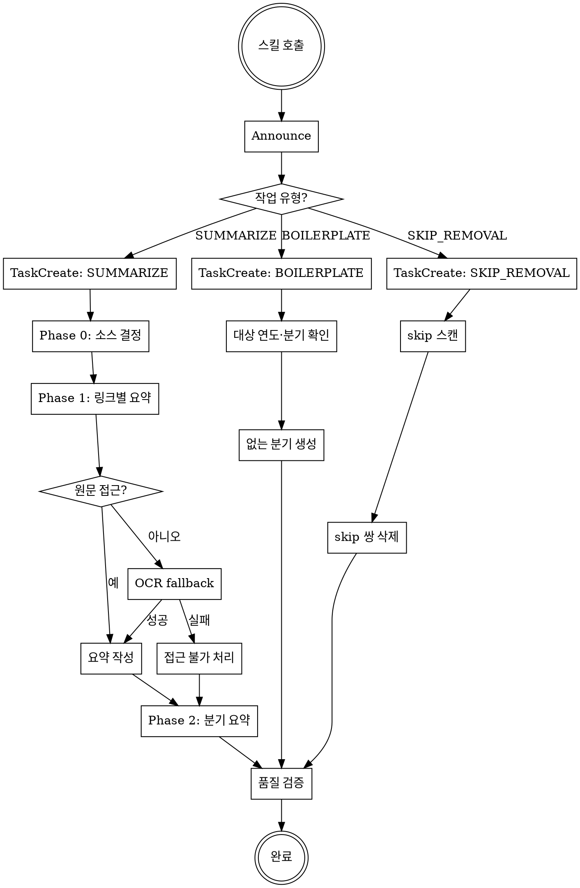

> **RIGID SKILL** — 이 스킬의 모든 규칙은 엄격히 따른다. 포맷·표 스키마·들여쓰기 규칙을 임의로 변형하지 않는다.

> **기준 파일(gold standard)**: `docs/quality-updates/2024/2024-10-01_to_2024-12-31.md`, `docs/quality-updates/2025/2025-10-01_to_2025-12-31.md` — 포맷·어조·상세 수준의 기준. 판단이 어려우면 이 파일들을 참조할 것.

# 에이전트 지침: Quality Updates – 회계·감사 규제 동향 요약

---

## 세션 시작 의식

### 1. Announce

스킬 호출 즉시 사용자에게 고지:

> `quality-updates-writer 스킬로 [작업 유형]을 시작합니다. 기준 파일: 2024-10-01_to_2024-12-31.md / 2025-10-01_to_2025-12-31.md`

### 2. 작업 유형 감지

사용자 요청을 분석해 **3개 유형 중 하나**로 분류:

| 유형 | 감지 키워드 |
|------|-------------|
| **SUMMARIZE** | "요약", "정리", "처리", "보도자료", "Phase" |
| **BOILERPLATE** | "보일러플레이트", "골격", "생성", "빈 문서" |
| **SKIP_REMOVAL** | "스킵 제거", "배포 정리", "skip 제거", "skip 삭제" |

### 3. TaskCreate 체크리스트 생성

유형별로 아래 태스크를 즉시 생성:

**SUMMARIZE**
- "Phase 0: 소스 경로 결정"
- "Phase 1: [링크 제목] 요약" (처리할 링크마다 1개)
- "Phase 2: 분기 요약 생성"
- "품질 검증"

**BOILERPLATE**
- "대상 연도·분기 확인"
- "Q[N] 파일 생성" (없는 분기마다 1개)
- "완료 검증"

**SKIP_REMOVAL**
- "skip 쌍 스캔"
- "링크+skip 삭제 실행"
- "Appendix 보존 확인"

### 4. Gold Standard 파일 확인

**SUMMARIZE 유형만**: Phase 1 시작 전 아래 파일을 반드시 읽어 포맷·어조·상세 수준을 확인한다.

- `docs/quality-updates/2024/2024-10-01_to_2024-12-31.md`
- `docs/quality-updates/2025/2025-10-01_to_2025-12-31.md`

---

## 프로세스 흐름도



---

## WORKFLOW — SUMMARIZE

### Phase 0: 소스 경로 결정

TaskUpdate → in_progress. 아래 우선순위 표 적용. 결정 후 TaskUpdate → completed.

| 우선순위 | 조건 | 동작 |
|----------|------|------|
| 1 | 사용자가 경로 지정 | 해당 경로 사용 |
| 2 | 요약 지시 (경로 미지정) | `downloads/*.pdf`에서 링크 제목 키워드 포함 파일 검색 → 매칭 시 사용 |
| 3 | "관련 PDF" 요청 | `downloads/1.pdf` 사용. 없으면 경로 확인 요청 |
| 4 | "최근 PDF" 요청 | `downloads/` 수정일 내림차순 첫 번째 파일 사용. 0건이면 경로 요청 |

**PDF 추출**: `scripts/pdf_path.txt`에 UTF-8로 경로 저장 → `scripts/extract_pdf.py` 실행 → `scripts/pdf_extracted.txt` 사용. `pypdf` 미설치 시 `pip install pypdf`.

**추출 실패 시 OCR fallback (필수)**:
1. `scripts/pdf_extracted.txt`가 비어 있거나 의미 파악 불가 → 추출 실패로 간주
2. 우선순위 A: 큐레이터에서 미리보기 캡처 저장 → `shot` 소스 → 필요 시 OCR `clip` 근거 사용
3. 우선순위 B: 로컬 OCR 도구로 PDF→이미지 변환 후 OCR 텍스트 생성
4. OCR 후에도 확인 불가 → `<!-- 원문 접근 불가 -->` 처리 후 다음 링크

**경로 인코딩 이슈**: 파일명에 특수 유니코드(U+2019 등) 있으면 `FileNotFoundError` 발생 가능. 스크립트는 날짜 접두어(`250827*.pdf`) 패턴으로 glob 재시도함.

**HWP**: 수동으로 PDF 변환 후 PDF 추출 워크플로우 사용.

**WEB 소스**: 큐레이션 편집기에서 해당 링크의 WEB 미리보기(iframe) 내용을 원문 근거로 삼아 요약. 불안정 시 캡처(스크린샷) 저장 → `<!-- source: shot|downloads/...png -->`.

### Phase 1: 링크별 요약 블록 생성

링크마다: TaskUpdate → in_progress → 요약 작성 → TaskUpdate → completed.

**최우선 원칙**: 원문(PDF/HWP) 또는 큐레이터 미리보기에서 직접 확인된 내용만 포함. 추정 절대 금지.

**요약 배치**: 링크 줄 바로 하단, 사이 빈 줄 1개. 요약 블록 마지막 줄과 다음 링크 사이 빈 줄 1개.

→ 포맷 규칙: **REFERENCE A, B, C, D, E** 참조

**큐레이션 링크 상태 코드**:

| 상태 | 표시 | 처리 |
|------|------|------|
| 미결정 | 링크 줄만, source/요약 블록 없음 | 처리 전 — 제목·링크만 노출 수준 |
| 요약 필요 | `<!-- source: pdf\|… -->`, `web`, `clip` 등 | Phase 0·1 요약·원문 연결 큐 |
| 요약 없음 | `<!-- no_summary -->` | 요약하지 않음 |
| 스킵 | `<!-- skip -->` | 편집기 저장 시 기록; 배포 전 제거 대상 |
| 완료 | `!!! note` / `??? note` 등 | 기존 Phase 1·2 규칙대로 유지·보강 |

### Phase 2: 분기 요약 생성

TaskUpdate → in_progress.

구조 (엄수): **Executive Summary → 기관별 요약 → 시사점**. 추가 섹션 불가.

→ 포맷 규칙: **REFERENCE F** 참조

TaskUpdate → completed.

---

## WORKFLOW — BOILERPLATE

**적용 시점**: 사용자가 "○년도 분기 보일러플레이트 생성", "○년 분기별 골격 추가" 등으로 요청한 경우.

### STEP 1: 연도·분기 확인

- 사용자 요청에서 대상 연도 추출
- `docs/quality-updates/{연도}/` 내 기존 파일 목록 확인
- 없는 분기만 생성 대상으로 설정 (기존 파일 덮어쓰기 절대 금지)

### STEP 2: 분기 파일 생성 (없는 분기마다 반복)

**파일 경로**: `docs/quality-updates/{연도}/{연도}-MM-DD_to_{연도}-MM-DD.md`

**분기별 구간**:
- Q1: `01-01` ~ `03-31`
- Q2: `04-01` ~ `06-30`
- Q3: `07-01` ~ `09-30`
- Q4: `10-01` ~ `12-31`

**필수 구조**:

````markdown
---
title: "{연도} Q{N} 회계·감사 규제 동향"
description: "{연도}년 {N}분기 금융감독원·금융위원회·한국공인회계사회·한국회계기준원 주요 규제 동향"
jurisdiction: KR
year: {연도}
frequency: quarterly
period_label: "{연도}-Q{N}"
period:
  start: "{연도}-MM-DD"
  end: "{연도}-MM-DD"
category: regulatory-updates
agencies:
  - 금융감독원
  - 금융위원회
  - 한국공인회계사회
  - 한국회계기준원
tags:
  - 회계
  - 감사
  - 규제동향
---

## Executive Summary

본 기간의 주요 동향은 추후 Phase 2 요약 시 기재 예정임.

#### 기관별 요약

!!! success ""

    === "금융감독원"
        - (추후 기재)
    === "금융위원회"
        - (추후 기재)
    === "한국공인회계사회"
        - (추후 기재)
    === "한국회계기준원"
        - (추후 기재)

#### 시사점

!!! success ""

    === "기업"
        - (추후 기재)
    === "감사인"
        - (추후 기재)

---

## 금융감독원

#### 보도자료

해당사항 없음

#### 세칙제ㆍ개정예고

해당사항 없음

#### 회계감독 동향자료

해당사항 없음

---

## 금융위원회

#### 보도자료

해당사항 없음

#### 고시/공고/훈령

해당사항 없음

#### 입법예고/규정변경예고

해당사항 없음

---

## 한국공인회계사회

#### 알림마당 - 공지사항

해당사항 없음

#### 회계감사 - 감사인증기준

해당사항 없음

---

## 한국회계기준원

#### 소통광장 - 공지사항

해당사항 없음

#### 소통광장 - 보도자료

해당사항 없음

#### 주요일정

해당사항 없음
````

**참고 템플릿**: `docs/quality-updates/2023/2023-01-01_to_2023-03-31.md` 참조.

### STEP 3: 완료 검증

생성된 파일 경로 목록 출력. 품질 검증 체크리스트(BOILERPLATE 유형) 확인.

---

## WORKFLOW — SKIP_REMOVAL

**적용 시점**: 사용자가 배포·정리 단계에서 "스킵 제거", "skip 삭제" 등을 요청한 경우.

### STEP 1: skip 쌍 스캔

- 대상: `docs/quality-updates/**/*.md` 본문 (특히 `## Appendix` 이전 구역)
- 식별: 표준 링크 줄 `- (YY-MM-DD) [제목](URL)` 바로 다음(빈 줄 0~1개 허용)에 **단독 줄** `<!-- skip -->`이 오는 쌍

### STEP 2: 삭제 실행

- 링크 줄 + `<!-- skip -->` 줄 함께 삭제
- 미결정 링크(skip 없음)는 보존
- 앞뒤 리스트 빈 줄 정리

### STEP 3: 보존 확인

- `## Appendix A. Complete List of Retrieved Items (Unfiltered)` 구역의 링크는 삭제하지 않음
- `<!-- skip -->`이 없는 링크만 있는 행은 미결정이므로 삭제하지 않음

---

## REFERENCE A. 블록 문법·들여쓰기

| 상황 | 문법 |
|------|------|
| 일반 (불릿 3~5개) | `!!! note "주요 내용"` |
| 긴 요약 (6개↑, 표·상세 포함) | `??? note "주요 내용"` |
| 증선위 조치 의결 (Type B) | `??? note "조사·감리결과 지적사항 및 조치내역"` |
| 금융위 최종 과징금 (Type A) | `!!! note "조사·감리결과 최종 과징금 부과"` |

> `!!!`/`???` 선택은 불릿 수만이 아니라 길이·밀도를 종합 고려. 과도하게 길면 `???`.

**들여쓰기**: 요약 블록은 링크 줄 하단 4칸, 블록 내용은 추가 4칸, 블록 줄과 첫 내용 사이 빈 줄 1개 필수.

```markdown
- (24-12-04) [제목](https://...)

    !!! note "주요 내용"

        - 첫 번째 불릿
            - 하위 불릿 (4칸 추가)
```

---

## REFERENCE B. 작성 규칙

- **불릿 수**: 3~7개 (긴 문서 8~9, 짧은 공지 2~3 허용)
- **접두어**: 블록 단위로 하나만 사용 (혼용 금지)
    - **스타일 A 괄호**: 서사적 흐름 — `(배경)`, `(개요)`, `(향후)` 등 (2~6자)
    - **스타일 B 볼드-콜론**: 독립 주제 — `**감사전 재무제표**: …`
- **볼드**: 핵심 제도명·기관명·기준치·키워드에만
- **어미**: 명사형/~함/~임/~예정 (음/슴체·합니다체 금지)
- **내용 증류**: what·why·impact 중심, 수치·금액·날짜는 보존, 원문 재현 금지

---

## REFERENCE C. 요약 대상 선별 기준

**요약 O**: 정책 변경·제도 개정, 감독 운영계획, 주요 간담회·설명회, 제재 조치(과징금·제재), 표준감사시간, 내부회계관리제도, 보험건전성(IFRS17·K-ICS), K-IFRS 제·개정, 입법예고/규정변경예고, 중대 회계부정 별도 보도, 심사·감리 지적사례, 회계기준원 질의회신

**요약 X**: 시험 일정·합격자, 단순 통계, 절차적 공지, 포상금 실적, 뉴스레터

**경계 사례**:
- 동일 보도자료 금감원·금융위 양쪽 → 원 발표 기관에 요약, 다른 쪽 링크만
- 동일 보도자료 금감원·기준원 양쪽 → 정책 주체에 요약, 기준원은 별도 관점(제·개정 공표 등) 있을 때만
- 조사·감리결과 금감원·금융위 동일 건 → 금융위에 Type A 표, 금감원 링크만
- 중대 회계부정 별도 보도 → Type A/B 표와 별도 `!!! note "주요 내용"` 서술 블록

---

## REFERENCE D. 제재 조치 표 스키마

### Type A — 금융위 최종 과징금 부과

표 스키마 (**변경 금지**): `| 회사명 | 대상자 | 위반내용 | 과징금 부과액 |`

- 금액: **N.N백만원**, 반복 부호(〃) → 원래 텍스트 치환
- 회사명: 변경 시만 기재, 후속 행 비움
- 대상자: `회사`, `대표이사`, `前대표이사 등 ○인`, `담당임원 등 ○인`, 회계법인명
- 위반: `회계처리기준을 위반하여 재무제표 작성` / `회계감사기준을 위반하여 감사업무 수행`

### Type B — 증선위 조치 의결

접기 블록 안에 **회사별 조치 요약** 표는 항상 포함. **감사인 및 공인회계사 조치 요약** 표는 붙임에 감사인·공인회계사 조치가 있을 때만 포함.

1. **회사별 조치 요약**: `| 회사명 | 구분 | 주요 지적사항 | 주요 조치 |`
2. **감사인 및 공인회계사 조치 요약** (조치 있을 때만): `| 회사 | 주요 지적사항 | 대상 | 조치 |`

- **구분**: 유가증권시장/코스닥시장 상장, 비상장 등 붙임 기준으로 구체 표기
- **지적사항·조치**: 붙임(PDF/HWP)에서 구체 위반 내용·조치 추출
- 한공회 위탁감리위원회 조치 → 회사 열에 `(한공회 위탁감리)`, 지적사항에 위반 유형·대상 회사 수

---

## REFERENCE E. 특수 유형 요약

### 심사·감리 지적사례

`!!! note` 안에 **비불릿 서두 문단**(맥락·통계) + **중첩 `??? info`**(검색경로 링크, ■ 카테고리 헤더, 번호 목록)

### 중대 회계부정 서술 블록

Type A/B 표와 **별도 링크**에 대해 `!!! note "주요 내용"` 작성. 괄호 접두어((조치 개요)·(위반 1)·(유의사항)·(향후))로 서사 구성. 중대성 지표(자기자본 대비 비율, 검찰 고발 등) 포함.

### 입법예고/규정변경예고

외부감사법 관련 개정안 반드시 요약. 괄호 접두어((개정 이유)·(가중·감면)·(의견 제출) 등). 의견 제출 기한 **볼드**.

### 회계기준위원회·지속가능성기준위원회 회의(한국회계기준원 주요일정)

`!!! note "주요 내용"` 안에 `□ 의결 안건` / `□ 보고 안건` 헤더, 각 `- 제○호 …` 불릿.

- **줄 배치**: `□ 의결 안건` 다음 빈 줄 1개 → 의결 불릿 → 빈 줄 1개 → `□ 보고 안건` → 빈 줄 1개 → 보고 불릿
- **볼드**: 의결·보고 안건 내 제도명에 볼드 사용 안 함
- 해당 없으면 `해당사항 없음`
- 기준 예시: `2025-10-01_to_2025-12-31.md` 내 회계기준위원회 요약 블록 참조

---

## REFERENCE F. Phase 2 구조 규칙

### Executive Summary

- **음/슴체**, **3~5문장**, 불릿 금지, **볼드**는 핵심 테마에만
- 감독 기조·규제 우선순위·방향성 신호 중심. 링크·날짜·개별 사건 상세 불포함

### 기관별 요약

```markdown
#### 기관별 요약

!!! success ""

    === "금융감독원"
        - …
    === "금융위원회"
        - …
    === "한국공인회계사회"
        - …
    === "한국회계기준원"
        - …
```

**기관 역할 구분**:
- **금융위 = 정책**: 제도 수립·개정, 증선위·금융위 조치(과징금·제재)
- **금감원 = 집행**: 검사·감리·심사, 지정 통지, 설명회·간담회, 유의사항 안내
- **한공회**: 실무 지침·감사 유의사항
- **한국회계기준원**: K-IFRS 제·개정, 질의회신, IFRS IC 안내, 정착지원 T/F

> 증선위·금융위 조치는 **금융위원회** 탭에만 기재.

### 시사점

```markdown
#### 시사점

!!! success ""

    === "기업"
        - …
    === "감사인"
        - …
```

- **기업·감사인만** 포함. 실무적·전향적 시사점. 기관별 요약 반복 금지.

---

## REFERENCE G. Appendix A 구조

파일 말미에 크롤러 전체 목록(필터링 전)을 `??? info` 중첩 구조로 배치.

```markdown
## Appendix A. Complete List of Retrieved Items (Unfiltered)

??? info "전체 자료 (전문가 가공 전)"

    ??? info "금융감독원"
        **보도자료**
        - (YY-MM-DD) [제목](URL)
        ...
    ??? info "금융위원회"
        ...
```

---

## 출력 요건

- 언어: 한국어 / 포맷: Markdown (MkDocs 호환) / 복사-붙여넣기 즉시 사용 / 템플릿 밖 메타 텍스트 없음

---

## 품질 검증 체크리스트

완료 전 TaskCreate로 생성 후 항목별 확인:

### SUMMARIZE 유형

- [ ] 유효한 MkDocs 마크다운 (admonition 중첩, 들여쓰기 4칸)
- [ ] 요약 블록 내 URL 없음
- [ ] `!!!` / `???` 선택이 길이·유형에 적합
- [ ] 접두어 스타일 블록 내 일관 (스타일 A/B 혼용 없음)
- [ ] 어미 규칙 준수 (Phase 1: 명사형, Phase 2 ES: 음/슴체)
- [ ] 수치·날짜·기준치 원문 보존
- [ ] PDF 추출 실패 시 OCR fallback 1회 수행 후 접근불가 판단
- [ ] Type A 표: 스키마·백만원 단위·반복부호 치환
- [ ] Type B 표: 회사별 필수, 감사인 조치 표는 조치 있을 때만
- [ ] 증선위·금융위 조치 → 금융위원회 탭에만 기재
- [ ] 시사점: 기업·감사인 탭만 포함
- [ ] Appendix A 파일 말미 배치, 원본 링크 보존

### BOILERPLATE 유형

- [ ] 기존 파일 덮어쓰기 없음
- [ ] YAML frontmatter 완전 작성 (period_label, agencies 포함)
- [ ] 4개 기관 섹션 헤더 완전 포함

### SKIP_REMOVAL 유형

- [ ] Appendix A 구역 링크 삭제 없음
- [ ] 미결정 링크(skip 없음) 보존
- [ ] 삭제 전후 빈 줄 정리 완료

---

> 패턴 예시는 기준 파일(`2024-10-01_to_2024-12-31.md`, `2025-10-01_to_2025-12-31.md`) 참조.