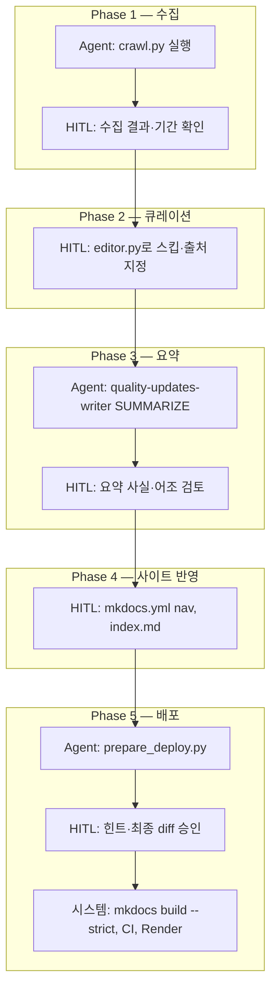

# 분기 운영 작업지시서

**대상**: Quality Updates 분기별 규제 업데이트 문서 운영  
**버전**: 2026-06  
**관련 문서**: [README.md](../../README.md), [CONTRIBUTING.md](../../CONTRIBUTING.md), [editor-curation-workflow.md](editor-curation-workflow.md), [quality-updates-writer 스킬](../../.claude/skills/quality-updates-writer/SKILL.md)

---

## 1. 목적

금융당국(FSS, FSC, KICPA, KASB) 보도자료·공지를 분기 단위로 수집하고, 전문가 판단으로 선별·요약한 뒤 공개 사이트에 반영한다.

본 문서는 **단계별 작업**, **Agent(에이전트)와 전문가(HITL)의 역할**, **품질 게이트**를 정의한다.

---

## 2. 역할 정의

| 역할 | 담당 | 책임 |
|------|------|------|
| **Agent** | Cursor·Claude 등 AI 에이전트 | 반복·대량 처리: 크롤 실행, 스킬 기반 요약 초안, validate/build, diff 힌트 해석 보조 |
| **전문가 (HITL)** | 회계·감사 실무 담당자 | 전문 판단: 링크 선별·스킵, 출처 적합성, 요약 사실 검증, 배포 승인 |
| **시스템** | 스크립트·CI | 규칙 기계 검증: 포맷, pytest, MkDocs strict, skip 쌍 제거 |

**원칙**

- Agent는 **원문에서 확인된 내용만** 요약한다 (스킬 RIGID 규칙). 추정·보완 금지.
- HITL은 Agent 산출물을 **그대로 배포하지 않는다**. 큐레이션·요약·nav/index는 반드시 검토한다.
- `mkdocs.yml`·`docs/index.md` 변경은 **HITL이 diff 힌트를 검토 후 수동 적용**한다 (자동 패치 없음).

---

## 3. 전체 흐름



---

## 4. 단계별 작업지시

### Phase 1 — 수집 (Crawl)

| | Agent | HITL | 시스템 |
|---|-------|------|--------|
| **실행** | `python scripts/crawl.py --year YYYY --quarter N` | 대상 연도·분기 지정, `--dry-run` 결과 확인 | 파일 없을 때만 생성 (기존 큐레이션본 보호) |
| **산출** | `docs/quality-updates/YYYY/YYYY-MM-DD_to_YYYY-MM-DD.md` | — | YAML front matter, 4기관 링크, Appendix A |
| **정렬** | 본문 dated list는 **과거→현재** (`unified.py`) | — | Appendix A는 크롤 수집 순(최신→과거) **유지** |
| **검토** | — | 기간·건수 이상 여부, 누락 기관 없는지 샘플 확인 | — |

**Agent 체크리스트**

- [ ] 올바른 `--year` / `--quarter` (또는 `--start` / `--end`)
- [ ] `[WARN] Output exists, skipping` 시 기존 파일 의도 확인
- [ ] `[DONE]` 경로가 `docs/quality-updates/{연도}/` 인지 확인
- [ ] 본문 첫·마지막 링크 날짜가 분기 시작·종료 방향과 맞는지 (과거→현재)

**HITL 체크리스트**

- [ ] 분기 기간이 달력 분기와 일치하는지
- [ ] 본문에 Executive Summary **없음**이 정상 (아직 수집 단계)
- [ ] Appendix A에 원자료가 포함되었는지

---

### Phase 2 — 큐레이션 (Editor)

| | Agent | HITL | 시스템 |
|---|-------|------|--------|
| **실행** | — | `python scripts/editor.py` | Flask 로컬 UI |
| **판단** | — | 링크별 **스킵** / **요약 필요** / **완료** | 마커를 `.md`에 저장 |
| **출처** | — | PDF·WEB·CLIP·KASB 첨부 연결 | `downloads/` 저장 |

**HITL 전용** — 이 단계는 전문가 판단이 핵심이다.

- [ ] 회계·감사 관련성 없는 보도자료 → **스킵**
- [ ] 요약 대상 → **요약 필요** + 원문(PDF/WEB) 연결
- [ ] 이미 요약된 링크 → **완료** 유지
- [ ] 저장 후 에디터가 `line_index` 갱신됐는지 확인 (연속 저장 시 오적용 방지)

**Agent**

- 이 단계에서 Agent가 `.md`의 스킵·출처를 **임의로 대량 변경하지 않는다**.
- HITL이 지정한 `<!-- source: … -->`만 Phase 3 입력으로 사용한다.

상세 UI·마커 규칙: [editor-curation-workflow.md](editor-curation-workflow.md)

---

### Phase 3 — 요약 (Writer 스킬)

| | Agent | HITL | 시스템 |
|---|-------|------|--------|
| **실행** | `quality-updates-writer` — **SUMMARIZE** (gold-excerpts + md ±80줄 윈도우 + REFERENCE 온디맨드; 재주입 금지) | 요약 대상 링크·우선순위 지시 | 스킬 포맷·gold-excerpts |
| **Phase 0** | PDF/WEB/CLIP 경로 결정 | 출처 파일 존재·적합성 확인 | `extract_pdf.py` 등 |
| **Phase 1** | 링크별 `!!! note` 요약 | **사실 관계 최종 검증** | — |

**Agent 체크리스트** (스킬 준수)

- [ ] `reference/gold-excerpts.md` 세션 1회 Read; 분기 md ±80줄 윈도우; REFERENCE 온디맨드; 재주입 금지
- [ ] 원문 미확인 내용 미포함
- [ ] 접근 불가 시 `<!-- 원문 접근 불가 -->` 처리

**HITL 체크리스트**

- [ ] 제재·수치·제도명 등 **핵심 사실** 샘플링 대조
- [ ] 과도한 해석·일반론 없음

---

### Phase 4 — 사이트 반영 (Nav / Index)

| | Agent | HITL | 시스템 |
|---|-------|------|--------|
| **실행** | diff 힌트 해석 보조 | `mkdocs.yml` nav 수동 추가 | — |
| **대상** | — | `docs/index.md` Latest Update 링크 | — |

**HITL 체크리스트**

- [ ] `mkdocs.yml` → 규제 업데이트 → 해당 연도 → `N분기 (MM–MM월): quality-updates/...`
- [ ] `docs/index.md` 바로가기·Latest Update가 새 분기를 가리킴
- [ ] 로컬 `mkdocs serve`로 사이드바·링크 확인

**Agent**

- nav/index **자동 커밋하지 않음**. HITL 승인 후에만 반영.

---

### Phase 5 — 배포 전처리·배포

| | Agent | HITL | 시스템 |
|---|-------|------|--------|
| **실행** | `python scripts/prepare_deploy.py` | stdout diff 힌트 검토·적용 | skip 제거, validate `--strict` |
| **선행** | `prepare_deploy.py --dry-run` 권장 | 삭제될 skip 쌍 확인 | — |
| **빌드** | `mkdocs build --strict` | 최종 미리보기 | CI 동일 |
| **배포** | — | `main` merge·push **승인** | Render 자동 배포 |

**Agent 체크리스트**

- [ ] `prepare_deploy` exit 0
- [ ] validate strict 통과
- [ ] `npm test` 또는 `cd scripts && python -m pytest tests/ -q` 통과

**HITL 체크리스트**

- [ ] Appendix A 보존 (skip 제거 대상 아님)
- [ ] 공개 본문에 스킵 링크·마커 잔존 없음
- [ ] 배포 후 [quality-updates.onrender.com](https://quality-updates.onrender.com) 샘플 확인

---

## 5. 역할 분담 요약표

| 단계 | Agent | HITL | 자동(스크립트/CI) |
|------|:-----:|:----:|:-----------------:|
| 1. 수집 | 실행·로그 보고 | 기간·건수 승인 | skip-if-exists |
| 2. 큐레이션 | — | **주도** | 마커 저장 |
| 3. 요약 | **주도**(스킬) | **검증·승인** | 포맷 규칙 |
| 4. nav/index | 힌트 보조 | **주도** | — |
| 5. 배포 전처리 | 실행 | 힌트·diff 승인 | skip 제거, validate |
| 6. 배포 | build·test 실행 | **push 승인** | CI, Render |

---

## 6. 명령어 빠른 참조

```bash
# 수집
python scripts/crawl.py --year 2026 --quarter 2
python scripts/crawl.py --dry-run

# 큐레이션
python scripts/editor.py

# 배포 전처리
python scripts/prepare_deploy.py --dry-run
python scripts/prepare_deploy.py

# 검증
python scripts/validate_content.py --strict
cd scripts && python -m pytest tests/ -q
mkdocs build --strict
```

npm: `npm run crawl`, `npm run prepare:deploy`, `npm test`, `npm run build:strict`

---

## 7. 품질 게이트 (배포 전 필수)

| # | 게이트 | 담당 |
|---|--------|------|
| G1 | HITL 큐레이션 완료 (요약 필요 링크에 source 연결) | HITL |
| G2 | HITL 요약 사실 검토 완료 | HITL |
| G3 | `mkdocs.yml` nav 등록 | HITL |
| G4 | `prepare_deploy.py` 성공 | Agent 실행, HITL 확인 |
| G5 | `validate_content --strict` 통과 | 시스템 |
| G6 | `pytest` 통과 | 시스템 |
| G7 | `mkdocs build --strict` 통과 | Agent/HITL |
| G8 | `main` push 승인 | HITL |

**G1~G3 미충족 시 배포 금지.**

---

## 8. 예외·에스컬레이션

| 상황 | 처리 |
|------|------|
| 크롤러 기관별 수집 실패 | Agent 재실행; 지속 실패 시 HITL이 해당 기관 수동 보완 |
| 원문(PDF/HWP) 접근 불가 | Agent: OCR fallback → 실패 시 HITL이 수동 확보 |
| Agent 요약과 원문 불일치 | HITL이 수정 지시 후 Agent 재작성 |
| validate strict 실패 | Agent가 포맷 수정; 내용 변경 없이 들여쓰기·날짜 형식만 |
| nav 힌트와 실제 레이블 불일치 | HITL이 기존 nav 관례에 맞게 수동 조정 |

---

## 9. 관련 파일

| 경로 | 용도 |
|------|------|
| `scripts/crawl.py` | 분기 수집 CLI |
| `scripts/editor.py` | 큐레이션 UI |
| `.claude/skills/quality-updates-writer/SKILL.md` | 요약·스킵 제거 규칙 |
| `scripts/prepare_deploy.py` | 배포 전처리 |
| `scripts/validate_content.py` | 콘텐츠 스키마 검증 |
| `mkdocs.yml` | 사이트 탐색 |
| `docs/quality-updates/` | 분기 문서 소스 |

---

## 10. 개정 이력

| 날짜 | 내용 |
|------|------|
| 2026-06-25 | 초판 — 크롤러 통합·prepare_deploy 반영, Agent/HITL 역할 분담 |
