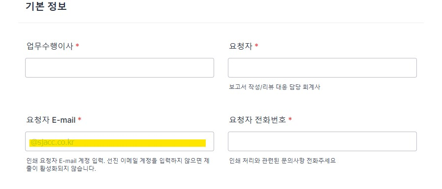
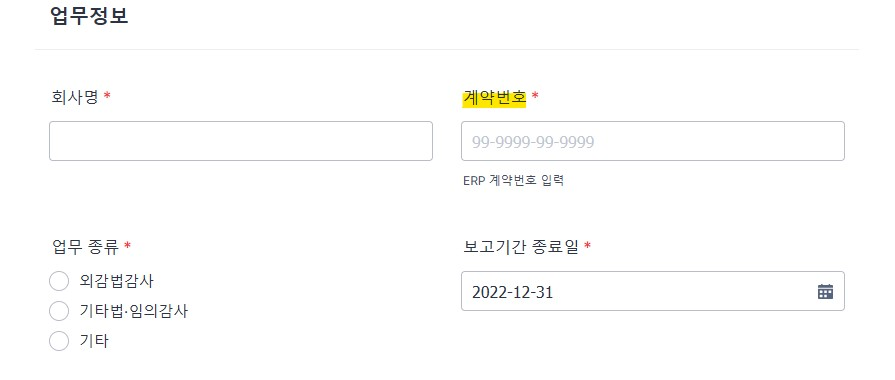
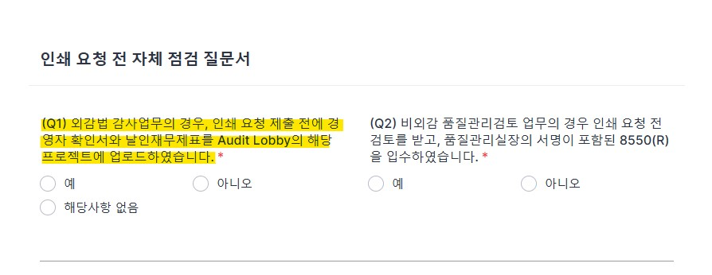
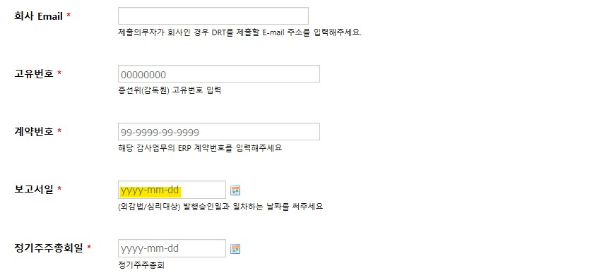
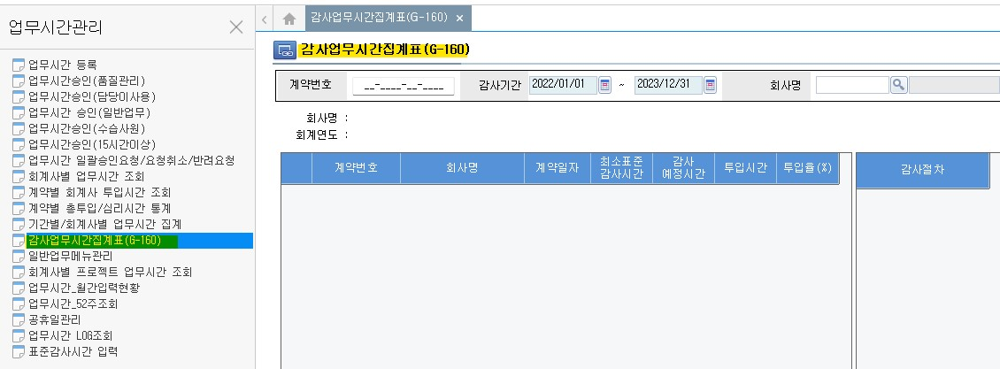
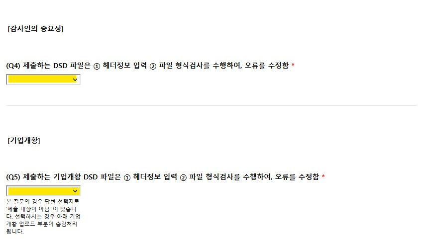
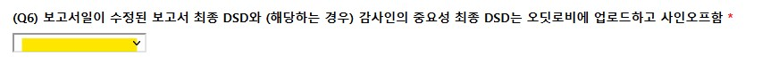
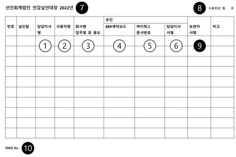

<!-- ## 발행 -->

### 개요

법인의 업무 계약은 일반적으로 보고서 발행과 용역 계약 기간의 만료 두 가지 방법으로 이행됩니다. 여기서 발행 절차를 설명하겠습니다.

감사기준서, 품질관리기준서는 발행 승인 이후를 다루고 있지 않습니다. 따라서 관리 목적에서 발행을 정의하여야합니다.

**발행**이란 고객과의 계약에 따라 업무를 수행하고 업무수행 결과인 보고서를 제작하여 법인 명의로 고객에게 제출하여 계약을 이행하는 것을 의미합니다. 따라서 발행은 다음을 모두 포괄하는 용어입니다.

1. 법인 공인인증서로 [전자 서명](https://www.law.go.kr/LSW/lsLinkProc.do?lsNm=%EC%A0%84%EC%9E%90%EC%84%9C%EB%AA%85%EB%B2%95&efYd=20120329&lsId=prec20120329&lsClsCd=L&joNo=000300&mode=11&lnkJoNo=undefined)된 공시 파일 작성
2. 법인 대표이사 명의의 인감(이하, '법인인감')이 날인된 인쇄물 제출
3. 법인인감 날인을 생략한 인쇄물 제출
4. 법인인감이 날인된 보고서 파일 제출
5. 법인인감 날인을 생략한 보고서 파일 제출

**미발행 용역**이란 발행이 없는 용역 업무를 의미합니다. 

**지정 인쇄소**란 업무팀에서 인쇄물 형태 혹은 파일 형태의 보고서를 제작할 수 있도록 법인에서 지정한 인쇄소를 의미합니다. 

### 발행승인

발행의 정의와 [공인회계사법 제34조](https://www.law.go.kr/법령/공인회계사법/(20210721,18114,20210420)/제34조)와 [정관 제24조]()에 따르면 인증업무의 발행승인 권한은 대표이사에게 있습니다. 품질관리제도의 운영을 원활히하기 위하여 법인의 [내규](/policy/90-품질관리규정/#29)는 감사보고서의 발행승인 권한을 품질관리업무 담당이사에게 위임하였습니다. 

품질관리제도 관점에서 발행의 관리 목적은 법인 명의로 발행되는 보고서에 승인권자의 승인이 있었는지 확인하는데 있습니다. 인쇄, 인감 날인 등의 관리를 이해하기 위해 우선 발행승인에 대해 확인하여야 합니다.

#### 감사보고서

감사보고서란 외부감사법에 의한 감사, 기타 법령에 의한 감사 및 임의 감사의 결과물을 의미합니다.

- 감사보고서 발행 승인

    감사보고서 발행 전 다음 절차가 필요합니다. 세부 내용은 [품질관리절차-업무품질관리검토-사전심리와 품질관리검토]()를 참조해주세요.

    1. 업무팀은 DART 편집기의 감사보고서 서식에 따라 감사보고서를 작성하고, 재무제표와 외부감사실시내용을 첨부합니다. (이하 함께 '감사보고서등')
    2. 업무팀은 법령에서 요구하는 감사인의 중요성 금액 서식('중요성서식')을 작성합니다.
    3. 업무팀은 업무품질관리 절차에 감사보고서등과 중요성서식을 사전심리 실시자·품질관리검토 담당자에게 제출합니다.
    4. 사전심리 실시자/품질관리검토 담당자는 품질관리업무 담당이사에게 사전심리·품질관리검토의 종료를 알립니다.     
    5. 사전심리 결과를 확인한 품질관리업무 담당이사는 ‘심리사항점검표(8550)’에 서명하여 감사보고서의 발행을 승인합니다. 

- 외부감사법에 따른 감사보고서 재발행 승인

    감사인은 외부감사법에 따라 수행하는 감사 대상 회사/사업연도 [감사보고서 제출 의무](https://www.law.go.kr/법령/주식회사등의외부감사에관한법률/(20230922,19264,20230321)/제23조)가 있습니다. 법에 따른 감사보고서 제출의무는 최초 감사보고서 제출로 이행됩니다. 
        
    따라서, 최초 감사보고서 제출 이후 재감사·단순 기재정정 등의 사유로 인한 감사보고서의 재발행은 법정 제출의무 이행이 아니며, 법정감사의 수행으로 분류하지 않습니다.
    
    1. 추가 업무는 법정감사계약의 부가 업무로 수행할 수 있으며, 임의감사계약을 체결할 수 있습니다. 법정감사계약의 부가 업무인 경우 계약 승인이 필요하지 않습니다. 추가 보수를 청구할 경우 외감계약 업데이트가 필요할 수 있습니다. 임의감사계약의 경우, 추가 승인 절차가 필요합니다. 수정 계약이나 추가 계약은 금융감독원에 체결보고하지 않습니다. 구체적인 내용은 [품질관리절차-계약](https://seonjin-qualitycontrol.github.io/policy/qualityProcedure/goPublic/contract)을 참고해주세요.

    2. 조서관리 관점에서 재발행 업무는 법정감사의 연장선상에 있습니다. [외감법 제19조](https://www.law.go.kr/법령/주식회사등의외부감사에관한법률/(20230922,19264,20230321)/제19조)에 따라 감사인은 감사보고서일로부터 8년간 감사조서를 보관하여야합니다. 재발행 업무에 따라 감사조서를 열람하고 수정하는 것은 외부감사법에 따른 감사조서 관리 범위에 포함됩니다. [품질관리절차-업무의수행-조서](https://seonjin-qualitycontrol.github.io/policy/qualityProcedure/workingPaper/) 참고바랍니다.

    3. 감사인은 외감법 [제18조제3항](https://www.law.go.kr/법령/주식회사등의외부감사에관한법률/(20230922,19264,20230321)/제18조)에 외부감사 실시내용을 첨부하여야 합니다. 재발행 업무는 법정감사가 아니지만, 추가 감사업무의 수행 내용이 외부감사 실시내용에 반영되지 않는 것은 합리적이지 않습니다. 따라서, 법인의 품질관리정책은 재감사업무의 추가업무수행 내용을 외부감사 실시내용에 누적 반영할 것을 요구합니다. [품질관리절차-업무의수행-시간]()에서 구체적인 절차를 설명합니다.

    4. 재감사 결과 정정보고서가 제출되는 경우는 공식자문대상입니다. 자문 결과는 조서화합니다. [품질관리절차-업무의수행-자문](https://seonjin-qualitycontrol.github.io/policy/qualityProcedure/consultation/)을 참고해주세요.
    
    5. 마지막으로, 재발행 업무는 외부감사법 감사에 따른 사전심리대상이 아닙니다. 원칙적으로, 재발행 업무는 기타법에 의한 외부감사, 임의감사에 준하는 업무품질관리검토 대상이지만, 예외적으로 외감법 재감사 업무는 품질관리업무 담당이사의 결정에 따라 사전심리 대상으로 관리하겠습니다. 

    !!! note "재감사"

        거래소는 법정 제출기한 내에 변형사유를 해소하지 못하여 의견거절된 상장사가 변형사유를 해소할 수 있도록 일정기간 유예기간을 부여하는 상장유지 제도를 운영하고 있습니다. 유예기간동안 수행되는 감사업무를 일반적으로 [**재감사**](https://dic.hankyung.com/economy/view/?seq=14002)라고 합니다. 원래 의미의 재감사를 포함하여, 외부감사법에 의한 감사보고서 제출 후 추가감사업무를 수행하여 업무시간이 투입되고 감사조서가 수정된 결과 추가 감사증거가 확보되어 감사보고서일이 변경된 감사보고서가 재발행될 수 있습니다. 관리 목적상 이러한 추가 감사업무를 모두 **'재감사'**라 하겠습니다.
   
    !!! note "재발행·정정공시 절차 - 최초발행 조서입고 전"

        1. (제출 준비) Audit Lobby 프로젝트에 다음 준비사항 반영

            !!! warning ""

                Audit Lobby 프로젝트에서 정정공시 폴더 분리해주세요. 

            ① [보고서 재발행·정정공시 발행 승인요청서](https://docs.google.com/uc?export=download&id=1myBLSy_-lytBmserue5K-O_6vaqfh36M&confirm=t)  
            ② 정정 보고서 DSD (정오표 삽입)  
            ③ (재감사 업무) 추가 감사업무 조서, 경영자 확인서, 날인 재무제표 사인오프
            
            !!! warning ""
            
                재감사 업무 수행 내용은 기존 조서를 수정하지 않고, 필요 기존 조서의 복사본을 생성하여 추가업무를 수행하거나, 추가 조서에 업무를 수행하여 업로드합니다. 구체적인 절차는 [품질관리절차-업무의 수행-조서-출고 및 재입고](https://seonjin-qualitycontrol.github.io/policy/qualityProcedure/workingPaper/#_31)를 참고해주시기 바랍니다.

            ⑤ (재감사 업무) 독립성 조서와 감사종료 조서에 재감사업무 참여자 모두 사인오프. 기존 외감업무 계약코드에 재감사업무 참여자 시간 추가 입력후 외부감사 실시내용 누적 반영

        2. (제출) 업무팀은 사전심리 의뢰서식 또는 품질관리검토 의뢰서식을 제출하여 재발행의 업무 품질관리검토 요청.

            !!! warning "사전심리 실시자"
            
                최초 발행 사전심리 실시자(퇴사 등 업무수행이 불가능한 경우 품질관리업무 담당이사가 재지정)는 재감사 업무 내용을 검토하고, 필요한 경우 업무팀과 정정 보고서에 대한 의견 교환후 독립성 조서, 업무수행시간 입력, 재발행·정정공시 발행 승인 요청서 사인오프

        3. (사전심리·품질관리검토 수행) 사전심리 실시자는 심리 종료 후 독립성 조서와 보고서 재발행·정정공시 발행 승인 요청서에 사인오프 후 사전심리 종료. 품질관리검토 실시자는 업무 수행 결과를 품질관리업무 담당이사에게 전달.
        
        4. (발행 승인) 품질관리업무 담당이사는 검토 결과 확인 후 Audit Lobby에서 보고서 재발행·정정공시 발행 승인요청서에 사인오프 하여 재발행·정정공시 발행 승인 후 E-mail 안내.
        
            !!! warning "감사보고서일"
            
                외감법 재감사 업무는 품질관리업무 담당이사가 재발행·정정공시 발행 승인요청서에 사인오프한 날짜가 수정된 감사보고서일입니다. 
                
                외감법 재감사 업무 이외의 재발행 업무의 경우, 정정공시 업무의 감사종료 조서에 담당이사가 사인오프한 날짜가 새로운 감사보고서일 혹은 수정된 감사보고서일입니다.
                
                단순 기재정정의 경우 감사보고서일이 유지됩니다.

    !!! note "재발행·정정공시 절차 - 입고 후"

        입고된 업무는 출고, 조서수정 절차로 업무 개시합니다. 조서관리절차를 참고하셔서 정정공시 워크스페이스를 생성한 후 추가 업무를 진행해주세요.

#### 감사보고서 이외의 보고서

담당이사의 승인으로 발행됩니다. 현재, 품질관리실은 업무팀에서의 발행 승인 과정은 통제하지 않습니다. 공시 요청 혹은 인쇄 요청을 담당이사의 발행 승인으로 간주하겠습니다.

!!! note "담당이사의 발행승인 권한"

    법과 내규는 감사보고서 이외의 인증업무, 기타 비인증업무의 발행 승인 권한에 대해 정하고 있지 않습니다. 법인은 이러한 업무의 산출물은 담당이사의 발행승인 대상으로 보아 관리하고 있습니다. 감사보고서의 발행과 달리 발행의 결정이 체계적으로 문서화되고 있지 않습니다.

### 감사보고서 산출물 제작

감사보고서는 산출물의 물리적 형태에 따라 크게 두 가지로 구분할 수 있습니다. 전자문서는 작성 형식에 따라 다시 구분되며, 인쇄물은 제작 방법에 따라 다시 나눌수 있습니다.

- 전자문서:
    - [DART 문서편집기](https://newfiler.fss.or.kr/raaf001/select.do)로 작성된 문서 (.DSD)
    - 기타 범용 문서편집기(한글, MS워드 등)로 작성된 문서 (.HWP, .DOC, .PDF)
- 인쇄물: 작성된 전자문서를 책자형태로 제작한 결과물. 
    - 지정인쇄소에서 제작
    - 자체 제작

### 인쇄

인쇄는 지정인쇄소를 통한 제작과 자체 제작이 모두 가능합니다. 

#### 지정인쇄소

지정인쇄소 제도는 발행 통제와 인감 관리 목적으로 운영하고 있습니다. 현재 본점과 대구지점 각각 인쇄소가 지정되어있습니다. [Forms and Templates-발행-인쇄](https://sjacc-quality-portal.com/forms)를 통해 지정인쇄소에 의뢰할 수 있습니다. [내규](/policy/90-품질관리규정/#29)에 따라 발행된 보고서 사본 1부를 품질관리업무 담당이사에게 제출하여야합니다. 지정인쇄소에서 제작하는 경우 제출이 불필요합니다.

??? info "인쇄의뢰서식 작성관련 주의사항"

    1. 온라인 서식의 E-mail은 법인 E-mail 주소를 입력하여야 합니다. 선진회계법인 Email(@sjacc.co.kr)을 입력하지 않으면 서식 제출 버튼이 활성화되지 않습니다.
        

    2. 계약번호는 “계약 단위로” 건 별 작성하여 제출해주시기 바랍니다. (온라인 서식 1건에 계약 1건에 대해서만 작성). 계약 단위로 온라인 서식이 작성되지 않으면 인쇄가 진행되지 않는 점 유의하여 주시기 바랍니다.
        

    3. 인쇄 의뢰 온라인 서식 제출 전에 수령한 ①경영자 확인서와 ②날인재무제표를 Audit Lobby에 업로드 완료해야 합니다.업무수행팀에서는 사전심리 절차가 완료되는 즉시 감사대상회사로부터 경영자확인서와 날인재무제표를 입수하시기 바랍니다.
        

#### 자체제작

업무팀에서 복합기와 제본 도구 등을 활용하여 인쇄물을 자체제작할 수 있습니다. 자체제작의 경우 제작후 [지체없이](https://www.lawmaking.go.kr/lmKnlg/jdgStd/info?astSeq=19&astClsCd=CF0101#:~:text=%EC%9D%B4%EC%97%90%20%EB%B9%84%ED%95%98%EC%97%AC%20'%EC%A7%80%EC%B2%B4%20%EC%97%86%EC%9D%B4'%EB%8A%94,%ED%95%9C%EB%8B%A4%EB%8A%94%20%EB%9C%BB%EC%9C%BC%EB%A1%9C%20%EC%82%AC%EC%9A%A9%ED%95%9C%EB%8B%A4.) 품질관리실로 사본 1부를 제출해주세요.

### 인증

인증(Authenticity)은 해당 보고서에 기재된 선진회계법인 명의가 명의자에 의해 기재되었다는 진정성을 확인하는 절차입니다. 명의인증의 방법은 일반적으로 서명·기명·날인(인장 이미지 포함)·공인전자서명이 있습니다. 법인은 현재 기명날인, 공인전자서명의 방법으로 산출 보고서의 제출자가 선진회계법인이라는 것을 인증합니다. 

발행의 정의에서 확인할 수 있는 것처럼, 인증은 발행에 포함된 요소입니다. 따라서, 발행 승인은 인증의 선행조건입니다. 그 밖에 다른 '인증 승인' 등의 절차가 존재하지 않습니다.

!!! warning 

    날인이나 전자서명이 없이 선진회계법인이라 기명하여 업무 산출물을 제출하는 경우 선진회계법인은 진본성을 인정하지 않습니다. 

#### 전자서명

법인은 DART 제출용 전자문서의 작성에 전자서명을 사용합니다. 금융감독원의 [전자문서제출요령](https://newfiler.fss.or.kr/raaf001/search.do)에서 구체적인 사항을 확인할 수 있습니다. 

1. DRT 생성

    DART편집기에서 문서 작성이 완료되면 문서파일(.DSD)을 전자서명하여 전송파일(.DRT 형식, 이하 'DRT')로 만듭니다. 전자서명을 위한 인증서는 품질관리실에서 보관합니다. 업무팀은 [Form and Template-발행-DRT생성](https://sjacc-quality-portal.com/forms)을 통해 품질관리실에 DRT 생성을 요청할 수 있습니다.

    ??? info "전자공시 전송파일 생성/제출 서식 주의사항"

        1. 외부감사업무의 감사보고서일(품질관리업무 담당이사 또는 담당이사의 8550 사인오프일)을 입력해주시기 바랍니다. 감사보고서일은 업무품질관리검토 종료일입니다. 세부 내용은 [품질관리절차-업무품질관리검토-사전심리와 품질관리검토]()를 참조해주세요.
        
            
            

        2. 외부감사 실시내용과 ERP 등록시간 일치, 미결재시간 없음, 담당이사 투입비율 10% 초과, 내규에 따른 사전심리 시간 조건 충족을 확인 후 '예'를 선택합니다.

            
                       
                       

        3. 제출하는 DSD 파일은 ① 헤더정보 입력 ② 파일 형식검사 ③ 재무제표 검사(일반기업회계기준)를 수행해야합니다. 재무제표 검사 과정에서 필요한 경우 계정을 신설합니다. 검사 수행자의 PC의 C:\DART\User에 회사의 증선위 고유번호로된 DAT파일이 생성됩니다. 신설계정목록을 제출하기 위하여 DAT파일을 첨부합니다. DAT파일이 생성되지 않는 경우(ex. 범위제한으로 인한 의견거절, 저축은행 등 일반기업회계기준을 적용하는 금융업의 경우). 3-1에 아니오를 선택합니다.

            

        4. 감사인의 중요성과 기업개황은 헤더정보 입력 후 파일 형식검사로 형식적 문제를 해소한 후 제출하여야 합니다.

            

        5. 최종 ① 감사보고서 DSD파일과 ② 감사인의 중요성 DSD파일을 Audit Lobby에 업로드 후 사인오프가 완료되었음을 확인 후, 답변을 “예“ 로 선택합니다. 감사보고서일을 정확하게 수정해주세요.

            

        6. 수령한 ① 경영자 확인서 ② 날인 재무제표를 Audit Lobby에 업로드 후 사인오프가 완료되었음을 확인 후, 답변을 “예“ 로 선택합니다. 
        
            

            !!! warning ""
            
                경영자 확인서와 날인 재무제표는 감사증거입니다. 감사보고서일보다 제출일이 늦을 수 없습니다. 주의 부탁드립니다.

        7. 품질관리실에서는 ①서명된 경영자 확인서 와 ②날인 재무제표가 Audit Lobby에 업로드 및 사인오프가 완료되었음을 확인후 전자공시 전송파일을 생성합니다.

2. 법인이 제출의무자인 경우 - 품질관리실에서 제출합니다.

    감사보고서 등 법인이 제출의무자인 경우 품질관리실은 작성된 DRT를 지체없이 DART 접수시스템에 제출합니다. 품질관리실은 제출 결과를 업무팀에 회신합니다. 회신내용은 **DART 공시 조회 결과**와 **DART 접수시스템 제출결과조회 상세페이지**의 캡처 화면입니다. 회신이 없는 경우 품질관리실에 문의해주세요.
    
    감사보고서와 첨부서류의 제출의무자가 법인이 아닌 경우에도, 감사인의 중요성 서식은 법인이 제출의무자입니다. 제출여부를 반드시 품질관리실과 더블체크해주세요.
    
3. 법인이 제출의무자가 아닌 경우 - 품질관리실에서 제출의무자에게 DRT를 보냅니다. 

    DRT 생성 요청서에는 제출의무자의 업무담당자 E-mail 주소를 기록할 수 있습니다. 품질관리실은 생성된 DRT를 제출의무자에게 직접 송부합니다. 다음은 E-mail 제출 서식입니다.

        Subject : [선진회계법인] XXX 주식회사 감사보고서 DRT 송부
        Date : 202X-XX-XX XX:00:00
        From : 품질관리실 <qualitycontrol@sjacc.co.kr>
        To : XXX@XXXXX
        Cc : 품질관리실 <qualitycontrol@sjacc.co.kr>, 업무팀

        선진회계법인 품질관리실입니다.

        1. 귀 사의 무궁한 발전을 기원합니다.
        2. 전자공시용 DRT 파일을 보내드립니다. 업무에 참고하시기 바랍니다.

        기타 문의사항이 있으신 경우, 담당공인회계사 또는 품질관리실에 연락 부탁드립니다. 

        감사합니다.

#### 인감

인감은 법인의 문서를 인증하기 위한 대표적인 방법입니다. 과거 독립채산제에서 이어진 관행으로 인하여 법인의 사원들께서는 모두 사용인감을 **자체적으로** 만들어 보관하고 있습니다. 이 뿐만 아니라, 발행승인 없이 인감 이미지를 활용하여 보고서에 기명날인하는 사례 역시 다수 적발되었습니다.

2022년말 품질관리실은 통합관리로 이행하기 위한 조치의 일환으로 실물인감 관리 절차를 구축하였습니다. 이를 근거로 각사업부 보관 인감을 등록받았습니다. 2023년 1월 현재 법인인감과 사용인감 25호까지 등록되었습니다. 인감 이미지 역시 신청에 따라 등기이사 10인에게 교부되었습니다.

각 실물인감과 인감 이미지의 관리책임자가 지정되었습니다. 관리책임자는 규정에 따른 승인이 있는 경우에만 인감을 사용한 후, 사용이력을 기록해야 합니다.

법인의 현재 관리 역량과 실무 관행, 건전한 내부통제 원칙을 모두 고려할 때 최적 수준의 관리절차라 판단합니다. 관리 책임이 분산되어 있기 때문에 구성원들이 승인, 기록, 보관 등 관련 절차를 이해한 후 업무에 반영할 때 본 절차는 효과적으로 운영될 것입니다.

1. 인감 등록

2. 인감날인절차

    인감날인 절차는 업무/비업무로 용도에 따라 구분할 수 있습니다.

    업무용은 계약·발행의 승인권자에 따라 다시 구분되며, 각각의 승인 여부는 다음과 같이 확인할 수 있습니다. 계약·발행 이외의 업무 목적은 편의상 비업무에 포함합니다.

    | 계약승인권자 [^1] | 승인문서 |
    | - | - |
    | 품질관리업무 담당이사| 하이웍스-전자결재-업무수임유지평가서 |
    | 업무담당이사| ERPiU-계약관리-계약등록-세무업무등록/기장대리등록 |

    | 발행승인권자 | 승인문서 |
    | - | - |
    | 품질관리업무 담당이사| 오딧로비 8550 사인오프 |
    | 업무담당이사| 인쇄요청·인감날인요청·인감날인대장 [^2] |

    비업무용은 인감 사용용도별 승인권자에 따라 다음과 같이 승인·기록합니다.

    |인감구분|용도|승인권자|승인방법|기록|
    |-|-|-|-|-|
    |법인인감|총무 계약|대표이사|법인인감 관리대장|법인인감 관리대장|
    |사용인감|외부 공문발송|대표이사|하이웍스-전자결재-공문발송|하이웍스 결재목록|
    ||감독기구 자료제출 등|품질관리실장|인감날인대장 인감날인요청서|인감날인대장 하이웍스 결재목록|
    ||기타 업무용|담당이사|인감날인대장 인감날인요청서|인감날인대장 하이웍스 결재목록|

2. 인감날인대장

    인감날인대장은 하드카피로 작성하는 관리대장입니다. 인감관리책임자가 작성 보관하며 아래와 같은 서식입니다[^3]. 계약, 발행의 경우 승인문이 별도로 없을 경우, 승인의 문서화 목적으로 사용할 수 있습니다.

    {width=90%}

    !!! note "인감날인대장 작성 방법"

        [기본정보] ① 인장 보관 사업부 담당 이사/사원명 ② 사업부 날인 처리 요청자 ③ 계약서, 보고서, 공문, 확인서 등 ⑦ 인감날인대장은 연도별로 관리함. 인덱스번호와 날인일은 연도별로 부여. ⑧ 인감등록부 등록 사용인감 번호 ⑩ 인감날인대장 연도별 페이지 번호입니다.
        
        [계약-매출] 승인된 계약은 본점, 대구지점의 계약인감 보관자에게 방문하여 인감날인대장에 기재후 날인 받습니다. 
        
        - 품질관리실 승인 계약[^4]의 경우 ④, ⑤를 기재합니다. 인감보관자는 하이웍스 문서번호를 통해 품질관리실장 승인 여부를 확인합니다. 인감보관자는 확인 결과에 따라 승인된 계약의 계약서에 날인하고 ⑨에 서명합니다.

        - 담당이사 승인 계약의 경우 ④를 기재합니다. 인감보관자는 ERP 계약번호로 담당이사 승인 여부를 확인합니다. 인감보관자는 확인 결과에 따라 승인된 계약의 계약서에 날인하고 ⑨에 서명합니다.

        [계약-매입] 매입 계약은 본점 총무 보관 법인인감과 각 사업부 등록 인감으로 날인합니다. 매입계약의 경우 품질관리실의 관리 영역에 해당하지 않습니다. 여기서는 업무 내용에 대해 기술합니다.
        
        - 본점 비업무 매입 계약은 대표이사의 승인에 따라 법인인감 날인하고, 필요에 따라 총무에서 관리중인 법인인감증명서를 교부합니다. 

        - 비인증 업무 관련 직접 관련 매입 계약의 경우 담당이사의 승인에 따라 집행됩니다. 

            !!! Warning "용역 매입 고려사항"

                - 비인증 업무 수행 관련하여 적격성·독립성이 있는 개인 또는 법인의 하도급 계약은 제한되지 않습니다. 이러한 하도급 계약 체결 전 적격성 평가가 수행되어야 하며, 체결 계약에는 다음 요구사항이 포함되어야 하며, 업무의 종료시점까지 이를 관리하여야 합니다.

                    1. 비밀유지
                    2. 인력 관리 및 신원 보증 
                    3. 산출물 등의 소유권
                    4. 업무 자료 요구
                    5. 하자보증
                    6. 독립성

                - 회계법인이 수임한 인증업무의 경우 [공인회계사법](https://www.law.go.kr/법령/공인회계사법/(20230922,19257,20230321)/제34조)에 따라 회계법인의 이사외의 자는 수행할 수 없습니다.

        [발행] 비인증 업무의 발행은 업무수행이사의 결정에 따릅니다.

        - 비인증 업무의 발행 승인은 인증업무와 달리 체계적으로 관리되지 않습니다. 인쇄의뢰 등 다른 발행 방법을 고려하지 않고 직접 산출물에 인장을 포함하는 경우 인감날인대장에 발행 승인 내역을 기록해야합니다.

[^1]:

    [업무수임과 유지에 관한 policy]()에 따르면, 원칙적으로 모든 업무는 품질관리업무 담당이사의 계약 승인 대상입니다. 다만, 품질관리업무 담당이사는 [정책공지]()에 따라 비인증업무 대상에 대한 세무업무와 기장업무는 담당이사의 승인으로 계약체결하도록 정하였습니다.

[^2]:

    업무수행이사의 발행 결정은 체계적이고 명시적으로 문서화되고 있지 않습니다.

[^3]:

    현행 인감날인 서식은 [Quality Portal-Forms and Templates](https://sjacc-quality-portal.com/forms)에서 확인할 수 있습니다.

[^4]:

    [내규]()에 따르면 업무 계약은 원칙적으로 모두 품질관리업무 담당이사의 승인 대상입니다. 현재 [내규](/policy/90-품질관리규정)와 품질관리업무 담당이사의 결정에 따라 인증업무 대상에 대한 세무계약과 기장계약은 예외적으로 담당이사의 승인대상입니다.

## 변경이력

절차의 추가, 수정, 삭제 등 주요 변경 내역을 기록하고 있습니다.

### 2023-10-03

1. [업무의 수행 - 조서](https://seonjin-qualitycontrol.github.io/policy/qualityProcedure/workingPaper/)에서 조서 관리 절차를 정비하였습니다. 재발행·정정공시 절차는 출고, 조서수정 등 조서 관리 절차 연계를 고려하여 수정하였습니다. [<링크>](/policy/qualityProcedure/goPublic/#_3)
2. 인감날인대장의 작성 관련하여 매입계약, 발행계약에 관한 사항을 정리하였습니다. [<링크>](/policy/qualityProcedure/goPublic/#_11)

### 2023-01-24

최초 배포. 다음 공지 내역을 종합하여 대체합니다.

- [[품질관리실] 인감관리절차 - 보고서 각인 이미지 사용 관련 추가 사항 안내](https://board.office.hiworks.com/sjacc.co.kr/bbs/board/board_view/7328/554#)
    - [[품질관리실] 발행승인 후 발행방법 추가 - 감사보고서 사각도장 실물 날인](https://board.office.hiworks.com/sjacc.co.kr/bbs/board/board_view/7328/546#)
- [[품질관리실] 재발행·정정공시 발행 승인절차 업데이트 안내 (2022-09)](https://board.office.hiworks.com/sjacc.co.kr/bbs/board/board_view/7328/544#)
    - [[품질관리실] 재발행·정정공시 발행 승인절차 안내](https://board.office.hiworks.com/sjacc.co.kr/bbs/board/board_view/7328/427#)
- [[품질관리제도] 분반기 검토보고서 발행 절차 안내 (2022 업데이트)](https://board.office.hiworks.com/sjacc.co.kr/bbs/board/board_view/7328/518#)
    - [[품질관리제도] 분반기 검토보고서 발행 절차 안내 (2021년 계획 포함) - outdated](https://board.office.hiworks.com/sjacc.co.kr/bbs/board/board_view/7328/442#)
- [[품질관리실] [내부공지] 발행절차 정비 - 기업진단보고서 제출 추가](https://board.office.hiworks.com/sjacc.co.kr/bbs/board/board_view/7328/482#)
    - [[품질관리실] 발행절차 정비 안내](https://board.office.hiworks.com/sjacc.co.kr/bbs/board/board_view/7328/412#)