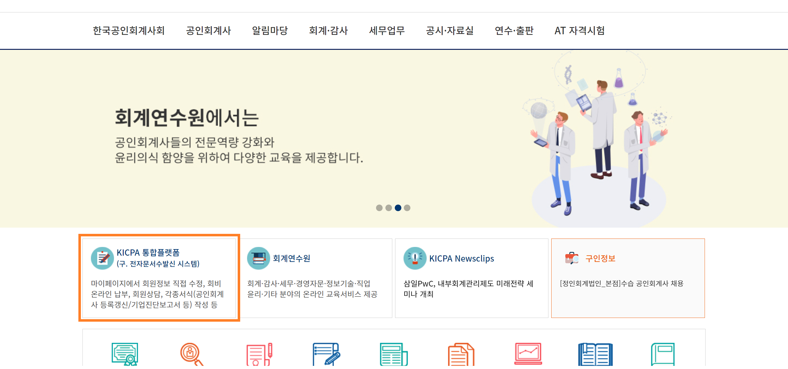
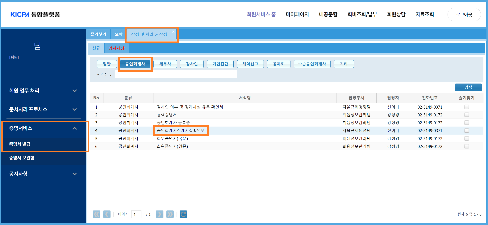
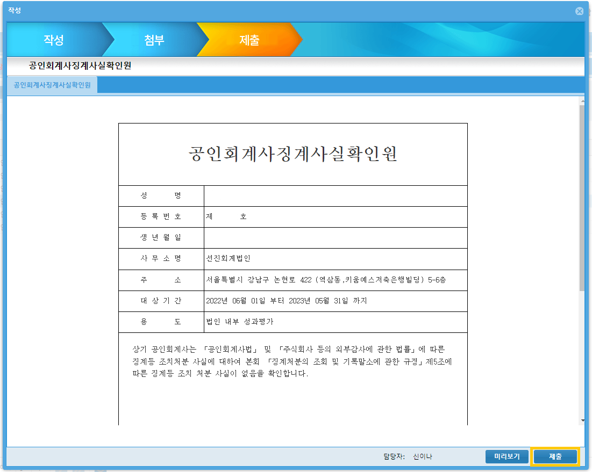

## 개요

성과평가 

### 관련 규정과 관리 목표

### 제출 정보

#### 담당이사 평가

담당이사에 대한 상향 평가

#### 공인회계사 징계사실 확인원 제출

외감규정에 따른 감독원의 실무적용 사례와 내규는 성과평가에 외부 징계 여부를 고려할 것을 요구합니다. 외부 징계여부는 법인에 따로 통보되지 않습니다. 따라서 품질관리실은 구성원들의 공인회계사징계사실확인원을 매년 평가시점에 제출받습니다. 구체적인 제출 일정은 매년 평가기간에 품질관리실에서 안내하겠습니다.

!!! note "공인회계사징계사실확인원 발급 및 제출방법" 

    1. 한국공인회계사회 홈페이지에서 로그인합니다. KICPA 통합플랫폼을 클릭합니다. 
        
        

    2. KICPA 통합플랫폼이 새로운 탭에서 열립니다. [증명서비스-증명서발급]을 클릭합니다. [작성 및 처리 > 작성] 탭이 열립니다. 화면의 공인회계사 탭을 눌러서 공인회계사징계사실확인원을 클릭하거나, 서식을 검색하여 해당 서식을 선택합니다.

          

    3. 작성 창이 열립니다. 대상기간과 용도를 입력합니다. 입력 후 '검토 후 제출'을 클릭합니다.

        - 성과평가 대상기간은 06월 01일 - 05월 31일입니다. 외부감사업무의 경우 12월 감사업무의 입고가 완료되어야 의미있는 평가가 가능하다는 점을 고려하여 내규에서 정한 기간입니다. 입력형식은 YYYY-MM-DD 입니다. 
        - 용도는 '법인 내부 성과평가'로 기재 부탁드립니다. 

          

    4. 제출 화면으로 넘어갑니다. 서식의 내용을 확인하신 후 '제출' 클릭합니다.

          

    5. 안내사항에서 '증명서 보관함'으로 이동합니다.

          

    6. '제증명서 보관함'이 열립니다. 발급된 '공인회계사징계사실확인원'이 있습니다. 제출문서를 클릭합니다. 
    
          

    7. 상세보기 화면에서 발급된 서류를 확인할 수 있습니다. 'PDF 저장 및 인쇄'를 클릭하여 문서를 저장합니다.

        

    8. 저장한 PDF 파일을 품질관리실 메일로 제출해주세요.

## 변경이력

절차의 추가, 수정, 삭제 등 주요 변경 내역을 기록하고 있습니다.

### 변경계획

#### 추가/수정

### [1.0.0] - 2023-04-10

최초 배포. 아래 하이웍스 공지 내역을 종합하여 대체함.
