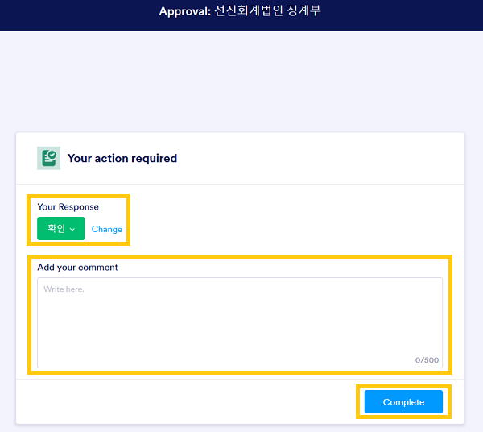
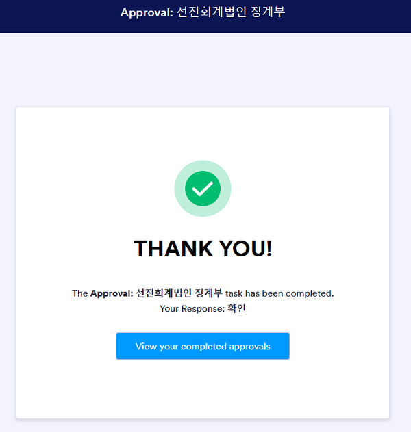

## 개요

본 항목에서는 구성원의 내규 위반사항이 발견되어, 징계가 확정되기까지의 절차를 설명합니다. 위반의 정도는 벌점으로 산정됩니다. 내규는 벌점에 따라 구성원에게 벌과금을 부과할 것을 요구합니다.

### 관련 규정과 관리 목표

징계항목과 벌점은 [법인내부 윤리규정 및 품질관리규정 징계지침]()에서 정한 바에 따릅니다. 규정에서 정하였으나, 구체적이지 않은 사항은 품질관리업무 담당이사가 정한 바에 따라 벌점을 산정하고, 운영위원회의 결정에 따라 확정됩니다.

!!! note "법인내부 윤리규정 및 품질관리규정 징계지침의 징계항목"

    - 제2장 1. 금융감독원, 한국공인회계사회 감리시 경고 이상을 받을 때 : 감리결과에 따른 부과벌점
    - 제2장 2. 심리방침에 따른 심리를 받지 않은 보고서를 발행하거나 공시할 때 : 벌점 10점
    - 제2장 3. 심리받은 보고서와 발행·공시한 보고서가 다를 때 : 벌점 10점
    - 제2장 4. 독립성 준수 확인서의 내용이 사실과 다를 때 : 벌점 10점
    - 제2장 5. 외부감사시 감사인원수를 충족하지 못할 때 (외감: 2인 이상, 상장 및 코스닥: 3인 이상) : 벌점 10점
    - 제2장 6. 모니터링 점검 결과 중대한 미비점이 발견된 경우 : 사안에 따라 벌점 5점에서 10점(법률 위배 등 중대한 경우 10점)
    - 제2장 7. 주식거래내역 자료가 사실과 다를 때 : 벌점 10점
    - 제2장 8. 적시에 타임레포트를 입력하지 않을 때 : 벌점 1점
    - 제2장 9. 감사조서 관리규정 위반시 : 벌점 5점
    - 제2장 10. 그 외 모든 품질관리 관련 자료를 지연 또는 부실 제출한 경우 : 벌점 5점
    - 제2장 11. 기타 운영위원회가 징계가 필요하다고 판단한 사항 : 사안에 따라 벌점은 5점에서 10점 
    - 제3장 1. 법인명의의 대출. 단, 법인운영에 필요한 시설물 리스 또는 자동차할부는 제외 : 벌점 100점
    - 제4장 명의대여에 관한 징계 : 벌점 100점
    - 제5장 특정 명칭 사용에 관한 징계 : 벌점 100점
    - 제6장 1. 소속 공인회계사가 매년 한국공인회계사회에서 정한 일정 시간의 교육을 미이수할 때 : 벌점 10점

### 징계 절차

징계 절차는 ① 위반 사실의 적발 ② 징계대상 통보 및 소명 요청 ③ 확인 및 소명 절차 ④ 징계기록부 기록 ⑤ 윤리위원회 회부 및 결의 ⑥ 징계사항의 집행으로 진행됩니다.

### 위반 사실의 적발

위반 사실은 품질관리실의 품질관리절차와 그에 대한 모니터링,  외부 기관의 징계사실 통보에 따라 적발됩니다.

### 징계대상 통보 및 소명 요청

품질관리실은 다음의 형식에 따른 징계기록(안)을 징계 대상자에게 발생확인일에 이메일로 송부합니다. 소명 기간인 1 영업일 이내에 이메일의 '확인' 또는 '소명' 버튼을 누르면 브라우저의 새 탭이 열립니다. 통보 후 징계 대상자의 대응이 없는 경우, 1 영업일이 경과하면 소명절차가 종료되어 징계사실이 확인됩니다.

### 위반사실에 대한 확인

#### 위반 사실 확인

'확인' 버튼을 클릭해서 생성되는 탭 화면은 다음과 같습니다.

- Your Response: 확인의 의미는 위반 사실을 인정한다는 것입니다.
- Add your comment: 사실의 인정에는 코멘트가 따로 필요없습니다. 코멘트를 추가할 수 있습니다.
- Complete: 상기 답변 내용을 제출합니다.

'Complete'를 클릭하면 다음과 같이 접수가 완료되었다는 화면을 확인할 수 있습니다.

#### 위반 사실의 소명 기간의 경과

통보 후 1 영업이 이내에 '확인' 혹은 '소명' 절차를 진행하지 않은 경우 확인 처리합니다.

징계 대상자는 기간내 소명하지 못한 경우, 윤리위원회에 출석하거나 서면을 제출하는 방법으로 소명할 수 있습니다. 윤리위원회 소명 기회에 관한 사항은 따로 안내하겠습니다.

#### 위반 사실이 확인되었거나 소명 기간이 경과한 경우 

징계 대상자의 이메일 계정에는 다음과 같은 확인 내용이 송부됩니다.

### 위반 사실에 대한 소명

'소명' 버튼을 클릭해서 생성되는 탭 화면은 다음과 같습니다. 소명을 제외한 추가 자료 제출 등 필요한 내용은 품질관리실장에게 바로 제출 부탁드립니다.

- Your Response: 소명의 의미는 위반 사실에 대하여 위반자는 다른 의견이 있다는 것입니다.
- Add your comment: 소명 내용을 요약 제출하여주세요.
- Complete: 상기 답변 내용을 제출합니다.

'Complete'를 클릭하면 다음과 같이 접수가 완료되었다는 화면을 확인할 수 있습니다.

#### 소명 충분

품질관리업무 담당이사는 징계 대상자의 소명 내용과 제출자료를 검토하여 위반 사실이 없다는 사실에 대한 소명이 충분하다고 결정할 수 있습니다. 이 경우 징계 대상자의 이메일 계정에는 다음과 같은 확인 내용이 송부됩니다.

#### 소명 부족

품질관리업무 담당이사는 징계 대상자의 소명 내용과 제출자료를 검토한 후, 위반 사실에 대한 소명이 부족하다고 판단할 수 있습니다. 이 경우 징계 대상자의 이메일 계정에는 다음과 같은 확인 내용이 송부됩니다.

징계 대상자는 품질관리업무 담당이사의 판단에 동의하지 않는 경우 윤리위원회에 출석하거나 서면을 제출하는 방법으로 소명할 수 있습니다. 윤리위원회 소명 기회에 관한 사항은 따로 안내하겠습니다.

### 징계기록부 기록

품질관리실은 소명 절차에 따라 확인된 사항을 바탕으로 징계기록부를 기록합니다. 징계기록부 기록 내용은 윤리위원회 확정 여부에 상관없이 품질관리 성과평가에 활용합니다.

### 윤리위원회 회부 및 결의

품질관리실이 연중 기록한 징계기록부는 매년 6월 운영위원회/윤리위원회에 회부됩니다. 징계기록은 윤리위원회의 심사를 거쳐 징계 여부가 확정됩니다. 

위반 사항의 소명 과정에서 다음에 해당하는 경우 윤리위원회에 출석하거나 서면을 제출하는 방법으로 의사표명할 수 있습니다. 해당 인원에게는 운영위원회 소명에 관한 사항을 따로 안내하겠습니다.

- 품질관리업무 담당이사와 의견 불일치가 있는 경우, 즉 소명하였으나 심사 결과 기각된 경우
- 소명기간 내에 소명하지 못하였으나, 다른 의견이 있는 경우

### 징계사항의 집행

윤리위원회의 징계 결정은 품질관리실과 총무이사가 집행합니다.

- 품질관리실은 결의 내용에 따라 필요한 경우, 징계에 관한 사항을 내부공지
- 총무이사는 결의 내용에 따라 벌과금을 구성원에게 부과

## 변경이력

절차의 추가, 수정, 삭제 등 주요 변경 내역을 기록하고 있습니다.

### 변경계획

#### 추가/수정

해당사항 없음

### [1.0.0] - 2023-06-14

최초 배포. 