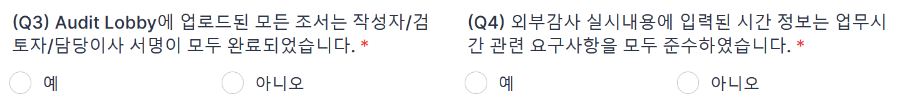
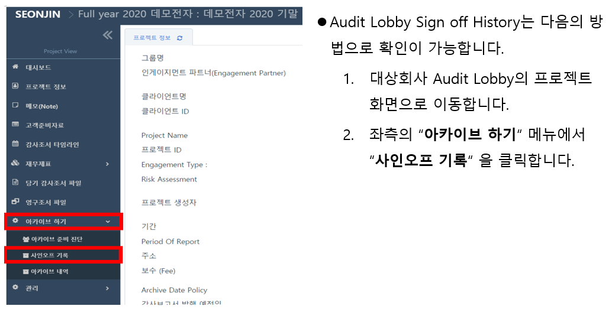
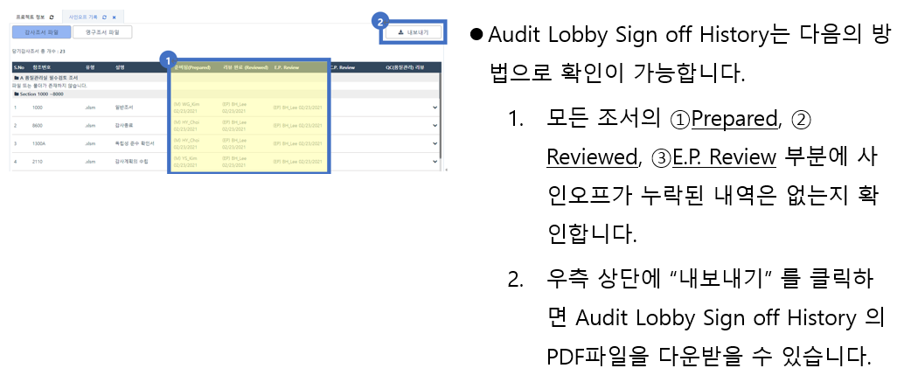
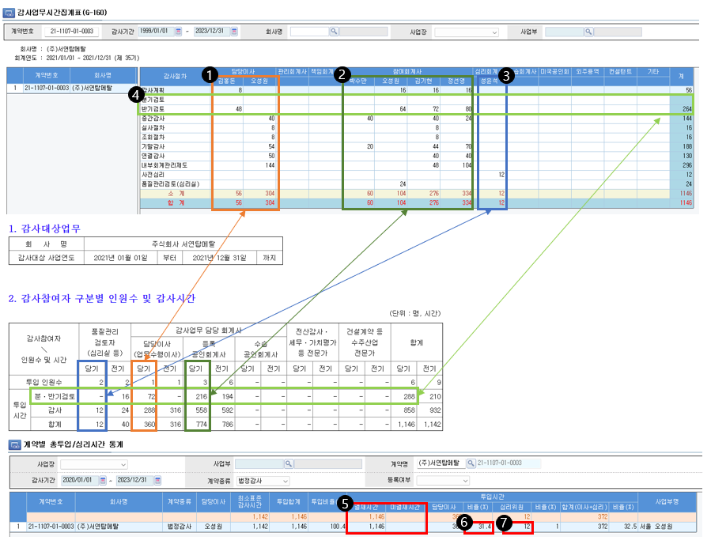
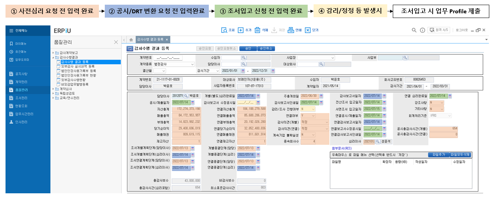
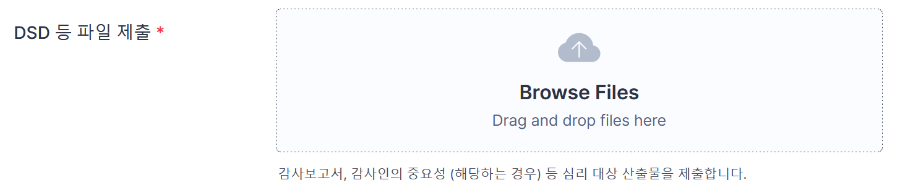
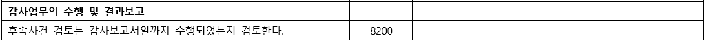
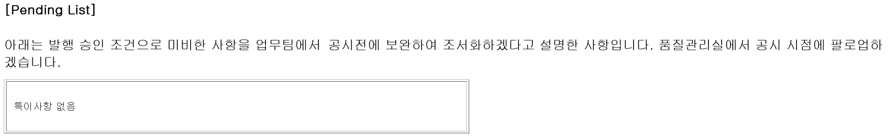
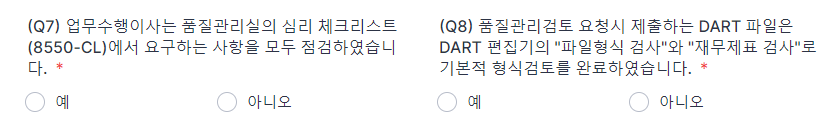

<!-- ## 사전심리와 품질관리검토 -->

품질관리실은 외부감사법에 따라 업무품질관리검토 절차를 수립하여 운영하고 있습니다. 업무품질관리검토 대상 업무의 결과물은 배정된 업무품질관리 검토자의 발행전 검토를 받습니다.

내규([#](/policy/90-%ED%92%88%EC%A7%88%EA%B4%80%EB%A6%AC%EA%B7%9C%EC%A0%95#29))에 따라 감사보고서의 발행은 품질관리업무 담당이사의 승인 대상입니다.

역시 내규에 따라 품질관리업무 담당이사는 대상업무의 발행전 [사전심리](/policy/90-%ED%92%88%EC%A7%88%EA%B4%80%EB%A6%AC%EA%B7%9C%EC%A0%95/#35) 또는 [품질관리검토](/policy/90-%ED%92%88%EC%A7%88%EA%B4%80%EB%A6%AC%EA%B7%9C%EC%A0%95/#401)를 요구합니다. 이하 사전심리와 품질관리검토 절차를 구체적으로 설명합니다. 품질관리검토 절차에서 세부적으로 다루지 않은 사항은 사전심리절차를 참고하시면 됩니다.

### 사전심리

사전심리 대상, 사전심리 실시자의 배정, 요청자와 실시자가 수행할 구체적 절차와 문서화 사항를 설명합니다.

### 사전심리의 정의

법인의 사전심리는 품질관리기준서와 감사기준서 220에서 정의하는 '업무품질관리검토'와 외감법과 하위 법령에서 요구하는 '심리' 또는 '사전심리'에 해당하는 절차입니다.

!!! quote "품질관리기준서 문단 12 용어의 정의"
    
    (d) 업무품질관리검토 - 보고서를 작성할 때 업무팀이 내린 유의적 판단 및 그 도달한 결론에 대하여 보고서일 이전에 객관적인 평가를 제공하기 위하여 설계된 절차. 업 무품질관리검토 절차는 상장기업의 재무제표감사 그리고 해당 회계법인이 품질관리검토가 필요하다고 결정한 업무를 대상으로 하는 것이다. 

따라서, 사전심리절차는 관련 법규와 기준의 요구사항에 따라 설계 및 운영합니다.

#### 사전심리 대상

다음 감사 업무는 [내규](/policy/internalPolicy/90-품질관리규정/#35)에 따라 사전심리 대상입니다.

- 외감규정의 사전심리 대상: 주권상장법인, 대형비상장주식회사, 금융회사, 감사인 지정을 받은 회사, 분사무소 소속 공인회계사가 감사업무를 수행한 회사
- 내규에 사전심리 대상에 추가 반영: 사업보고서 제출대상 회사, 직전 회계연도에 비적정의견을 받은 회사, 공공기관, K-IFRS 적용, 연결 FS 작성, 초도 또는 신규감사
- 품질관리업무 담당이사 지정: 
    
    1. 상증세법상 감사인 지정을 받은 비외감법 감사업무
    2. 외감법 감사의 재감사 업무

!!! note "사전심리대상의 선정"

    외부감사법에 의한 감사계약 체결 시점에 사전심리대상 여부를 알 수 있습니다. 계약 후 대상회사 또는 감사업무 특성의 변화에 따라 대상이 되거나, 대상에서 제외될 수 있습니다.

    품질관리실은 업무수임유지평가 서식의 아래 항목을 제출 받아 사전심리대상과 사전심리실시자를 관리합니다. 

    
    
    내규에 따라 기중 배정 내역은 사전심리실시계획에 포함되어 12월 중 대표이사의 승인으로 확정합니다.

!!! note "사유가 복수로 적용되는 경우"

    에를 들어, 주권상장법인이며 주기적 지정으로 수임한 회사의 경우 사전심리 사유는 '주권상장법인'입니다. 

!!! note "현황 업데이트"

    계약 후 다음의 사유로 특성이 변할 경우 심리대상이 될 수 있습니다. 계약 상황에 대해 지속적으로 모니터하여 업데이트해주십시오.
    
    - 감사보고서 제출로 대형비상장 여부 확정
    - 적용기준 K-IFRS로 변경
    - 기중 투자에 따라 종속회사 추가되어 연결 재무제표 작성 필요

!!! note "지정 사유 부연 설명"

    - 분사무소 소속 공인회계사가 감사업무를 수행한 회사는 대구지점의 모든 외부감사법 감사업무를 의미합니다. 
    - 비적정의견은 한정, 부적정, 의견거절 등 의견변형 뿐 아니라 계속기업 불확실성에 대한 강조사항이 기재된 적정의견도 포함합니다. 공공기관은 [공공기관 운영에 관한 법률에 따라 지정된 기관](https://www.alioplus.go.kr/organization/organByPub.do#:~:text=%EA%B3%B5%EA%B3%B5(%E5%85%AC%E5%85%B1)%EA%B8%B0%EA%B4%80%EC%9D%B4%20%EB%AC%B4%EC%8A%A8,%EC%A7%80%EC%A0%95%ED%95%9C%20%EA%B8%B0%EA%B4%80%EC%9D%84%20%EC%9D%98%EB%AF%B8%ED%95%A9%EB%8B%88%EB%8B%A4.)입니다. 
    - 초도감사는 전기에도 외감법 감사 대상이었으나 감사인을 선진회계법인으로 교체한 경우를, 신규감사는 전기에 외감법 감사 대상이 아니었고 당기 외감법 대상이 된 경우입니다.

#### 사전심리 실시자

사전심리 실시자는 [내규](/policy/internalPolicy/90-품질관리규정/#36)에 따라 품질관리업무 담당이사가 배정하고, 대표이사의 승인으로 확정됩니다. 구체적인 사항은 다음과 같습니다.

- 품질관리실은 [내규](/policy/internalPolicy/90-품질관리규정/#36)에서 정한 자격요건을 충족한 구성원을 사전심리 실시자로 배정합니다. 사전심리 실시자의 배정에는 업무의 성격과 품질관리 가용 자원 역시 고려합니다. 교차심리 금지 등 독립성 규정과 성과평가 결과, 누적 벌점등 감사품질 관련 역량이 사전심리 실시자의 배정 관련 주요 요인으로 반영됩니다. 
- 사전심리 실시자는 계약승인 시점에 배정됩니다. 업무수임유지 평가 서식의 코멘트로 배정된 사전심리 실시자가 기록되며, 사전심리 실시자는 승인된 업무수임유지 평가 서식에 참조됩니다. 업무팀은 ERP의 감사수행결과 등록 화면에 사전심리 실시자를 반영합니다.
- 사전심리 실시자의 퇴사 등 변경사유가 발생한 경우, 품질관리실은 변경 업무에 자격요건을 충족하는 다른 구성원을 사전심리 실시자로 배정하고, 업무수임유지평가 서식과 ERP에 변경 기록합니다. 
- 계약이 해지된 경우, 사전심리 실시자는 다른 처리 없이 배정 취소됩니다.

### 사전심리절차

사전심리 요청시에는 [Quality Portal-Forms and Templates](https://sjacc-quality-portal.com/forms)의 사전심리 서식의 Instruction에 따라 자체 점검 완료 후 관련 자료를 첨부하여 제출하여 주시기 바랍니다.

사전심리 각 단계별 수행주체와 절차는 아래와 같습니다.

|단계|수행절차|수행도구|수행자|
|-|-|-|-|
|심리의뢰|1. 감사조서 및 감사증거 Audit Lobby에 업로드 후 사인오프 완료|Audit Lobby|업무팀|
||2. 감사수행 결과 등록 메뉴 정보 입력 후 저장|ERP|업무팀|
||3. 사전심리 서식으로 심리 의뢰|Quality Portal|업무팀|
||4. 사전심리 실시자와 품질관리업무 담당이사 Audit Lobby Workspace 초대|Audit Lobby|업무팀|
|심리수행|5. 심리 8550CL 리뷰 및 보완|E-mail|심리실시자 업무팀|
||6. 심리실시자의 심리 진행 및 리뷰사항 보완|E-mail|심리실시자 업무팀|
||7. 심리실시자 필수조서 사인오프 수행|Audit Lobby|심리실시자|
||8. 심리실시자 Audit Lobby QC 조서 업로드 및 사인오프|Audit Lobby|심리실시자|
|심리종료|9. 심리실시자 심리 종료 (필요한 경우 미해결 이슈 코멘트 기재하여 품질관리실장에게 전달)|E-mail|심리실시자|
|발행승인|10. 품질관리업무 담당이사 8550/8550CL 조서 사인오프로 발행 승인|Audit Lobby|품질관리업무 담당이사|

#### 사전심리의뢰 유의사항

사전심리의뢰시 자체점검 질문서를 다음사항 유의하여 작성해주시기 바랍니다.

!!! quote ""

    

    - 담당이사가 리뷰 후 1번 질문에 대한 답변을 “예” 선택합니다. 사전심리 요청 시 담당이사 혹은 업무수행팀에서 감사보고서에 대한 사전검토가 수행되었음을 확인합니다.
        
        !!! warning "사인오프 보고서 스캔 등 제출 불필요"

            FY2021까지 담당이사 리뷰 후 서명한 하드카피 보고서를 제출하도록 하였으나, 효과성이 떨어져 본 질문에 대한 답으로 수행여부를 확인하겠습니다

    - 사전심리 의뢰자는 Audit Lobby에 [필수 일반조서](/qcProcedures/workingPaper/#_11)가 모두 업로드 되었는지 확인 후 2번 질문에 대한 답변을 “예” 로 선택합니다. ‘중요성요약표’는 QC 포탈에서 제공하는 [선진 서식](https://sjacc-quality-portal.com/forms)을 사용합니다.

!!! quote ""

    

    - Audit Lobby의 모든 조서에 서명이 완료되었음을 확인 후, 3번 질문에 대한 답변을 “예” 로 선택 후, Audit Lobby Sign off History출력본 PDF를 첨부합니다. 사인오프가 누락된 조서가 있는 상태로 사전심리를 요청하는 경우가 발생하고 있습니다. 감사조서로써 사용하지 않는 파일의 경우 Audit Lobby에서 삭제가 필요합니다. 

        ??? note "사인오프 히스토리 확인방법"

            
            

    - 외부감사 실시내용에 업무 시간 관련 요구사항을 모두 준수하였는지 확인 후, 4번 질문에 대한 답변을 “예” 로 선택합니다. 아래의 예시를 참고바랍니다.
        - 담당이사는 총시간의 10% 이상을 업무에 투입하여야 합니다(⑥). 사전심리 실시자는 내규에서 정한 충분한 업무시간을 투입해야합니다(⑦).
        - 미결재 업무시간이 있는지 확인합니다(⑤) (ERP-업무시간관리-계약별 총투입/심리시간 통계) 
        - 외부감사 실시내용의 투입인원, 투입시간은 ERP의 감사업무시간집계표(G-160)와 일치하여야 합니다(①, ②, ③, ④). (ERP-업무시간관리-감사업무시간집계표(G-160))
        
            !!! warning "기중 담당이사가 변경된 경우 2인 이상 담당이사 가능"

                기중 담당이사가 변경된 경우 2인 이상 담당이사를 외부감사실시내용으로 보고할 수 있습니다. 담당이사 변경시에도 기존 담당이사는 감사보고서 발행 또는 퇴사 시점까지 독립성을 유지해야 합니다.

        

!!! quote ""

    

    - 중요성 요약표(2700) 조서에 중요성 금액 산정기준이 구체적으로 충실히 기재되었는지 확인 후, 5번 질문에 대한 답변을 “예” 로 선택합니다. 
        - 감사인의 중요성 금액 DSD파일의 중요성금액과 중요성 요약표(2700)조서의 중요성 금액은 일치해야 합니다.
        - 감사인의 중요성 금액 DSD 파일은 외부감사 및 회계 등에 관한 규정 및 시행세칙, 중요성 조서, 내규에 근거하여 작성/제출합니다.

    - ERP 감사수행 결과 등록에서 필요한 정보가 모두 기입되었는지 확인 후, 6번 질문에 대한 답변을 “예” 로 선택합니다. 
        - 감사수행 결과 등록은 “ERP-품질관리-감사수행결과-감사수행 결과 등록”에서 처리합니다.

            !!! note "감사수행결과등록 Schedule"

                감사수행결과 등록에서 감사업무 결과로 생성된 고객과 업무 정보를 ERP에 기록합니다. 감사수행결과 등록에서 관리된 정보는 감사조서 입고시 다시 제출합니다. 각각의 일자는 오딧로비의 사인오프 히스토리에서 외부감사업무 필수조서에 담당이사와 사전심리담당자가 사인오프한 날짜입니다.

                

!!! quote ""

           

    - 7번 질문에 대한 답변을 “예” 로 선택 후, 업무수행팀의 자체 점검한 심리체크리스트(8550-CL) 파일을 첨부합니다. QC 포탈에서 제공하는 [8550-CL](https://sjacc-quality-portal.com/forms)을 사용합니다.
        - 심리체크리스트(8550-CL) 파일의 조서번호 Reference를 기입해주시기 바랍니다. 조서번호 Reference가 누락되면 심리실시자가 해당 조서를 찾기 어려워 리뷰과정이 지체될 수 있습니다.
        - 구체적 작성 방법은 아래 별도로 다루겠습니다.

    - 8번 질문은 DART편집기에서 ①“파일형식 검사” 와 ②“재무제표 검사”(일반기업회계기준) 를 완료한 후 질문에 대한 답변을 “예” 로 선택합니다. 파일형식 검사와 재무제표 검사가 완료되지 않은 DART 파일이 접수된 경우 반려하겠습니다.

!!! quote ""

    

    - 모든 질문에 답변을 완료하면 “Submit”이 생성됩니다. 감사보고서 DSD파일과 ②감사인의 중요성 금액 DSD파일을 첨부 후 “Submit” 을 누릅니다.

#### 사전심리체크리스트(8550CL) 작성·검토시 유의사항

사전심리체크리스트를 준비(업무팀)하고 작성(심리실시자)할 때의 유의사항입니다. 사전심리실시자는 유의사항을 심리결과에 적절히 반영해주시기 바랍니다.

!!! quote ""

    

    - 감사대상회사가 상장, 대형비상장, 금융인 경우는 [회계감사실무지침 2018-3](https://www.kicpa.or.kr/portal/default/kicpa/gnb/kr_pc/menu08/menu01/menu11.page)을 숙지하시어, 감사 전 재무제표 확인 절차조서를 작성합니다.

!!! quote ""

    

    - 채권채무조회서 발송/회수 내역을 확인할 수 있는 총괄표 조서의 작성이 필요합니다. 
    - 사전심리요청일까지 미회수된 조회처에 대해서 ①업무팀에서 수행한 대체적 절차의 방법과 ②대체적 절차 수행의 결과 및 ③그에 따른 결론의 문서화가 필요합니다.

!!! quote ""

    

    - 은행연합회 월보(결산월) 조회내역의 제출이 필요합니다.
    - 은행연합회 월보(결산월) 잔액이 관련 ①조서와 Reference를 수행 및 ②주석 공시에 누락된 부분은 없는지 검토가 필요합니다.

!!! quote ""

    

    - 후속사건 검토 관련 조서에 ①후속사건 검토를 수행한 대상 기간, ②후속사건 검토를 위해 업무팀에서 수행한 절차와 ③그에 대한 결과 및 결론의 문서화가 필요합니다.

!!! quote ""

    

    - 금융감독원이 선정한 중점심사 회계이슈로 "현금및현금성자산의 실재성과 현금흐름표 표시" 및 "사업결합"은 대상업종이 전 업종입니다. 회사의 해당 업종 확인하여 감사절차 수행하고 문서화합니다. 
    - [2023년도 재무제표 중점심사 회계이슈,업종 사전예고(금융감독원 2022)](https://www.kicpa.or.kr/board/fileMngr?cmd=down&boardId=noti&bltnNo=11669769717823&fileSeq=14&subId=sub06)를 참조하시기 바랍니다.

!!! quote ""

    

    - 감사대상회사가 비상장 법인인 경우, 한국공인회계사회 선정 2023 중점 점검분야에 대해 수행한 감사절차의 문서화가 필요합니다.
    - [2022년 비상장법인 재무제표에 대한 2023년 중점 점검분야 사전예고](https://www.kicpa.or.kr/board/fileMngr?cmd=down&boardId=asp06&bltnNo=11673309895941&fileSeq=4&subId=sub06)를 참조하시기 바랍니다.

#### 사전심리 실시절차

사전심리의뢰 후 절차는 다음과 같습니다. 사전심리 실시자와 업무팀 모두 참고 바랍니다. 

!!! quote ""

    - 심리요청 전후 업무팀은 심리실시자[^1]와 품질관리업무 담당이사를 오딧로비 워크스페이스에 초대합니다. 초대방법 등은 [오딧로비 유저가이드](https://userguide.auditlobby.com/undefined-2/auditlobby-start-guide/2.) 참고부탁드립니다.

!!! quote ""

    - 심리요청이 심리실시자에게 접수되면 제출된 감사보고서, 8550CL이 자체점검내역과 함께 다음과 같이 메일로 심리실시자에게 제출됩니다.
        
        - 심리실시자는 수신이 되지 않는 경우 스팸 편지함, 스팸 설정 등을 조정해주세요.
        - 조회서 등 하드카피 조서는 가능한 한 소프트카피로 조서화해주시고, 불가피한 경우 사전심리 실시자와 상의하시어 조서를 전달받으시기 바랍니다.
        - 업무팀은 심리실시자와 긴밀히 소통하여 일정 문제가 발생하지 않도록 조율해주세요.

        

!!! quote ""

    - 심리 실시자는 제출서류와 오딧로비 조서 등을 검토합니다. 검토 과정에서 발견된 보완이 필요한 사항을 업무수행팀 인차지, 담당이사와 커뮤니케이션해주세요.

        - 사전심리의뢰에 답장하면 인차지 주소로 이메일보낼 수 있습니다. 필요한 경우 담당이사를 추가해주세요.
        - 리뷰노트의 형식은 따로 없습니다. 보고서 표시 후 사진·스캔, 조서 캡쳐, 이메일 본문에 질의, 자체 리뷰노트 등 효과적이라 판단하는 모든 방법으로 의견 교환하시면 됩니다.
        - 심리는 감사기준서 220 문단 19-21에 따라 업무팀의 유의적 판단사항과 의견 형성에 충분한 감사증거가 입수되었는지 위주로 수행 부탁드립니다. 주석 오탈자나 비문, 계산검증, 상호참조 등 편집 관련 사항은 업무품질관리로 완화하려는 위험과 크게 관계가 없습니다. 이 부분은 재무제표 작성자와 업무팀에 맡겨주세요.
        - 사전심리에서는 감사의견과 관련 유의적 판단에 대한 감사증거가 충분하고 적합한지 위주로 코멘트해주시기 바랍니다.

    - 업무수행팀 인차지는 보완사항을 확인하여 FU (조서 작성 후 Audit Lobby업로드 및 사인오프 또는 보고서 수정 등) 후, ①FU완료여부와 ②FU한 조서번호를 기재하여 심리실시자에게 답변메일을 발송 합니다.
    - 심리 체크리스트 보완사항 FU에 대한 답변메일을 심리실시자에게 보내지 않으면 FU완료상황을 확인하기 어려워 심리절차의 진행이 느려질 수 있습니다.

!!! quote ""

    - 심리는 업무수행이사와 심리 실시자의 의견차이가 있는 경우에도 종료될 수 있습니다. 심리실시자는 업무 관련 책임의 수준을 고려하시어, 업무수행이사와 논의 끝에도 해소되지 않는 의견차이는 품질관리업무 담당이사에게 보고하는 수준에서 심리를 종료해주시기 바랍니다.
    - 심리가 종료된 경우 심리 실시자는 업무시간 입력, 8550과 8550CL 업로드 후 사인오프, 독립성/계획/감사종료 조서 사인오프 등 필요한 확인절차가 마무리되었는지 확인하신 후 사전심리의뢰 메일의 '사전심리종료' 버튼을 클릭해주세요.

        

!!! quote ""

    - 다음의 사전심리종료 화면에서 필요한 경우 ①에 업무수행이사와 의견불일치 사항 또는 펜딩사항을 입력하시고 ②를 클릭해서 심리종료하실 수 있습니다.

        

        !!! warning "사전심리 실시자는 사전심리 종료 메시지를 반드시 확인해주세요"
            
            {:width="60%"}

#### 발행승인

사전심리결과를 확인한 후 품질관리업무 담당이사는 발행승인합니다. 외감법 감사업무의 발행은 오딧로비에서 8550, 8550CL 사인오프로 승인합니다.

!!! quote ""

    - 사전심리가 완료되면 업무수행팀은 다음과 같은 메일을 받게 되며, 동 메일로 발행승인을 확인할 수 있습니다. 발행승인일은 오딧로비 사인오프일입니다.

        

    !!! warning "감사보고서일"

            - 외부감사법 감사업무 중 사전심리 대상의 감사보고서일은 사전심리 실시자가 8550과 8550CL에 사인오프한 날입니다. 품질관리업무 담당이사는 사전심리 대상의 감사보고서일과 발행승인일이 경우 후속사건에 대한 보완 후, 그 결과에 대해 다시 사인오프할 것을 요구할 것입니다. 따라서, 외부감사법 감사업무 중 사전심리 대상의 감사보고서일은 품질관리업무 담당이사의 발행승인일과 일치합니다.
            - 외부감사법 감사업무 중 품질관리검토 대상의 감사보고서일은 담당이사가 감사종료 조서에 사인오프한 날입니다.
            - 비외부감사법 감사업무의 감사보고서일은 담당이사가 감사종료를 결정한 날입니다. 발행승인과 달리 감사종료는 체계적으로 문서화하고 있지 않습니다.

!!! quote ""

    - "사전심리 등 완료/발행승인" 메일에 포함된 Pending List를 확인하여 인쇄/공시 요청 전에 조서의 보완이 필요합니다.

        

!!! quote ""

    - "사전심리 등 완료/발행승인" 메일을 받으시면 감사대상회사로부터 ①경영자확인서와 ②날인재무제표를 요청하여 입수하시기 바랍니다. 각각의 일자는 감사보고서일과 일치시켜주세요

        

### 품질관리검토 

품질관리검토에 관한 사항은 [내규](/policy/internalPolicy/90-품질관리규정/#401)에 따라 품질관리업무 담당이사가 정합니다. 이하, 품질관리검토의 성격, 대상, 요청자와 실시자가 수행할 구체적 절차와 문서화 사항를 설명합니다.

#### 품질관리검토의 성격

품질관리실은 업무수행 품질관리검토('품질관리검토')로 업무의 수행이 품질관리 절차에 따라 진행되었는지 여부를 관리합니다. 

법인의 품질관리검토는 품질관리기준서와 감사기준서 220에서 정의하는 '업무품질관리검토'가 아닙니다. 

외부감사업무의 경우 품질관리검토로 품질관리검토 실시자는 조서관리, 업무시간관리 등 품질관리제도의 관리 목적상 필수 항목에 대한 점검을 수행합니다.

#### 품질관리검토 대상 

외부감사법에 의한 감사 업무 중 사전심리 대상이 아닌 업무는 품질관리검토 대상입니다. 또한, 다음의 업무도 품질관리검토 대상입니다.

- DART에 공시되거나 금융감독원 등에 제출되는 비감사업무에 대한 보고서(예: 외부평가기관의 평가보고서 또는 실사보고서 등)
- 감사인 등의 조직 및 운영 등에 관한 규정 제5조제1항제2호부터 제19호까지에 해당하는 감사(이하, “기타법감사”)에 대한 감사(검토)보고서
- 그 외 품질관리업무 담당이사가 품질관리검토가 필요하다고 인정한 보고서
    1. 임의감사 보고서
    2. 기업진단업무 보고서

여기서는 외부감사법에 의한 감사업무에 대한 품질관리절차를 설명하고, 그 외 대상에 대한 품질관리검토는 따로 다루겠습니다.

#### 품질관리검토 실시자

품질관리검토에 관한 사항은 [내규](/policy/internalPolicy/90-품질관리규정/#401)에 따라 품질관리업무 담당이사가 배정하고, 대표이사의 승인으로 확정됩니다.

사전심리 담당자는 매년 6월 중 정기적으로 배정합니다.

- 계약이 해지된 경우, 사전심리 실시자는 다른 처리 없이 배정 취소됩니다.
- 정기 배정후 추가 계약의 경우, 계약 승인 시점에 배정하겠습니다. 배정 결과는 업무수임
- 12월 체결 계약의 경우 정기 배정 시점까지 사전심리 실시자가 배정되지 않습니다.

### 품질관리검토 절차

품질관리검토 요청시에는 [Quality Portal-Forms and Templates](https://sjacc-quality-portal.com/forms)의 품질관리검토 서식의 Instruction에 따라 자체 점검 완료 후 관련 자료를 첨부하여 제출하여 주시기 바랍니다.

사전심리 각 단계별 수행주체와 절차는 아래와 같습니다.

|단계|수행절차|수행도구|수행자|
|-|-|-|-|
|품질관리검토의뢰|1. 감사조서 및 감사증거 Audit Lobby에 업로드 후 사인오프 완료|Audit Lobby|업무팀|
||2. 감사수행 결과 등록 메뉴 정보 입력 후 저장|ERP|업무팀|
||3. 품질관리검토 서식으로 심리 의뢰|Quality Portal|업무팀|
||4. 품질관리실과 품질관리업무 담당이사 Audit Lobby Workspace 초대|Audit Lobby|업무팀|
|품질관리검토 수행|5. 보고서 본문, 자체질문서 리뷰 및 보완|E-mail|품질관리실 업무팀|
||6. 품질관리실 Audit Lobby 8550 업로드 및 사인오프|Audit Lobby|품질관리실|
|품질관리검토 종료|7. 품질관리검토 종료 (필요한 경우 미해결 이슈 코멘트 기재하여 품질관리실장에게 전달)|E-mail|품질관리실|
|발행승인|8. 품질관리업무 담당이사 8550 조서 사인오프로 발행 승인|Audit Lobby|품질관리업무 담당이사|

#### 품질관리검토의뢰 유의사항

품질관리검토시 사전심리체크리스트를 준비(업무팀 인차지)하고 작성(업무수행이사)할 때의 유의사항입니다. 업무수행이사는 유의사항을 검토결과에 적절히 반영해주시기 바랍니다.

!!! quote ""

    Q1-Q6과 Q8은 [사전심리체크리스트 작성 검토시 유의사항](/qcProcedures/qualityReview/#_5)과 동일합니다. 아래 주의사항 확인 부탁드립니다.

    !!! warning "심리시간 없음"

        품질관리검토의 경우 사전심리 실시자의 시간이 입력되거나, 외부감사실시내용으로 공시되지 않습니다.

!!! quote ""

    

    - 7번 질문에 대한 답변을 “예” 로 선택 후, 업무수행팀의 자체 점검한 심리체크리스트(8550-CL) 파일을 첨부합니다. 품질관리검토 대상은 사전심리 대상이 아니기 때문에 담당이사가 심리 체크리스트 검토를 수행합니다.

    !!! warning "8550CL 업무팀 업로드"

        담당이사가 심리체크리스트 검토를 수행하기 때문에 사전심리와 달리 품질관리검토는 8550CL을 업무팀 인차지 등이 업로드 후 작성자 사인오프합니다. 담당이사는 검토자 사인오프합니다. 업무의 실질은 자체검토이므로 사전심리 수행이 아닙니다.

#### 품질관리검토시 8550CL 작성검토 유의사항

품질관리검토의 경우 8550CL을 업무팀에서 작성하고 담당이사가 검토합니다. 이를 제외하면 [사전심리체크리스트 작성 검토시 유의사항](/qcProcedures/qualityReview/#8550cl)과 내용 동일합니다.  

#### 품질관리검토 실시절차

품질관리실에서는 감사보고서의 형식, 재무제표와 주석의 편집 일부, 품질관리검토의뢰 자체질문서 내용을 확인한 후 업무팀에 코멘트합니다. 사전심리가 아니기 때문에, 심리시간을 입력하지않습니다. 다음 검토 결과 사례 확인 부탁드립니다.

품질관리실은 위의 검토가 종료되면 8550을 오딧로비에 업로드하고 작성자 사인오프합니다. 품질관리실은 종료 결과를 품질관리업무 담당이사에게 보고합니다.

#### 품질관리검토 발행승인

품질관리검토 결과를 확인한 후 품질관리업무 담당이사는 발행승인합니다. 품질관리검토 대상 외감법 감사업무의 발행은 오딧로비에서 8550 사인오프로 승인합니다.

!!! warning "품질관리검토 발행승인일"

    품질관리검토의 감사보고서일은 업무수행이사가 감사종료(8700) 조서에 사인오프한 날입니다. 보고서 일자 관리 부탁드리며, 경영자확인서와 날인재무제표 역시 동일자로 수령하여야 합니다.

### 발행승인후

발행승인후 발행, 조서의 취합 등 후속 절차는 관련 항목 확인부탁드립니다. 

[^1]:

    이메일로 별도 공지합니다. 배정이 안되었거나, 확인이 어려운 경우 품질관리실(qualitycontrol@sjacc.co.kr)로 연락 바랍니다.

## 변경이력

절차의 추가, 수정, 삭제 등 주요 변경 내역을 기록하고 있습니다.

### 2023-10-03

사전심리 대상과 품질관리검토 대상을 추가하였고, 사전심리 실시자의 배정 관련 절차를 실무에 맞게 수정하였습니다.

1. [사전심리 대상으로 재감사업무 추가](/policy/qualityProcedure/qualityReview/#_3)
2. [사전심리 대상의 실시자 배정 절차 수정](/policy/qualityProcedure/qualityReview/#_4)
3. [품질관리검토 대상으로 기업진단업무 추가](/policy/qualityProcedure/qualityReview/#_11)

### 2023-06-21

다음 항목을 추가/수정 하였습니다.

1. [사전심리 실시자](/policy/qualityProcedure/qualityReview/#_4)와 [품질관리검토 실시자](http://localhost:8000/policy/qualityProcedure/qualityReview/#_12)
2. [사전심리대상 선정 시점](/policy/qualityProcedure/qualityReview/#_3)
3. [사전심리의 성격](/policy/qualityProcedure/qualityReview/#_2), [품질관리검토 절차의 성격](/policy/qualityProcedure/qualityReview/#_10)

### 2023-02-17

최초 배포. 아래 하이웍스 공지 내역을 종합하여 대체함.

- [[공지] (Update) [품질관리실] 기타법에 의한 감사 · 임의감사의 품질관리검토 (ERP 정보 입력 요청)](https://board.office.hiworks.com/sjacc.co.kr/bbs/board/board_view/7328/470)
- [[품질관리실] 2022 사전심리 계획 (Updated: 2022.12)](https://board.office.hiworks.com/sjacc.co.kr/bbs/board/board_view/7328/564)
- [[품질관리실] 비감사업무 관련 서식 작성 및 배포 - 공공기관 비감사업무 준법감시인 검토 서식 (2022.06)](https://board.office.hiworks.com/sjacc.co.kr/bbs/board/board_view/7328/533)
- [[품질관리실] 오딧로비 신규 클라이언트 일괄 등록 / 등록 방법 안내](https://board.office.hiworks.com/sjacc.co.kr/bbs/board/board_view/7328/517)
- [[수정] [품질관리실] 2022년 사전심리 실시자 배정 안내(Updated : 2022.05) (2)](https://board.office.hiworks.com/sjacc.co.kr/bbs/board/board_view/7328/516)
- [[품질관리실] 연결감사보고서일과 외부감사실시내용에 관한 사항 (Reminder)](https://board.office.hiworks.com/sjacc.co.kr/bbs/board/board_view/7328/506)
- [[품질관리실] 감사보고서일 문제 - 심리전 감사보고서일 결정(Backdating) 불가](https://board.office.hiworks.com/sjacc.co.kr/bbs/board/board_view/7328/505)
- [[품질관리실] 기말감사 심리/품질관리 관련 공지 : 24일까지 사전심리 우선 진행](https://board.office.hiworks.com/sjacc.co.kr/bbs/board/board_view/7328/503)
- [[품질관리실] 2021년 기말감사 현황 안내 (심리 체크리스트 공통 리뷰사항 공유 포함)](https://board.office.hiworks.com/sjacc.co.kr/bbs/board/board_view/7328/502)
- [[품질관리실] 2021년 기말감사 지침/절차 안내 ](https://board.office.hiworks.com/sjacc.co.kr/bbs/board/board_view/7328/493)
- [UPDATE: [품질관리실] 발행승인일과 감사보고서일 불일치 확인 → 확인절차 폐지](https://board.office.hiworks.com/sjacc.co.kr/bbs/board/board_view/7328/469)
- [(수정/추가) 2020년 기말감사 사전심리절차 안내 (5)](https://board.office.hiworks.com/sjacc.co.kr/bbs/board/board_view/7328/399)
- [[품질관리실] 8550CL 상장·대형비상장·금융 공통 리뷰사항 안내](https://board.office.hiworks.com/sjacc.co.kr/bbs/board/board_view/7330/420)
- [[품질관리실] 교육_사전심리 주요 변경사항 및 유의사항 안내 (일부 수정)](https://board.office.hiworks.com/sjacc.co.kr/bbs/board/board_view/7330/416)
