## 개요

감사업무수행 결과인 감사조서의 관리 절차를 설명합니다. 조서관리는 계약에서 보관의무가 종료되는 시점까지 법규에 따라 정해진 원칙을 준수하기 위한 여러 절차입니다. 아래 그림에서 나열한 수행업무를 이하 구체적으로 설명하겠습니다.

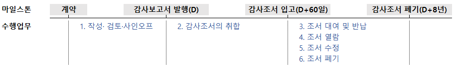

## 일반사항

### 관련 규정과 관리 목표

감사조서에 관한 일반 사항은 [감사기준서 230 감사문서]()와 관련 법규를 따릅니다. [외부감사법 제19조(감사조서)](https://www.law.go.kr/법령/주식회사등의외부감사에관한법률/(20230117,19217,20230117)/제19조)와 [외감규정 별표 1](https://www.law.go.kr/LSW//admRulBylContentsInfoR.do?bylSeq=2475125)는 다음과 같이 규정하고 있습니다.

!!! quote "외부감사법 제19조(감사조서)"

    ① 감사인은 감사를 실시하여 감사의견을 표명한 경우에는 회사의 회계기록으로부터 감사보고서를 작성하기 위하여 적용하였던 감사절차의 내용과 그 과정에서 입수한 정보 및 정보의 분석결과 등을 문서화한 서류(자기테이프ㆍ디스켓, 그 밖의 정보보존장치를 포함한다. 이하 “감사조서”라 한다)를 작성하여야 한다.

    ② 감사인은 감사조서를 감사종료 시점부터 8년간 보존하여야 한다.

    ③ 감사인(그에 소속된 자 및 그 사용인을 포함한다)은 감사조서를 위조ㆍ변조ㆍ훼손 및 파기해서는 아니 된다. 

!!! quote "외감규정 별표 1의 2. 물적설비 및 업무방법"

    바. 감사조서 등 감사업무 관련 정보의 생산부터 보존까지의 모든 과정에 걸쳐 진본성(眞本性), 무결성(無缺性), 신뢰성 및 이용가능성이 보장될 수 있도록 관리하는 체계를 갖출 것

상기 규정은 [KS X ISO15489-1 문헌정보-기록관리](https://www.standard.go.kr/KSCI/standardIntro/getStandardSearchView.do?menuId=919&topMenuId=502&upperMenuId=503&ksNo=KSXISO15489-1&tmprKsNo=KSXISO15489-1&reformNo=05)를 차용하고 있습니다. 해당 국가표준에서 진본성, 무결성, 신뢰성 및 이용가능성이 의미하는 바를 확인할 수 있습니다.

??? quote "KS X ISO 15489-1 문헌정보-기록관리 5.2.2 공신력 있는 기록의 특징"

    5.2.2.1 진본성

    진본 기록은 다음과 같은 사항을 입증할 수 있는 것이다.

    a) 기록이 표방하는바 그대로의 기록인지 b) 그것을 생산했거나 보낸 것으로 되어 있는 바로 그 행위주체가 생산했거나 보냈는지 c) 기록에 명시된 시점에 생산되었거나 보내졌는지

    기록의 진본성을 보장하기 위해 기록의 생산, 획득, 관리를 통제하는 업무 규칙, 프로세스, 방침 및 절차(6.2)를 이행하고 문서화하여야 할 것이다. 기록 생산자는 승인되고 식별되어야 할 것이다(6.3참조)

    5.2.2.2 신뢰성

    신뢰성 있는 기록은:

    a) 기록이 입증하고자 하는 처리행위, 활동 또는 사실의 완전하고 정확한 표현물로서 해당 기록의 내용을 신뢰할 수 있고 b) 이후의 처리행위 또는 활동 과정에서 의존할 수 있는 것이다.

    기록은 사실에 대한 직접적인 지식을 가진 개인에 의해서 또는 처리행위를 위해 일상적으로 활용하는 시스템에 의해서, 관련된 사건이 일어난 시점이나 또는 바로 뒤에 생산되어야 할 것이다.

    5.2.2.3 무결성

    무결성을 가진 기록은 완전하고 변경되지 않은 것이다.

    기록은 허가받지 않은 변경이 이루어지지 않도록 보호되어야 할 것이다. 기록 관리에 대한 방침과 절차에서는 생산된 이후의 기록에 무엇을 추가 또는 부기(annotations)해도 되는지, 어떤 조건에서 추가 또는 부기를 승인해도 되는지, 그리고 누구에게 그 권한을 부여할지를(6.2 참조) 명시하여야 할 것이다. 기록에 대한 승인된 추가, 부기 또는 삭제는 어떤 것이든 명확하게 표시되고 추적할 수 있도록 하여야 할 것이다.

    5.2.2.4 이용가능성

    이용가능성 있는 기록은 이해관계자들이 합당하다고 여기는 시간 안에 위치를 찾을 수 있고, 검색할 수 있으며, 보여 줄 수 있고, 해석할 수 있는 것이다.

    이용가능성 있는 기록은 그것을 생산한 업무의 프로세스나 처리행위와 연계되어야 할 것이다. 연관된 업무 처리행위를 문서화한 기록 사이의 연계는 유지되어야 할 것이다.

    기록 메타데이터는 식별자, 포맷이나 저장 정보와 같이 기록을 검색하고 보여주는 데 필요할 경우, 정보를 제공함으로써 기록의 이용가능성을 지원해야 할 것이다(5.2.3 참조).

한편 [품질관리기준서1](https://www.kicpa.or.kr/board/fileMngr?cmd=down&boardId=acc02&bltnNo=11545282555449&fileSeq=2&subId=sub06)는 다음과 같이 규정하여 조서 관리에 비밀유지, 안전한 보관, 무결성, 접근성 및 재생가능성을 고려할 것을 요구합니다.

??? quote "품질관리기준서1 문단 46"

    46 회계법인은 업무문서의 비밀유지, 안전한 보관, 무결성, 접근성 및 재생가능성을 유지할 수 있도록 설계된 정책과 절차를 수립하여야 한다.(문단 A56-A59 참조)

    업무문서의 비밀유지, 안전한 보관, 무결성, 접근성 및 재생가능성(문단 46 참조)

    A56 관련 윤리적 요구사항에서는 정보공개에 관한 의뢰인의 구체적인 승인이 없거나 정보공개의 법적 또는 전문가적 의무가 있지 않는 한, 회계법인의 구성원이 업무문서에 포함된 정보에 대하여 항상 비밀을 유지할 의무를 정하고 있다. 특정 법규에서는 특히 개인적 성격의 데이터에 대하여, 회계법인의 구성원에게 의뢰인의 비밀을 유지하는 것에 대한 추가적인 의무를 부과하기도 한다.
    
    A57 업무문서가 종이, 전자, 또는 기타 형태의 매체인지에 관계없이, 회계법인이 모르게 변경, 추가, 삭제될 수 있거나 또는 영구적으로 분실, 손상될 수 있다면 기초데이터에 대한 무결성과 접근성 및 재생가능성이 훼손될 것이다. 따라서, 회계법인이 업무문서의 승인되지 않은 변경이나 분실을 방지하기 위해 설계하고 실행하는 통제에는 다음 사항이 포함될 수 있다.
    
    • 업무문서를 언제 그리고 누가 작성, 변경 및 검토하였는지를 확인할 수 있는 통제  
    • 업무의 모든 단계에서, 특히 정보가 업무팀 내부에 공유되거나 인터넷을 통하여 다른 당사자에게 전송되는 경우, 정보의 무결성을 보호하는 통제  
    • 업무문서의 승인되지 아니한 변경을 방지하는 통제  
    • 그 책임을 적절히 이행하는 데 필요한 경우에 한하여 업무팀과 타 승인된 당사자의 업무문서 접근을 허용하는 통제
    
    한A57-1 외부감사법에 따라 실시되는 감사업무의 경우, 최종감사업무파일 취합 완료일 이후에 감독당국의 감리나 품질관리기준서에 따른 회계법인의 모니터링 과정에서 제기된 문제와 관련하여 이를 위한 추가 조치나 보완절차의 시행 등을 요구 받는 경우가 있을 수 있다. 이와 같이 불가피하게 업무조서를 최종감사파일 취합 완료일 이후에 변경하거나 추가하여야 하는 경우에는 업무조서를 변경∙추가한 자와 이를 검토한 자의 성명, 변경·추가 일시, 변경·추가의 구체적인 사유와 그 내용 등 업무조서의 변경∙추가와 관련된 정보를 기록하여 해당 업무조서 보존기간 동안 보존할 수 있어야 할 것이다.

    A58 회계법인이 업무문서의 비밀유지, 안전한 보관, 무결성, 접근성 및 재생가능성을 유지하기 위하여 설계하고 실행하는 통제에는 다음 사항이 포함될 수 있다.

    • 전자형태의 업무문서에 대한 접근을 승인된 이용자에게만 제한적으로 허용하도록 업무팀원간에 비밀번호 사용  
    • 업무의 적절한 단계에서 전자형태의 업무문서를 적합하게 저장하는 절차  
    • 업무문서를, 업무의 시작단계에서 업무팀원에게 적절히 배분하고, 업무 중에 작성하며, 업무 종료시에 취합하는 절차  
    • 인쇄된 업무문서의 경우, 이에 대한 접근제한과 적절한 배포 및 비밀유지가 되는 보관이 가능한 절차  
    
    A59 실무적인 이유로 원본 종이 문서를 업무 파일에 넣기 위하여 전자적으로 스캔할 수도 있다. 이러한 경우에 문서의 무결성, 접근성 및 재생가능성을 위해 설계된 회계법인의 절차에는 업무팀에게 다음 사항을 요구하는 것을 포함할 수 있다.

    • 수기로 작성한 서명, 상호 참조, 주석을 포함한 원본 문서의 전체 내용을 반영하여 스캔된 사본을 생성한다.  
    • 스캔된 사본을 업무파일에 통합한다. 필요한 경우, 스캔된 사본에 대한 색인 및 서명을 포함한다.  
    • 필요시 스캔된 사본을 재생하거나 출력할 수 있도록 한다.  

    회계법인이 스캔된 문서의 원본을 보관하여야 할 법규적 또는 기타 이유가 있을 수 있다

이에 더하여 관련 규정이 명시적으로 요구하고 있지는 않지만, [디지털 증거의 수집·분석 및 관리 규정 제8조](https://www.law.go.kr/행정규칙/디지털증거의수집·분석및관리규정/(1151,20210101)/제8조)에서 전자정보 압수, 수색, 검증의 기본원칙의 하나로 제시한 보관의 연속성(chain of custody)을 고려할 필요가 있습니다.

!!! quote "디지털 증거의 수집·분석 및 관리 규정 제8조"

    디지털 증거는 최초 수집된 상태 그대로 어떠한 변경도 없이 보관되어야 하고, 이를 위해 보관 주체들 간의 연속적인 승계 절차를 관리하는 등의 조치를 취해야 한다.

상기 전문가 기준과 관련 법규에서 등록법인에게 요구한 바에 따라, 품질관리실은 진본성, 무결성, 신뢰성, 이용가능성, 비밀유지, 접근성, 재생가능성, 보관의 연속성 등 법규에서 요구하는 목적을 달성할 수 있도록 조서관리 절차를 설계·운영합니다.

??? quote "(참고)외부감사인의 감사정보 관리에 대한 감독 강화"

    금융감독원은 2017년 [보도자료](https://www.fss.or.kr/fss/bbs/B0000188/view.do?nttId=13166&menuNo=200218&cl1Cd=&sdate=&edate=&searchCnd=1&searchWrd=%EC%99%B8%EB%B6%80%EA%B0%90%EC%82%AC%EC%9D%B8%EC%9D%98+%EA%B0%90%EC%82%AC%EC%A0%95%EB%B3%B4+%EA%B4%80%EB%A6%AC%EC%97%90+%EB%8C%80%ED%95%9C+%EA%B0%90%EB%8F%85+%EA%B0%95%ED%99%94&pageIndex=1)에서 감사정보와 관련한 다음과 같은 유의사항을 발표하였습니다.

    <blockquote> 
    <table>
    <thead>
        <tr>
        <th scope="col">구분</th>
        <th scope="col">내용</th>
        </tr>
    </thead>
    <tbody>
        <tr>
        <td>감사의견 등에 대한 내부통제 강화</td>
        <td>감사의견 등이 사전에 외부 유출되지 않도록 비밀엄수 및 내부통제 실시</td>
        </tr>
        <tr>
        <td>비적정 감사의견 거래소 통보</td>
        <td>감사의견이 적정이 아닌 경우 회사에 감사보고서 제출하는 즉시 한국거래소에 동 사실과 감사의견을 통보</td>
        </tr>
        <tr>
        <td>관리종목·상장폐지 요건 유의</td>
        <td>관리종목 지정 및 상장폐지 요건에 해당할 가능성이 있는 경우 보다 주의 깊은 감사 실시 (연결감사보고서 기한내 미제출시 감사보고서 미제출에 해당</td>
        </tr>
        <tr>
        <td>전임감사인과 충분한 사전협의</td>
        <td>중요한 전기오류사항 발견시 전임감사인과 충분한 사전협의 및 기초잔액에 대한 감사증거 감사조서에 적절히 기재</td>
        </tr>
    </tbody>
    </table>
    </blockquote>

### 정보보호 절차

금융감독원의 [품질관리감리매뉴얼](https://www.fss.or.kr/fss/bbs/B0000136/view.do?nttId=44309&menuNo=200449&pageIndex=1)에서 감사정보 유출방지를 위한 내부통제 절차를 구축하였는지 평가하도록 하였습니다. 법인은 대표이사의 결정에 따라 2021년 4월 26일부터 아래와 같은 절차를 구축하여 운영하고 있습니다.

|요구사항|개선전|개선후|
|-|-|-|
|정보보호 담당자 1인 지정여부|지정 없음|품질관리업무 담당이사를 정보보호 담당자로 지정|
|감사정보 보호 서약서 징구 여부|재직자 반기 1회 ERP iU로 / 입사|재직자 반기 1회 ERP iU로 / 입사 / 퇴사|
|감사정보 폐기 확인서 징구|징구하지 않음|제정된 서식을 입고시 징구|
|주기적 모니터링|수행하지 않음|6월말 연1회 감사정보 보호 서약서 / 감사정보 폐기 확인서 제출 완전성 확인|

### 감사조서, 감사파일과 개인파일

감사조서와 관련 용어를 정의하고 예시하는 것은 보관과 폐기 대상을 명확히하기 위하여 필요합니다. 

감사기준서는 **감사조서**를 다음과 같이 정의합니다. 

<blockquote> 감사인이 수행한 감사절차, 입수한 관련 감사증거 및 감사인이 도달한 결론에 관한 기록</blockquote>

또한, 감사조서의 물리적 형태를 **감사파일**이라고 하며, 그것을

<blockquote>특정 감사업무의 감사문서를 구성하는 기록들을 포함하고 있는 하나 이상의 실물 또는 전자적 형태의 편철이나 기타 저장 매체</blockquote>

라고 정의하고 있습니다.

우리는 관리 목적에 따라, 감사기준서가 정하고 있지 않은 **개인파일**을 다음과 같이 정의합니다.

<blockquote>회사의 재무제표에 대한 감사 수행 과정에서 본인이 작성하였거나 회사 등으로부터 제공받은 문서 또는 정보로서, 최종 감사조서 내에 감사의견 형성을 뒷받침하는 감사증거로서 보관할 필요가 없는 모든 문서</blockquote>

따라서, 어떠한 회사-업무 관련 문서 또는 정보는 감사파일과 개인파일로 구분할 수 있으며, 아래는 그 예시입니다.

|감사파일 (감사기준서 230 A3)|개인파일|
|-|-|
|- 감사프로그램 - 분석자료 - 이슈에 대한 비망록 - 유의적 사항의 요약 - 조회서 및 진술서 - 점검표 - 유의적 사항에 대한 왕복문서(전자우편 포함)|- 감사조서로 보관되지 않은 회사제시 자료 (거래증빙, 명세서, 전자적 형태의 소스데이터, 회사의 분석자료 등) - 감사조서 초안 및 최종 감사조서 복사본 - 재무제표 및 감사보고서 초안 - 감사팀 내부검토 지적사항 (Review notes) - 수행할 업무목록을 기재한 사항 (To-do list) - 감사절차 수행과 관련하여 회사 또는 감사팀원과 교신한 왕복문서(이메일 포함)지만 감사조서에 포함되지 않은 경우 - 기타 상기와 유사한 감사관련정보 또는 문서로서 감사조서에 포함시킬 필요가 없다고 판단되는 자료|

감사파일은 외감법과 감사기준서에 정해진 기간동안 보관후 폐기하며, 개인파일은 감사파일의 취합이 완료되는 시점에 폐기합니다.

### 조서관리자

품질관리업무 담당이사는 [내규](policy/internalPolicy/70-감사조서관리 규정/#3)에 따라 본점 품질관리실과 지점에 각각 1인의 조서관리자를 지명하였습니다. 본점 품질관리실에서 품질관리업무 담당이사와 조서관리자가 조서관리 관련 품질관리 제도를 운영합니다. 지점의 조서관리자는 직전기 지점 업무의 서면 조서 입고 승인, 보관, 본점 이관시 실사 수행 등 제한된 관리업무를 수행합니다.  

### 조서의 보관

#### 서면조서

법인은 직전기 조서를 조서관리자가 지정한 장소에 보관하고 있습니다. 기간이 경과하면 직전기 조서를 서울 문정동에 위치한 [조서창고](http://kko.to/_9BvWbrG2r)로 이관하여 법정기간동안 보관합니다.

|보관장소|직전기 조서 [1]|과거 조서 [2-8]|
|-|-|-|
|본점|품질관리실 책장|조서창고|
|대구지점|조서관리자 지정장소|조서창고|

서면조서대장은 ERPiU-조서관리 기능을 사용합니다.

#### 전자조서

법인은 외부 Application인 Audit Lobby로 전자조서를 관리합니다.

- Audit Lobby 사용법은 [Audit LOBBY User Guide('가이드')](https://userguide.auditlobby.com/)를 참고하시기 바랍니다. 
- 품질관리실과 업무팀의 사용 권한이 다릅니다. (과금 단위인) 사용자 등록관리와 Archive 해제 등은 업무팀 계정으로 수행할 수 없습니다. 
- 클라이언트 등록은 가이드의 ['A-3. 클라이언트 등록/수정/삭제하기'](https://userguide.auditlobby.com/undefined-2/auditlobby-start-guide/add_clients) 항목을 참고해주세요.
- 프로젝트 생성은 가이드의 ['A-9. 프로젝트 생성'](https://userguide.auditlobby.com/undefined-2/auditlobby-start-guide/1-3.), 감사팀 구성은 ['A-10. 감사팀 구성](https://userguide.auditlobby.com/undefined-2/auditlobby-start-guide/2.)을 참고합니다. 

    !!! warning "프로젝트ID 주의사항"

        프로젝트ID는 ERP 계약번호를 사용합니다. 분반기 워크스페이스의 ID는 '계약번호-1Q~4Q'로 정합니다. 

- 프로젝트 내부 폴더는 업무팀의 판단에 따라 구성하되, ['품질관리 필수조서'](/policy/qualityProcedure/workingPaper/#_13)와 ['입고준비'](/policy/qualityProcedure/workingPaper/#_22) 폴더는 반드시 분리해주시기 바랍니다.

## 입고전

### 작성·검토·사인오프

#### 조서 템플릿

품질관리실은 현재 일반목적의 감사 메뉴얼을 제공하고 있지 않습니다. 따라서 일반목적 감사조서 템플릿을 관리하고 있지 않습니다. 

품질관리실은 한국공인회계사가 매년 제공하는 조서 템플릿을 안내하고 있습니다. 한공회 서식은 감사기준에 따라 감사를 수행할 수 있도록 가이드로 사용하시고, 구체적인 절차의 수행 결과는 업무팀의 판단에 따라 조서화하시기 바랍니다. 

현행 서식은 [Quality Portal-Forms and Templates-현행서식파일](https://sjacc-quality-portal.com/forms)에서 입수바랍니다.  

#### 사인오프 일반원칙

법인은 주권상장법인 감사인 등록 이후 품질관리제도에 전자서명을 전면 도입하였습니다. 품질관리절차에 사용하는 하이웍스·ERPiU·오딧로비는 모두 외부 Application으로 내부 관리자가 DB를 수정할 수 없습니다. 따라서 백데이팅(back-dating)이 불가능합니다[^1].

모든 업무팀 생성 조서는 작성자와 검토자 각각의 사인오프가 필요합니다. 

1. 아래 설명하는 필수조서는 담당이사가 검토자로 사인오프합니다. 필수조서는 인차지 등 업무팀원이 작성하는 것을 원칙으로 합니다. [내규](/policy/90-품질관리규정/#28)에 따라 외부감사업무 최소 투입 인력이 2인인 것을 고려할 때 가능한 조건이라 판단합니다. 

2. 업무수행이사가 계정을 담당하는 경우 업무팀원 중 1인이 해당 업무조서를 검토하고 사인오프합니다. 

[^1]:

    백데이팅은 조서의 공신력을 훼손하며, 이를 허용할 경우 법인의 품질관리제도의 근간이 흔들립니다. 서면조서에 사인오프는 백데이팅이 쉽기 때문에 시스템으로 제어하기 어렵습니다.

#### 외부감사법 감사업무 필수조서

외부감사법에 의한 감사업무는 다음 조서를 전자조서로 제출합니다. 감사대상 회사의 속성에 따라 필수검토 조서에 차이가 있습니다. 이를 고려하시어 업무 진행에 반영해주시기 바랍니다.

|조서번호|조서명|대상 회사|사전심리실시자 사인오프|
|-|-|-|-|
|1300A-개시 (1300B 포함)  1300A-종결 (1300B 포함)|독립성 준수 검토 조서 (개별 감사 참여자의 독립성 준수 확인서)|All|O|
|7100-개시 (7100A 포함)  7100-종결 (7100A 포함)|그룹 독립성 준수 검토 조서 (그룹 감사 참여자의 독립성 준수 확인서)|All|O|
|2100|감사계획의 수립|All|O|
|2100A|업무분장표|All|X|
|2100B|감사업무시간 집계표|All|X|
|2110-1|감사전략계획서|상장·대형비상장 금융회사·증선위지정 필수|O|
|7200|그룹감사계획의 수립|그룹감사|O|
|2700 (2700A 포함)  연결 2700 (2700A 포함)|중요성 (중요성요약표 및 산정 Template)|그룹감사|X|
|8400|공시사항점검표|All|X|
|8700|감사종료|All|O|
|7570|그룹감사 종료|그룹감사|O|

#### 모든 업무참여자의 사인오프가 필요한 감사조서

감사 조서 사인오프는 업무참여자가 업무투입 시점과 종료시점에 수행합니다. 업무팀원은 사인오프로 독립성 준수여부를 확인합니다. 업무팀원이 독립성 준수기간 동안 입력한 업무시간을 취합하여 외부감사실시내용으로 공시합니다. 한편, 업무팀원은 감사종료 조서에 사인오프하여 업무수행이사의 결론이, 본인의 업무 결과 입수된 감사증거에 부합하는지를 확인합니다.

|조서번호|조서명|대상 참여자|
|-|-|-|
|1300A-개시 (1300B 포함)|독립성 준수 검토 조서 (개별 감사 참여자의 독립성 준수 확인서)|감사업무에 참여하는 모든 참여자(변경 담당이사 및 내부전문가 등 포함)가 감사 업무에 참여하는 시점에 서명|
|1300A-종결 (1300B 포함)|독립성 준수 검토 조서 (개별 감사 참여자의 독립성 준수 확인서)|업무시간을 입력한 모든 참여자(내부전문가 등 포함)가 감사종료시점(또는 퇴사시점)에 서명|
|2100A|업무분장표|업무참여자가 업무분장내용을 확인한 시점에 서명|
|7100-개시 (7100A 포함)|그룹 독립성 준수 검토 조서 (그룹 감사 참여자의 독립성 준수 확인서)|감사업무에 참여하는 모든 참여자(변경 담당이사 및 내부전문가 등 포함)가 감사 업무에 참여하는 시점에 서명|
|7100-종결 (7100A 포함)|그룹 독립성 준수 검토 조서 (그룹 감사 참여자의 독립성 준수 확인서)|업무시간을 입력한 모든 참여자(내부전문가 등 포함)가 감사종료시점(또는 퇴사시점)에 서명|
|8700|감사종료|시간을 입력한 모든 참여자(내부전문가 등 포함)가 감사종료 시점(또는 퇴사시점)에 서명|
|7570|그룹감사 종료|시간을 입력한 모든 참여자(내부전문가 등 포함)가 감사종료 시점(또는 퇴사시점)에 서명|

#### 사전심리대상 감사업무 필수조서

[사전심리대상](/policy/qualityProcedure/qualityReview/#_3)은 다음 조서를 제출합니다. 업무팀은 사전심리요청 서식에 참조 조서를 기재한 8550CL을 첨부합니다. 

사전심리 대상의 경우 사전심리실시자가 사전심리를 종료한 후 작성한 8550과 8550CL을 제출하고 사인오프합니다. 품질관리검토 대상은 품질관리실에서 8550업무수행이사가 8550CL을 제출/사인오프합니다.

|조서번호|조서명|사전심리 작성자|품질관리검토 작성자|
|-|-|-|-|
|8550|심리사항점검표|사전심리 실시자|품질관리실|
|8550CL|심리체크리스트|사전심리 실시자|업무수행이사|

!!! warning "8550/8550-CL의 업로드"

    업무팀은 오딧로비에 8550과 8550-CL을 업로드/사인오프하지 않습니다. 사전심리 담당자가 사인오프합니다.

!!! warning "사전심리조서 작성/검토 사인오프"

    8550조서는 검토 조서입니다. 따라서 사전심리 실시자의 승인은 검토 승인입니다. 오딧로비는 작성자, 검토자 모두 사인오프하는 것을 입고조건으로 하고 있습니다. 따라서 사전심리 실시자는 작성, 검토 모두 사인오프합니다.

#### 사인오프 사례

다음은 업무팀 사인오프 요구사항이 적용된 오딧로비 워크스페이스 사례입니다.
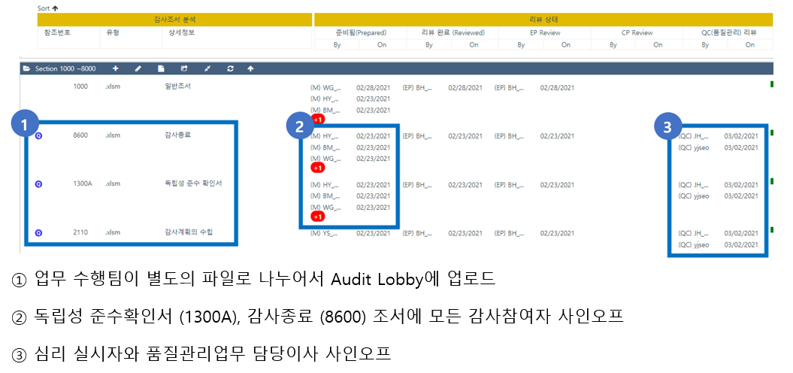

다음은 사전심리대상의 경우 사전심리담당자 사인오프 요구사항이 적용된 오딧로비 워크스페이스 사례입니다.

## 감사파일의 취합

조서의 보관에서 설명한 바와 같이 감사조서는 서면조서와 전자조서 형식으로 구분할 수 있습니다. 그 성격에 따라 관리 방법에 차이가 있습니다. 이하 필요에 따라 서면조서와 전자조서의 관리 방법을 나누어 설명할 수 있습니다.

### 감사조서 관리 절차

감사조서는 [70 감사조서관리 규정](/policy/internalPolicy/70-감사조서관리 규정/)과 [90 품질관리규정](/policy/internalPolicy/90-품질관리규정/)에 따라 관리합니다. 조서는 생산부터 보관, 폐기까지 생애 주기동안, 업무팀, 조서관리자, 품질관리업무 담당이사(조서창고)가 체계적으로 관리하고 있습니다(그림 참조).

이하 각 단계별로 수행할 업무와 문서화 내용을 설명합니다.

## 입고

### 일반사항

입고 절차와 관련한 일반 원칙은 다음과 같습니다.

- 입고기한: 개별(별도)감사보고서일로부터 60일 이내

    !!! warning ""

        연결재무제표 제출 기한이 사업연도 종료 후 120일 이내로 규정되어 있으나, 감사파일의 취합과 개인파일의 폐기 등 절차는 함께 수행될 것이므로 별도 기한에 맞춰서 진행하겠습니다.

- 입고일: 감사조서 입고증 승인일

    !!! warning ""

        아래 설명하는 바에 따라, 감사조서 입고증에는 전자조서 입고증빙이 포함됩니다. 따라서, 서면조서의 입고일은 전자조서의 입고일보다 빠를 수 없습니다.

입고는 ① 사후심리 ② 성과평가 ③ 타감사인 조서열람를 위한 선행 조건입니다. 품질관리실은 12월말 외부감사 업무의 입고절차가 5월말까지는 완료될 수 있기를 기대합니다. 후속 절차 진행을 위하여 협조 부탁드립니다. 

### 입고절차

업무팀의 입고절차는 다음 순서로 수행합니다.

1. 최종 감사조서의 취합과 개인파일의 삭제
2. (서면조서) 입고박스 준비
3. (서면조서) ERP MASTER 초기입고요청/출력 작성 
4. (전자조서) Audit Lobby Archive
5. 감사조서 입고증 작성
6. (서면조서) 조서 입고박스 제출

### 최종 감사조서의 취합과 개인파일의 삭제

업무팀은 감사보고서 제출 이후 감사조서를 하나의 감사파일로 취합하여 집계합니다. 업무수행이사는 업무팀원 중 1인을 조서 취합 담당자로 지정하거나, 직접 조서 취합을 담당할 수 있습니다. 업무수행이사는 업무에 참여한 모든 전문직원에게 다음을 지시하고 진행 내용을 확인합니다.
    
- 최종 서면조서를 취합 담당자에게 모두 제출합니다. 취합 담당자는 법인 제작 조서철에 서면 조서를 편철합니다.
- 전자조서는 감사보고서일 전에 오딧로비에 업로드·사인오프합니다. ① 사인오프된 전자조서가 최종 감사조서가 아닌 경우 혹은 ② 감사보고서 발행 전 해당 조서의 업로드·사인오프가 누락된 경우 오딧로비에 별도의 **'입고준비'**폴더를 다음 그림과 같이 생성하여, 수정 조서와 누락 조서를 업로드·사인오프 합니다. 설명한 사인오프 원칙은 이 경우에도 적용하여주십시오.

    

    !!! note "추가입고 및 감사증거 수정 보완 이력"

        오딧로비에 업로드 누락된 감사증거 혹은 버전 관리가 안된 감사증거의 경우, 엑셀 파일의 경우 추가 시트, 그렇지 않은 경우 파일 추가 등의 방법으로 누락, 버전 관리 미비 사유와 감사보고서일 시점 의견형성에 적절히 반영되었다는 점을 소명하는 '추가입고 및 감사증거 수정 보완 이력'을 자유 형식으로 업로드 후 사인오프해주세요.

- 취합담당자는 ERP에서 해당 감사업무의 '감사업무시간집계표(G-160)'를 확인하여, 하이웍스의 '감사업무 개인파일 폐기서약서'를 작성합니다.

    !!! note "감사업무시간집계표(G-160)의 조회 방법"

        1. ERP의 감사업무시간집계표로 조회 시점까지 해당 업무에 시간을 투입한 모든 전문직을 확인할 수 있습니다. 소속 사업부 문제 등 권한 문제로 조회가 되지 않는다면 담당이사에게 조회 요청합니다.

        2. ERPiU에 접속합니다. 업무시간관리-감사업무시간집계표(G-160)메뉴를 선택합니다. 

        3. 조회하고자 하는 계약의 계약번호 등을 입력하여 조회합니다. 그림과 같은 조회 화면을 확인할 수 있습니다.

            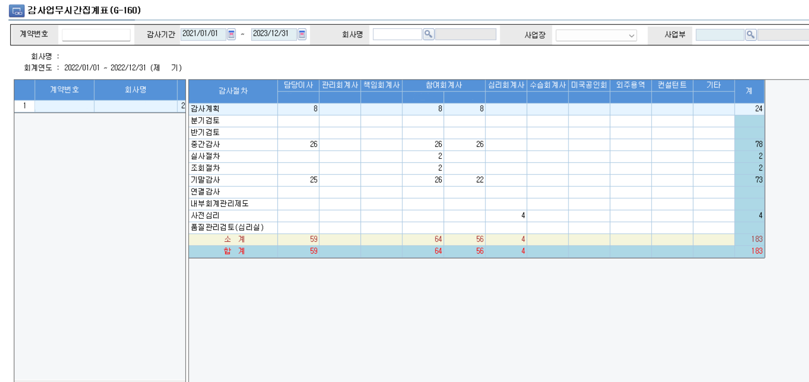

        4. 화면의 우하단에 사진기 아이콘을 클릭하여 조회 화면을 저장합니다.

            

    !!! note "감사업무 개인파일 폐기서약서"

        1. 감사업무 개인파일 폐기서약서(이하, "폐기서약서")는 기존에 하드카피로 제공하였던 'AP.7 감사정보 폐기서약서'를 대체합니다. 폐기서약서는 '하이웍스-전자결재-작성하기-문서종류:품질관리실-감사업무 개인파일 폐기서약서'로 생성할 수 있습니다.

            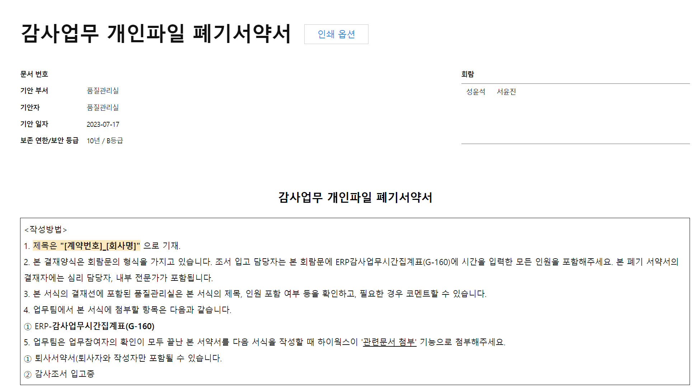

        2. 폐기서약서는 회람문 형식으로 생성됩니다. 본 문서의 회람대상자는 G-160에서 업무시간 입력이 확인되는 업무참여자입니다.        

        - 업무참여자가 기중 퇴사하게 될 경우, 업무수행이사는 폐기서약서를 생성하여 퇴사자에게 확인합니다.

            !!! warning ""

                폐기서약서 승인 대상자에는 사전심리 실시자와 내부 전문가와 포함됩니다.

    !!! warning "개인파일 폐기 서약서"

        조서 취합 시점에 개인파일 폐기 서약서 작성 이후에도, 업무팀원이 개인파일을 보관하는 것은 업무 비밀유지라는 가치를 훼손합니다. 폐기하지 않은 개인 파일은 법인이 보관하고 있는 감사파일의 진본성과 무결성에 위협이 될 수 있습니다. 따라서 개인파일을 신중하고 철저하게 폐기한 이후 서약서를 확인해주시기 바랍니다.

### 입고박스 준비

감사조서 입고증과 ERP 조서입고 기록은 감사계약 단위로 수행합니다. 

서면조서의 경우 제출·관리 편의상 법인 표준 조서 박스("입고박스")를 입고에 활용하고 있습니다. 따라서, 아래 규칙에 따라 입고박스에 박스 관리 번호를 부여하고 감사조서 입고증, ERP 조서입고 기록과 상호참조합니다.

!!! note "박스번호 인덱싱 규칙"

    조서박스는 '감사계약번호연도-업무수행이사명-일련번호'의 규칙으로 관리번호를 부여합니다.

    |구분|내용|
    |-|-|
    |감사계약번호연도|계약번호의 첫 두자리 ex. 23-xxxx-01-xxxx의 23, 2023년 업무에 대한 계약을 의미함|
    |업무수행이사명|감사업무 담당이사명|
    |일련번호|업무수행이사 연도별 생성되는 입고박스의 일련번호를 기재. 중복되거나 숫자가 누락되지 않도록 주의|

!!! note "감사조서 입고증과 상호참조"

    업무팀은 감사조서 입고증을 전자결재로 기안하고, 서면 조서를 보관한 박스를 조서관리자에게 제출합니다. 입고증에 입고박스 관리번호를 참조할 때 다음을 참고해주세요.
    
    - 입고박스에는 1개 이상의 감사업무 서면조서가 포함될 수 있습니다. 그 경우, 입고증에는 다음과 같이 입고박스 관리번호 1건이 참조될 것입니다.

        

    - 1개의 감사업무에 입고박스 여러 개가 필요할 수 있습니다. 입고증에는 다음과 같이 입고박스 관리번호 여러 건을 참조합니다.

        

    - 입고박스의 정보 기재란과 감사조서 입고증은 상호 부합하여야 합니다. 아래 사례 확인 부탁드립니다.

        

#### 박스 실물 관련 사항

품질관리실은 주기적으로 조서 박스를 제작하여 일부는 지점으로 송부하고, 나머지는 법인 6층 서고에 보관하고 있습니다. 

??? note "본점 조서박스 보관 서고 위치"

    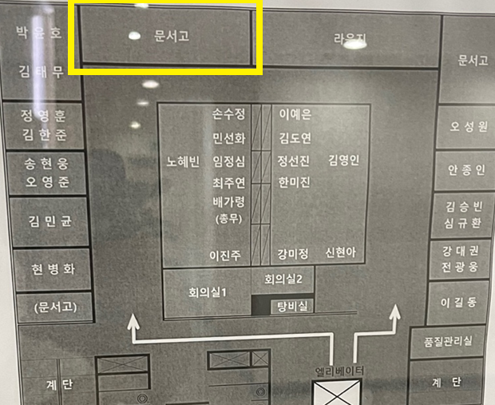

조서박스는 다음을 참고하여 접어주시고, 편철의 제목 부분이 위로 오게 넣어주시면, 조서 관리자의 실물 확인 절차 진행에 도움이 됩니다.

??? note "조서박스 접는법"
    
    

### ERP MASTER 초기입고요청/출력 작성

법인은 ERPiU의 조서관리 메뉴를 서면 감사조서 관리대장으로 사용합니다. 업무팀은 감사조서의 최초입고, 대여·반납 등의 절차를 진행할 때 조서 입출고 내역을 ERP에 기록한 후 담당이사, 본점 조서관리자의 승인을 얻어야합니다.

조서입고증의 다음 항목에 서면조서 없음을 선택하는 경우 해당 계약에는 ERP에 기록할 필요 없습니다.

 본점 조서관리자는 감사조서 입고증을 승인한 후 ERP의 조서 MASTER 초기입고요청/출력 요청을 승인합니다. ERP MASTER 초기입고요청/출력 작성 내용은 다음과 같습니다.

!!! Note "초기입고요청 기재방법"

    1. 사전작업 - '감사수행 결과 등록' 화면에서 **감사보고서일 입력** 필요. 미입력시 조서관리 메뉴에서 조회되지 않음

        ||
        |:--:|
        |*마우스 우클릭 후 '새 탭에서 이미지 열기'로 크게 볼 수 있습니다.*| 
    
    2. 계약 조회 후 선택

        |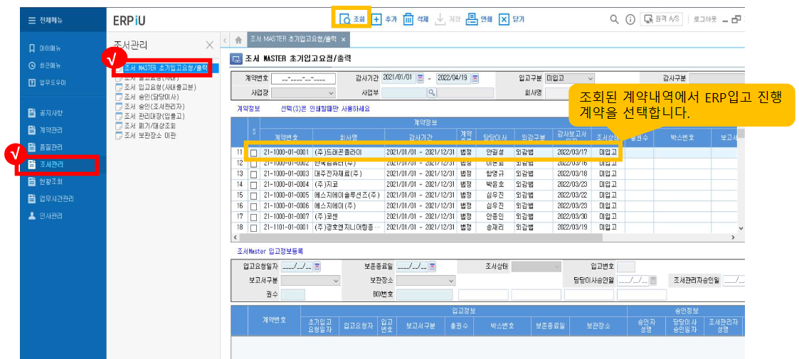|
        |:--:|
        |*마우스 우클릭 후 '새 탭에서 이미지 열기'로 크게 볼 수 있습니다.*|

    3. 조서 추가 후 입고정보등록 내용 기입

        ||
        |:--:|
        |*마우스 우클릭 후 '새 탭에서 이미지 열기'로 크게 볼 수 있습니다.*|
          
    4. 계약 조회 후 선택

        ||
        |:--:|
        |*마우스 우클릭 후 '새 탭에서 이미지 열기'로 크게 볼 수 있습니다.*|

        - 보존종료일: 입고박스와 입고증에 기재한 날짜
        - 보고서구분: 감사보고서/검토보고서(별도 입고시)/기타 중 선택
        - 보관장소: 본점(서울)/지점(대구) 선택
        - 권수: 입고증에 기재된 '조서철 권수'를 기재
        - BOX번호: 입고증에 기재된 입고박스 관리번호 기재
    
    5. 입고 승인 요청 후 담당이사, 조서관리자 입고 승인(더존 메뉴얼 관련 항목 참조)

        ??? quote "더존 ERPiU 품질관리모듈 사용법 중 관련 항목"

            |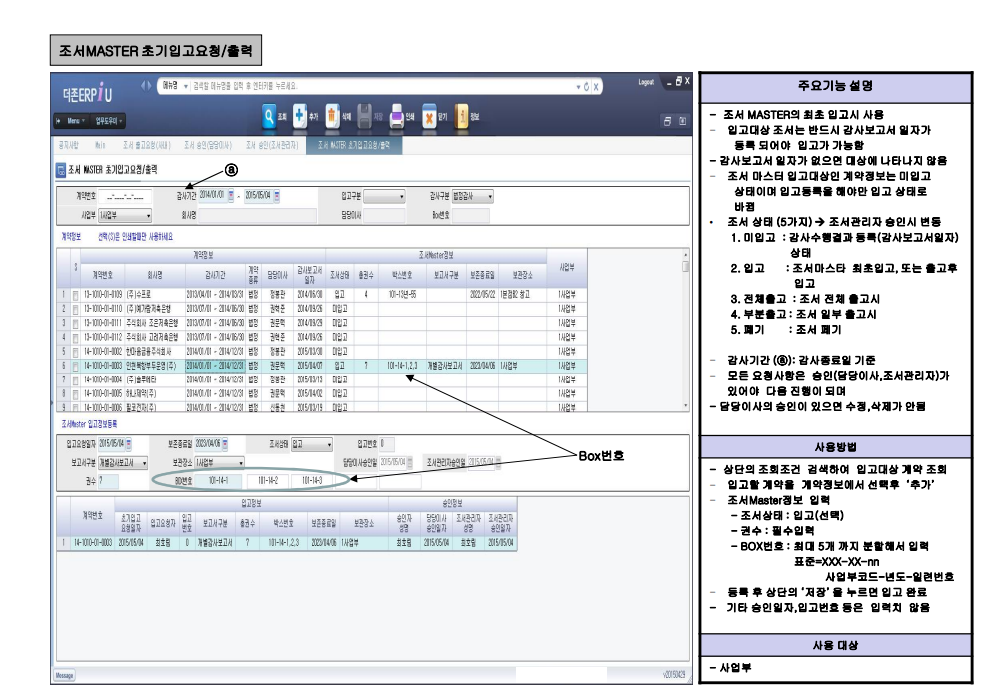|
            |:--:|
            |*마우스 우클릭 후 '새 탭에서 이미지 열기'로 크게 볼 수 있습니다.*|

### Audit Lobby Archive

오딧로비는 외부 유료 서비스입니다. [오딧로비 사용 메뉴얼](https://userguide.auditlobby.com/undefined-2/guide-by-scenario/6.#3-2.)을 참고하여 입고 진행 부탁드립니다. 

법인은 품질관리목적에 따라 Audit Lobby의 전자조서 입고조건을 다음과 같이 설정하였습니다.

#### 필요 조건

|Required Condition|Description|
|-|-|
|열려있는 파일|열려있는 당기감사조서 또는 영구조서가 없습니다|.
|리뷰 사인오프|모든 당기감사조서와 영구조서를 리뷰 사인오프 합니다.|
|Attention 상태|모든 당기감사조서와 영구조서의 Attention 항목이 완료(Completed) 상태입니다.|
|타임라인|타임라인의 모든 항목이 완료 상태입니다.|
|고객제공자료| 목록PBC 메뉴의 모든 항목이 완료 상태입니다.|
|PBC| 첨부파일PBC 메뉴에 남아있는 첨부파일이 없습니다.|
|휴지통|휴지통이 비어있습니다.|
|최종 감사보고서 발행일|최종 감사보고서 발행일을 설정합니다.|
|수정사유(Rationale)|최종 감사보고서 발행일 이후 수정된 모든 파일에 사유서(Rationale)가 있습니다.|
|프로젝트|프로젝트를 잠금처리(Lock) 합니다.|

#### 선택조건

|Optional Condition|Description|
|-|-|
|사인오프 재요청 1|사인오프가 수정된 모든 당기감사조서와 영구조서에 다시 사인오프 합니다. (화면에 붉은색 사인오프가 없습니다.)|
|QC 리뷰 사인오프|품질관리자(QC)에게 지정된 모든 당기감사조서와 영구조서에 품질관리자의 리뷰 사인오프가 있습니다.|
|코멘트|모든 당기감사조서와 영구조서에 남아있는 코멘트가 없습니다.|
|사인오프 재요청 2|내용이 수정된 모든 당기감사조서와 영구조서에 다시 사인오프 합니다. (화면에 붉은색 * 표시가 없습니다.)|
|프리페어 사인오프|모든 당기감사조서와 영구조서를 프리페어 사인오프 합니다.|
|EP 리뷰 사인오프|모든 당기감사조서와 영구조서에 인게이지먼트 파트너(EP) 의 리뷰 사인오프가 있습니다.|
|CP 리뷰 사인오프|모든 당기감사조서와 영구조서에 컨커링 파트너(CP)의 리뷰 사인오프가 있습니다.|
|Files assigned to roles|All assigned Workpaper & Permanent Files are reviewed by assigned role|

#### 아카이브 메뉴얼

아래는 참고 목적으로 품질관리실에서 작성한 Archive 메뉴얼입니다. 오딧로비의 메뉴얼과 함께 참고해주시기 바라며, 기술적 문제는 오딧로비에 직접 연락하시면 안내받으실 수 있습니다[^2].

[^2]:

    오딧로비 담당자의 연락처가 궁금하신 경우 [Contact](https://userguide.auditlobby.com/contact)를 참고해주세요. 문제 해결이 급한 경우 품질관리실로 연락주시기 바랍니다.

??? Note "Audit Lobby 입고 메뉴얼(선진)"

    1. Audit Lobby 입고 절차는 다음 순서로 진행됩니다. 이하 구체적 입고 방법을 설명합니다.
        
        !!! quote ""
        
            ① 업무수행팀은 Audit Lobby에 업로드 된 파일들에 대해 전반적인 검토를 수행합니다.

② Audit Lobby의 좌측메뉴에서 [아카이브하기] → [아카이브 준비진단]을 수행합니다.

③ 필수조건이 모두 파란색 체크인 상태에서 하단의 'Archive Pre-process'를 클릭합니다.

④ 다음의 순서대로 Archive를 진행합니다.

            1. 하단의 'Start Pre-process' 클릭  
            2. 상단의 '새로고침' 클릭  
            3. 모두 파란색 체크표시로 변경  
            4. 하단의 'Confirm Archive' 클릭

    2. 아카이브 준비 진단 
    
        2.1 (1/5) 진단

        ||
        |:--:|
        |*마우스 우클릭 후 '새 탭에서 이미지 열기'로 크게 볼 수 있습니다.*| 
    
        2.2 (2/5) 필수조건

        ||
        |:--:|
        |*마우스 우클릭 후 '새 탭에서 이미지 열기'로 크게 볼 수 있습니다.*|

        2.3 (3/5) 추가점검 항목

        ||
        |:--:|
        |*마우스 우클릭 후 '새 탭에서 이미지 열기'로 크게 볼 수 있습니다.*|
          
        2.4 (4/5) 세부내역 확인

        |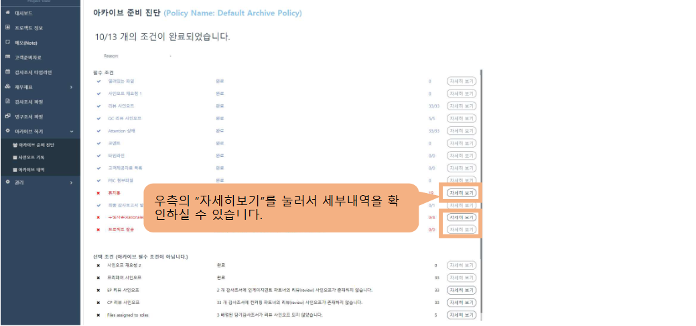|
        |:--:|
        |*마우스 우클릭 후 '새 탭에서 이미지 열기'로 크게 볼 수 있습니다.*|

        2.5 (5/5) 선택조건

        ||
        |:--:|
        |*마우스 우클릭 후 '새 탭에서 이미지 열기'로 크게 볼 수 있습니다.*|

    3. 주요 오류사항 1: 프로젝트 잠금 오류

        3.1 (1/2) 프로젝트 잠금 상태

        |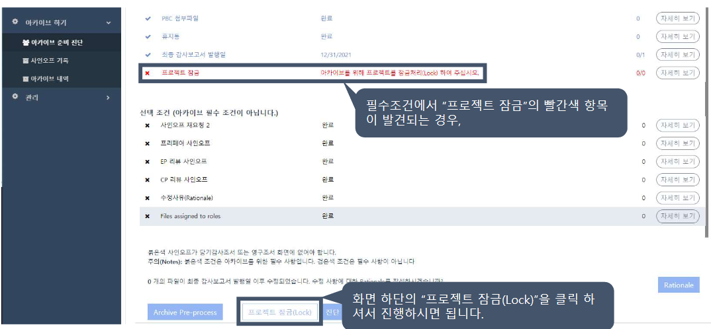|
        |:--:|
        |*마우스 우클릭 후 '새 탭에서 이미지 열기'로 크게 볼 수 있습니다.*|

        3.2 (2/2) 프로젝트 잠금 해제

        |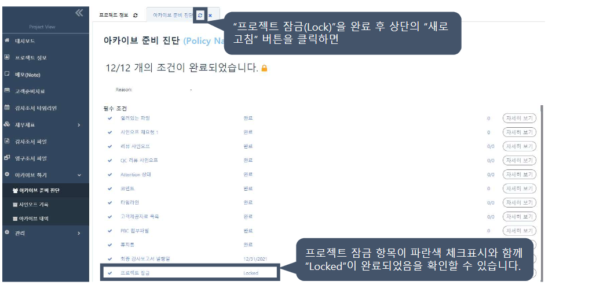|
        |:--:|
        |*마우스 우클릭 후 '새 탭에서 이미지 열기'로 크게 볼 수 있습니다.*|

    4. 주요 오류사항 2: 휴지통 

        4.1 (1/4) 휴지통 오류 발생

        |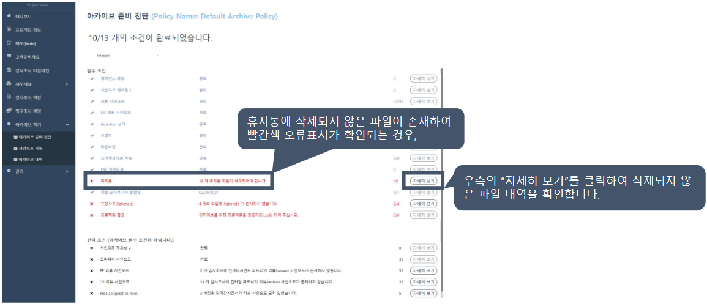|
        |:--:|
        |*마우스 우클릭 후 '새 탭에서 이미지 열기'로 크게 볼 수 있습니다.*|

        4.2 (2/4) 휴지통 파일 전체 삭제
        ||
        |:--:|
        |*마우스 우클릭 후 '새 탭에서 이미지 열기'로 크게 볼 수 있습니다.*|

        4.3 (3/4) 새로고침으로 휴지통 상태 확인

        ||
        |:--:|
        |*마우스 우클릭 후 '새 탭에서 이미지 열기'로 크게 볼 수 있습니다.*|

        4.4 (4/4) 새로고침으로 아카이브 진단 상태 확인

        |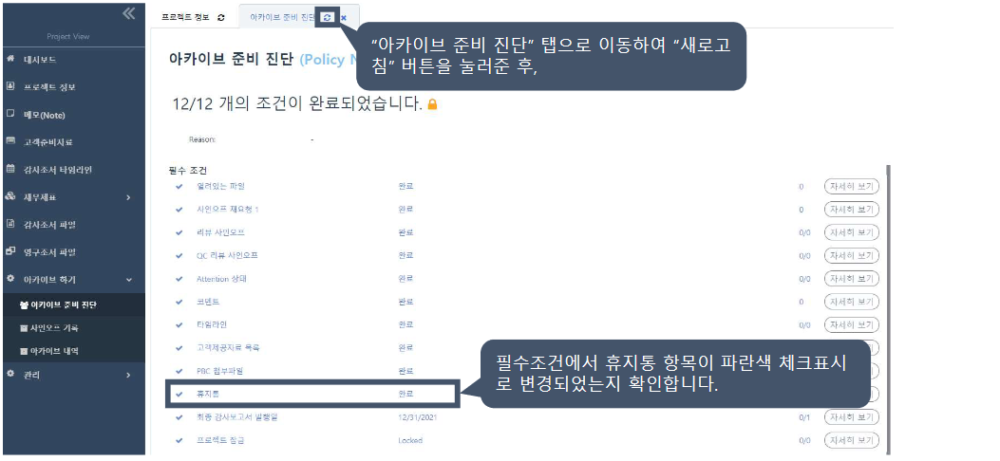|
        |:--:|
        |*마우스 우클릭 후 '새 탭에서 이미지 열기'로 크게 볼 수 있습니다.*|
        
    5. 주요 오류사항 3: 수정사유(Rationale)

        5.1 (1/2) 감사보고서일 이후 수정 사유 입력

        |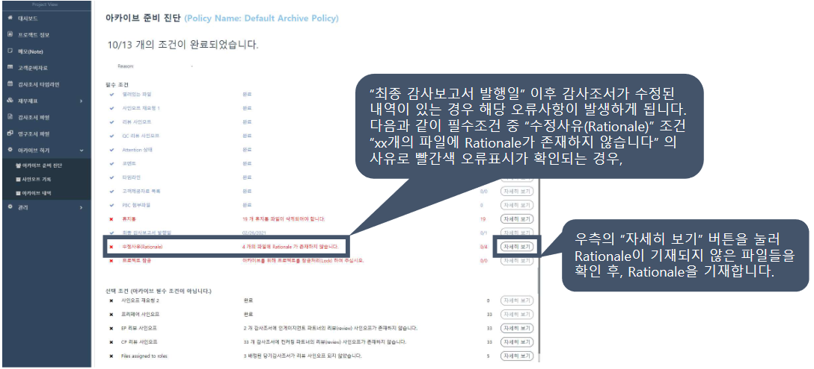|
        |:--:|
        |*마우스 우클릭 후 '새 탭에서 이미지 열기'로 크게 볼 수 있습니다.*|

        5.2 (2/2) 수정사유 입력 화면

        ||
        |:--:|
        |*마우스 우클릭 후 '새 탭에서 이미지 열기'로 크게 볼 수 있습니다.*|
    
    6. Archive Pre-process

        6.1 (1/2) Archive Pre-process 클릭

        |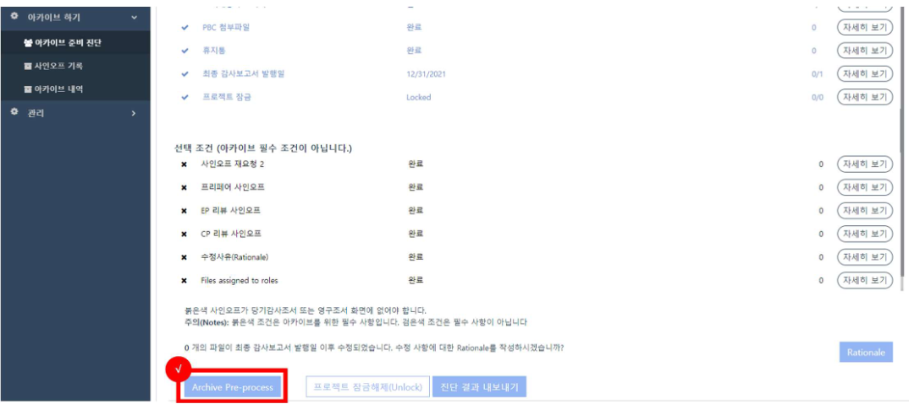|
        |:--:|
        |*마우스 우클릭 후 '새 탭에서 이미지 열기'로 크게 볼 수 있습니다.*|   

        6.2 (2/2) Archive Pre-process 진행

        ||
        |:--:|
        |*마우스 우클릭 후 '새 탭에서 이미지 열기'로 크게 볼 수 있습니다.*|

Audit Lobby 아카이브가 완료되면 다음과 같은 '아카이브 생성 안내' 메일을 수신하게 됩니다. 해당 메일을 PDF로 출력한 후 감사조서 입고증에 첨부합니다. 메일을 수신한 날짜는 '전자조서 입고일자'입니다. 

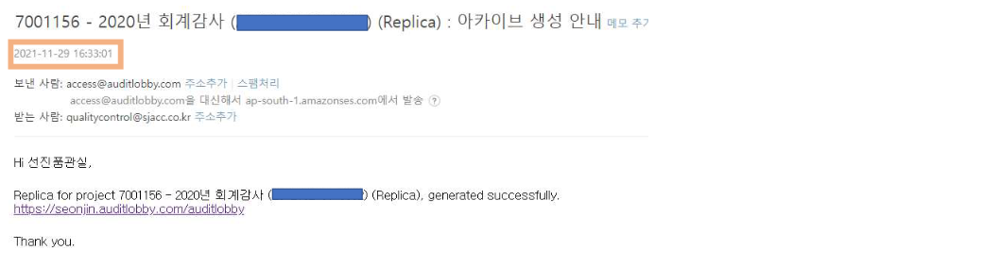

!!! warning "이메일 삭제"

    아카이브 메일을 삭제하여 전자조서 입고 증빙을 제출하지 못하는 경우가 있습니다. 
    
    ① 오딧로비의 '아카이브 관리' 메뉴에서 아카이브 생성 기록을 검색하여 화면 캡쳐한 내용을 제출할 수 있습니다.

!!! warning "Preprocess PDF"

    다음의 메일은 Archive Preprocess가 완료되었다는 안내입니다. 전자조서 입고 확인시 적격 증빙이 아니오니 제출시 참고 바랍니다. 
    
    

!!! warning "Audit Lobby Replica 접근 권한 일괄 조정"

    오딧로비는 아카이브시 레플리카를 자동 생성합니다([참고](https://userguide.auditlobby.com/undefined-2/guide-by-scenario/6./4-3.replica)). 오딧로비 사용자 가이드는 레플리카의 특성을 다음과 같이 설명합니다.

    !!! quote "레플리카의 특성"

        - 레플리카 프로젝트에서 기존 프로젝트의 조서를 다운받거나 열람할 수 있습니다.
        - 레플리카 프로젝트를 롤 포워드 하여 새로운 프로젝트를 만들 수 있습니다.
        - 새로운 사용자를 추가하여 열람, 다운로드, 롤 포워드 권한을 부여할 수 있습니다.
        - 레플리카 프로젝트의 조서를 수정할 수 없습니다.(열람과 다운로드만 가능합니다.)
        - 레플리카 프로젝트에 가해진 수정은 아카이브된 프로젝트에 영향을 주지 않습니다.
        - 레플리카 프로젝트 생성될 때, 기존 프로젝트에서 프로젝트 및 아카이브 관리자였던 사용자, 그리고 프로젝트 관리자이면서 포워드권한이 있었던 사용자만 활성화되고, 다른 사용자들은 모두 비활성화 처리됩니다.

    법인은 오딧로비 워크스페이스 접근을 엄격히 제한하기 위하여, 감사조서 입고증 검토 단계에서 관리자로 레플리카에 접근하여 활성화된 '프로젝트 및 아카이브 관리자', '프로젝트 관리자이면서 포워드 권한이 있었던 사용자'를 비활성화하겠습니다. 

    레플리카 워크스페이스의 편리함에도 불구하고, 전자조서 입고 내용을 출고 절차 없이 확인한다는 문제점을 해결하기 위한 정책입니다.

### 감사조서 입고증 작성 및 승인

지금까지 설명한 절차는 감사조서 입고증에 모두 집계됩니다. 조서관리자는 폐기 서약내용, 전자조서 입고, 서면조서 제출 내용 등을 종합 검토한 후 감사조서 입고증을 승인합니다.

감사조서 입고증 승인 후 조서관리자의 후속 절차는 다음과 같습니다.

- ERP MASTER 초기입고요청/출력 승인
- 실물 조서 박스 잠금장치가 있는 [보관장소](/policy/qualityProcedure/workingPaper/#_7)에 입고

감사조서 입고증은 '하이웍스-전자결재-공통-감사조서 입고증'을 사용합니다. 

!!! Note "감사조서 입고증"

    1. 제목은 "**[계약번호]_[회사명]**"으로 하고, 아래의 기본정보를 누락없이 정확하게 기재합니다.

        

        - 계약번호는 ERP 계약번호를 의미합니다(ex. 23-1111-01-0001 형식)
        - 감사조서 입고기한은 감사보고서일로부터 60일이내 입니다.
        - 감사조서 보존기한은 [외감법 제19조](https://www.law.go.kr/법령/주식회사등의외부감사에관한법률/(20230117,19217,20230117)/제19조)에 따라 감사종료일([판례](/policy/qualityProcedure/workingPaper/#_41)는 감사보고서일로 보고 있습니다)로부터 8년입니다.

            !!! warning ""

                제목의 정보는 품질관리 모니터링 목적으로 활용됩니다. 정확하게 기재하여주시기 바랍니다. 형식 검토 단계에서 제목 수정이 요구될 수 있습니다.
        
        - 서면조서가 없는 경우 '서면조서 유무'에 없음을 기재합니다. 하단의 서면조서 입고박스 관련 정보와 ERP 입고 처리가 불필요합니다.

    2. (서면조서가 있는 경우) 서면조서 관련정보를 정확히 기재합니다. 

        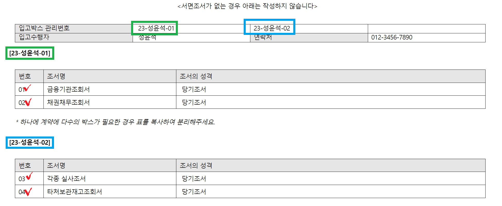

        - 입고박스 관리번호와 조서표 기재 관련 사항은 [입고박스 준비](/policy/qualityProcedure/workingPaper/#_23)의 '감사조서 입고증과 상호참조'를 참고합니다.
        - 입고수행자는 업무팀의 입고 담당자 성명을 기재합니다. 조서관리자와 담당자는 입고 관련 실무 진행 내용을 상의합니다.
        - **[입고박스 관리번호]** 부터 입력표까지 부분은 박스단위로 기재합니다. 하나의 계약에 두 개 이상의 박스가 필요한 경우 표를 복사하고, '입고박스 관리번호' 부분을 해당 입고박스 관리번호로 변경합니다. 그러나 '조서철 번호'는 계약 단위로 유일한 값을 부여합니다. 위의 예시에서 관련 사항을 확인할 수 있습니다.

    3. 결재선은 신청(작성자 → 담당이사) → 처리(품질관리실 → 조서관리자(본점은 "서윤진 회계사", 대구지점은 "강명석 회계사") 순서입니다.
    
    4. 제출 후 절차는 다음과 같습니다.
    
        1. 담당이사까지 승인한 본 서식은 품질관리실에서 ① 제목과 작성내용의 형식 검사 ② Audit Lobby Replica 접근권한 조정 후 처리합니다.
        2. 조서관리자는 실물 인수 내용, ERP 기재 내용, 본 서식을 상호대사/증빙 첨부 후 승인합니다(조서입고일 결정).
        3. 본점 조서관리자는 조서입고증 승인 내역 확인 후 ERP MASTER 초기입고요청 승인합니다.

    5. 첨부항목은 다음과 같습니다.

        A. 업무팀에서 본 서식에 첨부할 항목은 다음과 같습니다. (하이웍스 문서는 관련문서 첨부로 참조합니다)

        ① ERP감사업무시간집계표(G-160)에 시간을 입력한 전원이 서명한 감사업무 개인파일 폐기서약서 ② Audit Lobby Archive 확인증빙

        B. (서면 조서가 있는 경우) 조서관리자가 입고 승인 전 첨부할 항목은 다음과 같습니다.

        ① 입고박스에 보관된 입고조서 실물사진 ([핸드폰의 하이웍스앱-전자결재-입고증-추가항목(···)-파일첨부-사진찍기]로 입고증에 사진을 첨부할 수 있습니다.)

        ??? notice "입고조서 실물사진의 입력 사례"

            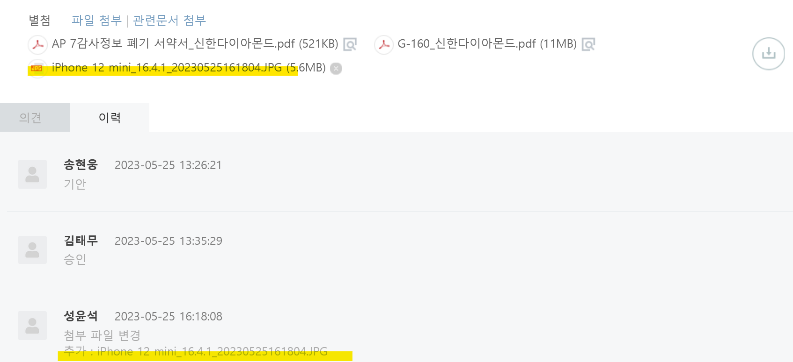

            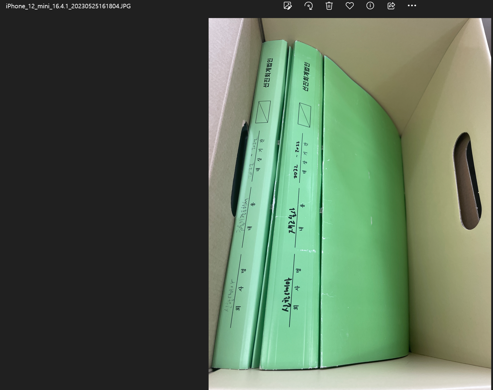

### 조서 입고박스 제출

업무팀 입고 담당자는 감사조서 입고증을 제출한 후 조서 입고박스를 조서관리자에게 제출합니다. 조서관리자는 조서철의 명칭과 수량이 감사조서 입고증과 일치하는 지 여부를 확인한 후 입고박스를 책임하에 조서창고에 보관합니다.

!!! warning "무결성의 한계"

    조서관리자는 감사조서 입고증에 기재된 제출 조서철 수량과 입고박스에 포함된 조서철 수량과 조서명이 일치할때 입고 승인합니다. 이후 출고, 재입고 과정에서 업무팀의 무결성 주장은 조서관리자의 관리 책임 하에서는 반납 조서철의 수량, 명칭과 직전 입고기록이 일치하는 경우 인정됩니다.
 
## 출고 및 재입고

[품질관리기준서1](https://www.kicpa.or.kr/board/fileMngr?cmd=down&boardId=acc02&bltnNo=11545282555449&fileSeq=2&subId=sub06)는 업무문서의 소유권에 대하여 다음과 같이 설명하고 있습니다.

<blockquote>A63 법규상 달리 명시하고 있지 않는 한, 업무문서는 회계법인의 자산이다. 회계법인은 업무문서의 일부나 발췌 내용을 공개하는 것이 수행된 업무의 유효성이나, 인증업무 경우의 회계법인 및 구성원의 독립성을 훼손하지 않는다면 회계법인의 재량으로 의뢰인이 이를 이용하게 할 수 있을 것이다.)</blockquote>

한국공인회계사회가 제공하는 [표준 외부감사계약서](https://www.kicpa.or.kr/portal/default/kicpa/gnb/kr_pc/menu02/menu04/menu09.page)는 다음과 같이 감사조서의 소유권을 정하고 있습니다.

<blockquote>제19조(감사조서의 소유권) 감사과정에서 감사인이 작성한 조서, 기타 전자문서나 전자파일 등에 대한 소유권은 감사인에게 있다.</blockquote>

관련 규정과 기준에 따라 생산되어 취합된 감사조서의 소유권은 따라서 감사인에게 있습니다. 여기서 감사인이라 함은 업무수행이사가 아닌 [외부감사법 제2조](https://www.law.go.kr/법령/주식회사등의외부감사에관한법률/(20230117,19217,20230117)/제2조)에서 정한 바 회계법인 또는 감사반을 의미할 것입니다. 

법인은 조서관리자가 감사조서를 법과 여러 전문가기준의 요구에 따라 관리할 수 있도록 하는 출고와 재입고 절차를 구축하고 있습니다.

### 출고 사유

감사인 등[^3]은 감사조서의 소유권을 가질 뿐 아니라 [외감법 제20조](https://www.law.go.kr/법령/주식회사등의외부감사에관한법률/(20230117,19217,20230117)/제20조)에 따라 원칙적으로 직무상 비밀을 엄수하여야합니다.

[^3]:
    감사인, 감사인에 소속된 공인회계사, 증권선물위원회 위원, 감사 또는 감리 업무 보조자, 증선위 위탁업무 수행 한국공인회계사회 관련자

따라서 입고 조서 열람 혹은 대여는 다음에 사유에 한하여 제한적으로 수행하고 있습니다.

1. 계속감사 업무팀의 업무 참고·롤포워드 워크스페이스 생성
2. 감리기관의 제출 요구([외부감사법 제27조](https://www.law.go.kr/법령/주식회사등의외부감사에관한법률/(20230117,19217,20230117)/제27조))
3. 내·외부 모니터링 결과 추가조치나 보완절차 시행([품질관리기준서1](https://www.kicpa.or.kr/board/fileMngr?cmd=down&boardId=acc02&bltnNo=11545282555449&fileSeq=2&subId=sub06) 문단 한A57-1)
4. 재감사·단순기재 정정
5. 차기 감사인의 기초잔액 확인 절차 협조(감사기준서 510 A4)
6. 다른 법률에 특별한 규정이 있는 경우([외부감사법 제20조](https://www.law.go.kr/법령/주식회사등의외부감사에관한법률/(20230117,19217,20230117)/제20조))

### 출고 단위

서면조서는 출고 목적에 따라 전체 출고 또는 부분 출고가 가능합니다. 출고 수량과 조서번호, 조서명은 출고증의 기재내용과 일치하여야 합니다.

전자 조서는 Replica 또는 Unarchived Workspace로 출고합니다.

### 감사조서 출고증 작성 및 승인

출고 사유에 해당하여 조서를 출고하려는 업무팀은 ERP 출고요청 후 하이웍스 감사조서 출고증을 작성합니다. 

감사조서 출고증 승인 후 조서관리자 수행 절차는 다음과 같습니다.

- ERP 조서출고요청 승인
- 오딧로비 Replica 또는 Archive 해제 절차 진행
- 실물 조서 출고

#### ERP 출고요청

법인은 ERPiU의 조서관리 메뉴를 서면 감사조서 관리대장으로 사용합니다. 업무팀은 감사조서의 최초입고, 대여·반납 등의 절차를 진행할 때 조서 입출고 내역을 ERP에 기록한 후 담당이사, 본점 조서관리자의 승인을 얻어야합니다.

!!! Note "출고요청 기재방법"

    1. 'ERP MASTER 초기입고요청/출력'화면에 입고승인이 된 경우만 출고 요청 가능
    
    2. 계약 조회 후 선택

        ||
        |:--:|
        |*마우스 우클릭 후 '새 탭에서 이미지 열기'로 크게 볼 수 있습니다.*|

    3. 조서 추가 후 입고정보등록 내용 기입

        ||
        |:--:|
        |*마우스 우클릭 후 '새 탭에서 이미지 열기'로 크게 볼 수 있습니다.*|

        - 출고구분/출고권수: 전체출고 혹은 부분 출고를 선택합니다. 전체 출고의 경우 출고권수는 자동으로 전체 수량 입력되며, 부분 출고의 경우 조서철의 권수를 입력합니다. 출고 조서수는 출고증의 출고 내역과 일치하여야 합니다.

            !!! notice "부분 출고 가능"

                출고 관리절차 변경으로 부분 출고가 가능합니다.

        - 사유: 조서 출고증에 입력한 '출고 사유'를 입력합니다.
        - 비고: 조서 출고증의 '문서 번호'를 입력합니다.
        - 입고예정일자: 조서 출고증의 '출고 후 재입고 완료 예정일'을 입력합니다.
          
    4. 저장

        ||
        |:--:|
        |*마우스 우클릭 후 '새 탭에서 이미지 열기'로 크게 볼 수 있습니다.*|

    5. 출고 승인 요청 후 담당이사, 조서관리자 입고 승인(더존 메뉴얼 관련 항목 참조)

        ??? quote "더존 ERPiU 품질관리모듈 사용법 중 관련 항목"

            ||
            |:--:|
            |*마우스 우클릭 후 '새 탭에서 이미지 열기'로 크게 볼 수 있습니다.*|

#### 출고증 작성

감사조서 출고증은 '하이웍스-전자결재-공통-감사조서 출고증'을 사용합니다. 

!!! Note "감사조서 출고증"

    1. 제목은 "**[계약번호]_[회사명]**"으로 하고, 아래의 기본정보를 누락없이 정확하게 기재합니다.

        !!! warning ""

            제목의 정보는 품질관리 모니터링 목적으로 활용됩니다. 정확하게 기재하여주시기 바랍니다. 형식 검토 단계에서 제목 수정이 요구될 수 있습니다.

        

        - 계약번호는 ERP 계약번호를 의미합니다(ex. 23-1111-01-0001 형식)
        - [출고 목적](/policy/qualityProcedure/workingPaper/#_31)은 인스트럭션 내용을 참조하여 기재합니다.
        - 첨부 '감사조서 (재)입고증'의 서면조서 입고일과 전산조서 입고일을 확인합니다. 출고 후 재입고가 있었던 경우 재입고증의 승인일을 입력합니다.
        - 출고대상 Workspace에는 프로젝트 ID를 입력합니다. Version은 **Archived** 또는 **Replica**를 기재합니다. 조서관리자는 해당 프로젝트 ID의 최종 아카이브 또는 레플리카를 제공합니다.
        - 서면조서를 출고하는 경우 '서면조서 출고 유무'에 '있음'을 기재합니다. 서면조서 출고가 없는 경우에는 하단의 서면조서 입고박스 관련 정보와 ERP 출고 처리가 불필요합니다.        

    2. (서면조서가 있는 경우) 서면조서 관련정보를 정확히 기재합니다. 

        

        - 입고박스 관리번호와 조서번호는, 출고증에 첨부하는 입고증과 아래의 '입고 기록의 상호 일치 확인'을 참고하여 정보가 상호 부합하도록 주의해주세요.
        - 입고수행자는 업무팀의 입고 담당자 성명을 기재합니다. 조서관리자와 담당자는 입고 관련 실무 진행 내용을 상의합니다.
        - 입력표까지 부분은 조서철단위로 기재합니다. 해당 조서가 포함되어있는 입고박스와 조서철 명칭은 감사조서 입고증에서 정보를 확인합니다.

    3. 결재선은 신청(작성자 → 담당이사) → 처리(품질관리실 → 조서관리자(본점 "서윤진 회계사", 지점 "강명석 회계사") 순서입니다.

        |구분||결재선|
        |-|-|-|
        |서면조서 출고|직전기[1]|신청(작성자 → 담당이사) → 처리(품질관리실 → 조서관리자(본점 "서윤진 회계사", 지점 "강명석 회계사")|
        ||과거[2-8]|신청(작성자 → 담당이사) → 처리(품질관리실 → 본점 조서관리자(본점 "서윤진 회계사")|
        |전산조서 출고|-|신청(작성자 → 담당이사) → 처리(품질관리실 → 본점 조서관리자("서윤진 회계사")|

        !!! notice "본지점 조서관리자가 모두 결재선에 포함되는 경우"

            직전기 서면조서와 전산조서를 모두 출고할 경우 본지점 조서관리자가 모두 결재선에 포함됩니다. 이 경우 처리선에 **지점 조서관리자 → 본점 조서관리자**의 순서로 결재선을 설정합니다.

            - 지점 조서관리자는 출고증의 내용을 확인한 후 출고 처리하며 출고 증빙을 첨부합니다.
            - 본점 조서관리자는 조서 출고 증빙과 출고증 내용을 확인한 후 Audit Lobby 출고 처리합니다.

        !!! warning "직전기와 과거 조서"

            관리 목적상 직전기 감사조서는 본점과 지점의 지정된 장소에 보관하고 있으며, 나머지 법정 기간 의무 보관 대상 조서는 본점, 지점이 아닌 다른 장소(문정동 창고)에 보관하고 있습니다. 따라서 과거 조서의 경우 본점 조서관리자의 승인으로 제출합니다.
    
    4. 제출 후 검토 절차는 다음과 같습니다.
    
        1. 담당이사까지 승인한 본 서식은 품질관리실에서 제목과 작성내용의 형식 검사 후 처리합니다. 
        2. 조서관리자는 입고증과 출고 요청 등의 내용을 확인하고 조서 출고증을 승인합니다. 

    5. 첨부항목은 다음과 같습니다.

        A. 업무팀에서 본 서식에 첨부할 항목은 다음과 같습니다. (하이웍스 문서는 관련문서 첨부로 참조합니다)

        ① 감사조서 입고증 ② 감사조서 재입고증(전부) ③ (사유에 해당하는 경우) 전기감사조서 열람 관련 확인서(날인본)

!!! Warning "입고 기록의 상호 일치 확인"

    출고증 작성시 하이웍스, ERP, 오딧로비의 정보가 상호 일치 여부를 주의해주세요.

    |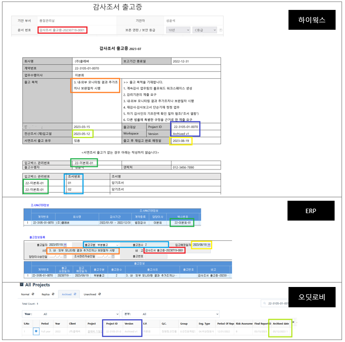|
    |:--:|
    |*마우스 우클릭 후 '새 탭에서 이미지 열기'로 크게 볼 수 있습니다.*|

### 출고증 승인후 처리

#### 서면조서

조서관리자가 출고증 승인후 출고 대상 조서가 보관되어 있는 조서박스를 조서보관소 또는 조서창고에서 출고합니다. 출고된 조서박스에서 출고 대상 조서를 대여용 박스에 옮기고, 출고된 조서박스는 조서보관소에 임시 입고합니다. 대여용 박스를 업무팀에게 넘기기 전에 아래 증빙을 생성하여 감사조서 출고증에 첨부합니다.

① 출고조서 실물사진[^4] 

[^4]: [핸드폰의 하이웍스앱-전자결재-입고증-추가항목(···)-파일첨부-사진찍기]로 출고증에 사진을 첨부할 수 있습니다.

#### 전자조서

전자조서의 대여는 출고 사유에따라 다음 두 가지 경우로 구분하여 본점 조서관리자가 처리합니다.

!!! warning ""

    법인이 사용하는 외부 서비스 Audit Lobby의 경우 입고 전자조서의 무결성·진본성을 유지하기 위하여, 최초 입고된 워크스페이스는 수정할 수 없으며, 아카이브의 복사본을 조회하거나 수정하도록 하고 있습니다. 전자조서에 대한 아래 처리는 비밀엄수 관점에서 설계되었습니다.

|절차|레플리카 사용|아카이브 해제본 생성|
|-|-|-|
|사유|1.계속감사 업무팀의 업무 참고·롤포워드 워크스페이스 생성 2.감리기관의 제출 요구(외부감사법 제27조) 5.차기 감사인의 기초잔액 확인 절차 협조(감사기준서 510 A4) 6.다른 법률에 특별한 규정이 있는 경우(외부감사법 제20조)|3.내·외부 모니터링 결과 추가조치나 보완절차 시행(품질관리기준서1 문단 한A57-1) 4.재감사·단순기재 정정|
|재입고|없음|있음|
|기간 경과후 처리|조서관리자가 레플리카 워크스페이스 초기화|업무팀이 입고절차를 준용하여 재입고 절차 진행|
|AL 가이드|[3-3. 레플리카(아카이브 사본) 이용하기](https://userguide.auditlobby.com/undefined-2/guide-by-scenario/6./4-3.replica)|[5-2. 아카이브 해제하기](https://userguide.auditlobby.com/undefined-2/guide-by-scenario/5./4-3.unarchive)|

#### 차기 감사인의 조서열람

우리가 전임감사인으로서 타 감사인(당기감사인)으로부터 전기감사조서 열람 요청을 받았을 경우에 취할 절차를 안내합니다. 우리가 당기감사인으로서 타 감사인(전임감사인)에게 전기감사조서 열람을 신청하는 경우를 참고로 제공합니다.

!!! notice "우리가 전기감사인인 경우 조서열람 절차"

    우리가 전임감사인으로서 타 감사인으로부터 전기감사조서 열람 요청을 받았을 경우

    □ 우리가 타 감사인으로부터 우리의 감사조서를 열람하겠다는 요청을 받았을 경우에는 가능한 한 협조를 하는 것을 원칙으로 합니다. 따라서 해당 감사의 업무수행이사는 열람 요청을 받은 즉시 아래의 공문 문구 사례를 활용하여 타 감사인에게 전기감사조서 열람 관련 확인서를 송부하여 원본을 제출받고, 출고증에 첨부하여야합니다.

    □ 업무수행이사가 퇴사 등 사유로 업무수행이사가 공석인 경우에는 품질관리실에서 대응합니다. 

    □ 우리가 열람 요청을 받았을 때 취해야 할 정책과 절차는 다음과 같습니다.

    가. 전기감사조서 열람 요청이 있는 경우 해당 업무의 전기 감사조서 출고절차 진행

    나. 타 감사인에게 아래의 공문 문구 사례를 참고하여 ‘전기감사조서 열람 관련 확인서’를 요청하는 공문 발송 

    다. 조서열람은 조서입고가 완료된 이후에만 수행 가능합니다. 감사조서와 개인파일이 분리되지 않은 상태에서는 조서 열람 절차를 진행할 수 없기 때문입니다. 

    라-1. (서면조서) 품질관리실에서 출고 절차에 따라 대상 업무의 감사조서를 반출하여 업무수행이사(또는 업무수행이사가 지정하는 자)에게 전달하면, 업무수행이사 등은 타 감사인에게 조서를 열람하도록 하고, 열람이 완료되면 재입고 절차에 따라 다시 품질관리실로 모든 조서 반납합니다.
    
    라-2. (전산조서) 품질관리실은 출고 절차에 따라 대상 업무의 Replica Workspace에 출고담당자를 초대하고, 열람용 컴퓨터를 제공합니다. 조서열람이 끝나면 업무팀은 열람용 컴퓨터를 반납합니다. 조서관리자는 열람용 컴퓨터에 저장된 조서를 삭제하고, 레플리카를 초기화합니다.

    라. 조서열람 시간은 1시간을 원칙으로 하며, 추가 시간이 필요한 경우 업무수행이사의 판단 하에 시간을 추가로 제공하고 품질관리실로 그 사실을 통보하며, 추가 시간이 과도한 경우 업무수행이사는 타 감사인에게 실비를 청구할 것을 고려할 수 있습니다.

    마. 조서 열람 환경의 통제

    감사팀은 당기감사인이 전기 조서를 오프라인 환경에서만 확인할 수 있도록 열람 환경 통제할 필요가 있습니다. 감사팀이 조서를 열람하려는 당기감사인에게 열람용 노트북과 하드카피 조서 등을 제공하는 경우 다음에 대하여 주의를 기울여야 합니다.

    1. 네트워크 연결 금지
    2. USB 등 이동식저장매체 사용 금지
    3. 핸드폰 카메라 등의 사용 금지
    4. 제공가능한 조서의 범위 확인
    5. 업무팀원 최소 1인의 동석 하에 열람 진행

    바. 오딧로비의 사용

    통제된 조서 열람 환경 하에서는 오딧로비 사이트를 활용할 수 없습니다. 오딧로비 가이드(3-3. 레플리카(아카이브 사본) 이용하기-[5) 레플리카 프로젝트에서 파일 다운받기](https://userguide.auditlobby.com/undefined-2/guide-by-scenario/6./4-3.replica#5))을 참고하여 열람용 노트북에 제공가능한 파일 준비 필요합니다.

    !!! warning "열람의 범위"

        람으로 제공할 감사조서의 범위는 다음으로 정합니다. 원칙적으로 제공하는 조서의 범위를 벗어난 감사조서의 열람을 타 감사인이 요청하는 경우에는 품질관리실과 상의해주시기 바랍니다.

        가. 열람 가능: 타 감사인 입장에서 기초잔액에 대한 감사증거에 도움이 되는 조서 (Ex. 입증감사조서, 계정별조서, 조회서, 재고실사조서 등)  
        나. 열람 불가능: 감사계획, 중간감사, A파일조서, 심리 및 검토 관련 조서 등 열람범위에서 제외된 모든 조서(특히, 자문 문서, 심리 문서 등은 열람범위에서 반드시 제외)

    <공문 사례>

    **우리가 전기감사인으로서 당기감사인에게 전기감사조서 열람 관련 확인서를 요청하는 공문을 보내는 경우**

    수신: XX회계법인 대표이사  
    참조: 20X1년 OO주식회사 업무수행이사  
    제목: OO주식회사 전기조서 열람에 대한 협조 공문
    내용:

    1. 귀 법인의 무궁한 발전을 기원합니다. 

    2. 당 법인은 OO주식회사의 20X1년 12월 31일로 종료되는 회계연도의 재무제표를 회계감사기준에 따라 감사하고 감사보고서를 발행하였습니다. 귀 법인의 요청에 따라 OO주식회사는 귀 법인에게 상기 조서에 대한 열람을 제공할 것을 요청하였습니다.  
    
회사의 재무제표에 대하여 수행된 당 법인의 감사와 감사조서는 귀 법인의 목적을 위하여 계획되거나 수행되지 아니하였습니다. 따라서 귀 법인에게 중요할 수도 있는 사항들이 특별하게 기술되지 않았을 수도 있으며, 우리의 감사를 위한 전문가적 판단과 중요성 평가가, 귀 법인에 의해서는 다르게 평가될 수도 있습니다. 우리는 귀 법인의 목적을 위하여 우리 조서의 충분성이나 적합성에 대하여 어떤 의견도 표명하지 않습니다.

    
우리는 귀 법인의 조서열람의 목적이 20x2년도 재무제표 감사시 기초잔액에 대한 감사절차의 일환으로 우리의 20X1년도 감사결과에 대한 정보를 얻기 위한 것이라고 이해하고 있습니다. 우리는 귀 법인이 오로지 상기 목적을 위해서만 우리의 감사조서를 열람하도록 허용할 것입니다.

    
귀 법인은 단지 상기에 기술된 목적을 위해서만 감사조서를 열람하기 때문에 우리의 모든 감사조서에 대한 열람을 하지는 아니하며, 다음 사항에 동의해주시기 바랍니다.

        - 인지한 정보는 다른 어떠한 목적을 위하여도 사용하지 아니함
        - 우리의 감사가 회계감사기준에 따라 수행되었는지의 여부를 서면 또는 구두로 어느 누구에게도 언급할 수 없음
        - 우리의 감사와 관련하여 전문가적 증언이나 소송을 지원하거나 당 법인의 감사품질에 관한 문제들을 언급하는 업무를 제공하지 아니함
        - 감사기준서 510 “초도감사-기초잔액”과 한국공인회계사 윤리기준 140 “비밀유지”에 명시된 경우를 제외하고는 회사의 20X2년도 재무제표에 대한 귀 법인의 의견을 형성하는데 있어 우리 감사조서에 문서화된 감사결과를 감사증거로 사용하지 아니함
        - 법규에서 요구되는 경우를 제외하고 회사의 감사와 관련하여 귀 법인이 작성한 조서에 대한 열람을 제3자가 요청하는 경우에, 귀 법인은 우리의 감사조서 및 관련 정보에 관한 열람을 허용하기 전에 우리에게 요청하여 허가를 받을 것임

    귀 법인이 상기 사항에 동의하신다는 것에 대하여 확인하시고 이 문서에 날인 후 회신하여 주시면 감사하겠습니다.
    
    -----------------------------------------------------------------------------------------------------------

    상기사항에 동의합니다.

    XX회계법인 OO주식회사 업무수행이사 성명 ○○○ (인)

??? notice "(참고) 우리가 당기감사인인 경우 조서열람 절차"

    1. 법인이 당기감사인으로서 타 감사인에게 전기감사조서 열람 신청하는 경우

        □ 우리가 당기감사인으로서 초도감사를 수행하는 경우 우리는 회계감사기준서 510(초도감사-기초잔액)에 의거하여 기초잔액과 관련된 충분하고 적합한 감사증거를 입수하여야 합니다. 그 기초잔액에 대한 감사절차로서 감사기준서 510 문단 6에서는 전임감사인의 감사조서를 검토할 것을 요구하고 있습니다.

        □ 초도감사를 수행하는 업무수행이사는 전임감사인에게 감사조서를 열람시켜 줄 것을 요청하는 것을 원칙으로 합니다. 이 때 업무수행이사는 아래의 공문 문구 사례 ①~③을 활용하여 회사의 동의를 얻은 후, 전임감사인에게 전기감사조서 열람 신청을 하시기 바랍니다.
        
        □ 전임감사인의 전기감사조서를 열람한 경우에는 열람한 내용을 바탕으로 기초잔액에 대한 검토조서를 작성하여 문서화합니다.

        □ 전임감사인이 전기감사조서 열람에 협조하지 않는 경우에는 다음 절차에 따라 업무를 수행하시기 바랍니다.
        
        !!! quote ""
            가. 감사대상회사의 경영진 및 지배기구에게 본 사실을 통지하고 커뮤니케이션 함
            나. 품질관리실에 본 사실을 통지하고 자문을 받음
            다. 감사기준서 510 문단 6에서 규정한 다른 감사절차 수행(필요한 경우 품관실 자문)
                (i) 당기에 수행된 감사절차가 기초잔액과 관련된 증거를 제공하는지 여부를 평가
                (ii) 기초잔액에 관한 증거를 입수하기 위하여 특정의 감사절차를 수행

        <공문 사례>

        **① 우리가 당기감사인으로서 타 감사인에게 전기감사조서 열람 신청하는 경우**

        수신: XX회계법인 대표이사  
        참조: 20X1년 OO주식회사 업무수행이사  
        제목: OO주식회사 전기조서 열람에 대한 협조 공문  
        내용:  

        1. 귀 법인의 무궁한 발전을 기원합니다.

        2. 당 법인은 OO주식회사의 20X2년 재무제표에 대한 감사업무를 수행하고 있습니다.  당 법인은 이와 관련하여 회계감사기준서 510(초도감사-기초잔액)에서 요구하는 감사절차를 수행하기 위하여 다음과 같이 귀 회계법인의 전기감사조서 열람을 요청 드리니 협조하여 주시기 바랍니다.
            - 대상회사: OO주식회사      
            - 대상연도: 20X1년도 재무제표  
            - 열람요청일시: 20X2년 O월 O일 X시 ~ XX시  
            - 담당자: OOO 이사 (연락처: 010-XXXX-0000)

        **② 우리가 감사대상회사에게 전임감사인이 조서열람에 협조해 줄 것을 요청해달라는 공문을 보내는 경우**

        수신: OO주식회사 대표이사  
        참조: (담당부서 책임자)  
        제목: OO주식회사 전기조서 열람에 대한 협조 공문  
        내용:  

        1. 귀 법인의 무궁한 발전을 기원합니다.

        2. 당 법인은 귀사의 20X2년 재무제표에 대한 회계감사 업무를 수행하고 있습니다. 이와 관련하여 당 법인은 회계감사기준 300 ‘재무제표감사의 계획수립’ 및 회계감사기준서 510 ‘초도감사 – 기초잔액’에서 요구하는 절차를 수행하기 위하여 귀사의 20X1년 재무제표에 대한 회계감사를 수행한 전임감사인인 XX회계법인의 감사조서에 대한 열람 및 관련된 질문 등의 절차를 수행하고자 합니다.

        3. 이를 위하여 귀사는 전임감사인인 XX회계법인에 대하여 조서의 열람 등에 대한 동의서를 발송하여주시기 바랍니다. 당 법인의 감사조서 열람 등의 절차는 오로지 위에서 언급한 감사계획의 수립 및 기초잔액에 대한 감사절차의 일환으로 이루어질 것이며 그 내용은 다른 목적에 사용되지 아니할 것이며 법규에서 요구하는 경우를 제외하고는 그 내용을 제3자에게 제공하지 아니할 것입니다.

        **③ 우리의 요청으로 감사대상회사가 전임감사인에게 우리(당기감사인)의 조서열람 요청에 협조해 줄 것을 요구하는 공문을 보내는 경우**

        수신: XX회계법인 대표이사  
        참조: 20X1년 OO주식회사 업무수행이사  
        제목: OO주식회사 전기조서 열람에 대한 협조 공문  
        내용:

        당사는 20X2년 12월 31일로 종료되는 회계연도의 재무제표에 대한 외감법에 따른 감사계약을 선진회계법인과 체결하였습니다. 선진회계법인은 동 회계감사 업무와 관련하여 20X1년 재무제표에 대하여 회계감사를 실시한 귀 법인의 감사조서에 대한 열람 절차를 수행하고자 하고 있습니다. 

        이에 당사는 선진회계법인이 회계감사기준 300 ‘재무제표감사의 계획수립’ 및 회계감사기준서 510 ‘초도감사 – 기초잔액’에서 요구하는 절차를 수행하기 위하여 20X1년 재무제표에 대한 감사와 관련된 감사조서에 대한 열람 절차를 수행하는데 동의합니다.

        당사는 이 감사조서 열람 절차는 오로지 위에서 언급한 감사계획의 수립 및 기초잔액에 대한 감사절차의 일환으로만 이루어지는 데 동의합니다. 또한 당사는 선진회계법인에 귀 법인의 감사가 회계감사기준에 따라 수행되었는지를 검토하여 서면 또는 구두로 보고하도록 하는 요청을 하지 않는다는 것에 동의합니다. 그리고 선진회계법인이 전문가적 증언이나 소송을 지원하거나 귀 법인의 감사품질에 관한 문제들을 언급하는 업무를 제공하지 않도록 할 것임에 동의합니다.

### 재입고

재입고는 출고 조서를 '원형 그대로 반납'하는 경우와 변경, 추가, 폐기, 삭제, 분실 등의 사유로 '기존 입고내용에 변형이 가해진 상태'로 나뉠 수 있습니다.

회계감사기준과 품질관리기준의 요구에 따라 설계된 수정절차를 준수하지 않는 경우 법인의 소유권을 침해하는 행위입니다. 또한, 출고후 업무팀에서 조서를 보관하는 동안 기존 입고내용을 변조 또는 파기하는 행위는 형사처벌 대상이 될 수 있다는 점 참고 부탁드립니다. 아래 판례를 통해 어떤 행위가 변조, 파기에 해당하는지 숙지해주시길 바랍니다.

!!! warning "감사조서를 위조, 변조, 훼손 또는 파기한 경우의 형사처벌 조항 관련 판례"

    다음 내용은 한국공인회계사회 회계법연구회(2019)를 인용하였습니다. 인용자가 강조표시 하였습니다.
    
    |구분|판례 요약|
    |-|-|
    |비외감법 감사업무의 조서 변조시 사문서 변조죄로 본 사례|<ins>서울고등법원 2009. 12. 11 선고 2009노1531판결, 서울중앙지법 2009. 6. 4. 선고 2008고합1413 판결</ins> 원심은, 감사조서는 감시인이 감사를 실시하여 감사의견을 표명한 경우, 회사의 회계기록으로부터 감사보고서를 작성하기 위하여 적용하였던 감사절차의 내용과 그 과정에서 입수한 정보 및 정보의 분석결과 등을 문서화한 서류(자기테이프·디스켓, 그 밖의 정보보존장치를 포함한다)를 말하는바(법 제14조의2. 제1항). 감사 당시 감사절차가 적정하게 이루어졌는지 여부를 심사하는 중요한 문서로서 그 내용에 따라 기업과 관련 있는 주주, 임원, 투자자 등 이해관계인들에게 상당한 영향을 미치고, 사후에 금융감독원 등이 그 내용에 있어서 분식회계가 이루어졌는지, 감사인이 분식회계사실을 파악하기 위하여 얼마나 노력하였는지 파악할 수 있는 자료로 사용되는 것으로 중요한 사실을 증명하는 사문서에 해당하고, 감사인은 감사조서를 감사종료 시점부터 8년간 보존하여야 한다는 규정(법 제14조의2 제2항)의 취지에 비추어 감사종료 시점에 완성된 문서라고 봄이 상당하며, 피고인은 검찰에 제출하여 이를 행사할 목적으로 2008. 11. 28.경 이 사건 감사조서에 2005. 12. 31.기준 공소외2 주식회사 수정사항집 계표 등을 2006. 3. 10.자로 소급 작성하여 감사조서에 끼워놓고, '선급비용 명세서' 하단에 감사보고서에서 데이터베이스 구입비용 및 판촉물제작비를 선급비용으로 계상한 것이 타당하다는 취지의 기재를 삽입하여 Y회계법인 명의의 감사조서를 변조하였고, 2008. 12. 1.경 위와 같이 변조한 감사조서를 그 정을 모르는 검찰수사관 공소외136에 제출함으로서 이를 행사하였으므로 사문서변조 및 동행사죄가 성립한다고 하였는바, 이 점에 관한 원심의 사실인정 및 판단은 정당한 것으로 수긍이 되고, 거기에 법리를 오해하여 판결에 영향을 미친 위법이 있다고 할 수 없다.|
    |감사보고서 감리 과정에서 당초 감사조서와는 다른 감사절차 수집활동 등의 내용을 수정 또는 추가 기재한 사례|<ins>광주고등법원 2012. 9. 27. 선고 2011노449 판결</ins> 피고인 C는 금융감독원의 감리 과정에서 감사조서의 제출을 요구받고 D(주)의 위 두 회사에 대한 단기대여금의 회수가능성에 대한 당초 감사조서의 기재 내용이 충분하지 못하자, 단기대여금의 회수가능성이 있어 대손충당금을 설정하지 않는다는 **결론의 동일성에는 변화를 주지 않으면서도 그와 같은 결론을 도출하기 위해 수행했던 구체적인 감사절차, 수집활동 등의 내용을 당초 감사조서와는 다른 새로운 내용으로 수정 또는 추가 기재하고, 관련 서류를 새로이 제출받아 첨부함으로써 당초 감사조서와는 다른 새로운 증명력을 작출케 하는 변조행위**를 하였다고 봄이 상당하다.|
    |감사보고서일로부터 60일 이후 감사조서에 특정 입증감사절차 등을 편입하거나 제외한 사례|<ins>서울고등법원 2013. 12. 12. 선고 2013노1579 판결</ins> 2009 회계연도 감사보고일인 2009. 9. 25.로부터 60일이 경과한 2009. 11. 25. 경에는 물론 그 이전인 2009. 11. 경이라도 특별한 사정이 없는 이상 그 서류 현상에 대한 변경이 예정되어 있지 아니한 점에 비추어, 2008 회계 연도 감사조서 뿐만 아니라 2009 회계연도 감사조서도 이미 완결되어 있었다고 할 것이므로, 그곳에 편철되어 있는 '대출채권 입증감사절차'를 감사조서에 편입하는 행위는 실제로 행해진 감사절차와 감사조서의 내용상 불일치를 가져옴으로써 실질적으로 감사조서의 내용에 변경을 가져오는 것이어서 감사조서의 변조에 해당한다. 2010 회계연도 감사보고일인 2010. 8. 11.로부터 60일이 한참이나 경과한 2011. 1.경에는 이미 2008 내지 2010 회계연도 감사조서는 모두 완결되었다고 할 것이므로, 여기에 **편철됨에 따라 감사조서의 일부가 되어있던 금융자문수수료 약정서를 감사조서로부터 분리하여 제외하는 행위는 감사조서의 파기에 해당**한다.|
    |감사보고서 발행당시 특정 매뉴얼조서의 미작성 등을 알고도 60일이 경과하여 작성하여 편절한 사례|<ins>서울고등법원 2017. 12. 7. 선고 2017노1888 판결</ins> 2015. 3. 경에 2014 회계연도 감사보고서 발행 당시 실행예산 추가 검토 매뉴얼 조서의 미작성 및 편철 누락 사실을 알고도 2015. 7. 이후 A글로벌의 D사 외부감사 에 관한 내부감리 이전까지 이를 문제삼지 않고 방치하였는바, 매뉴얼조서는 감사조서와 달리 전자화되지 아니하고 종이 형태로 존재하지만 전자감사조서 및 이에 연결된 매뉴얼조서철이 일체로서 감사조서를 구성하므로, 이 사건과 같이 **감사보고서일까지도 매뉴얼조서철에 편철하지 아니한 매뉴얼조서의 내용을 사후에 작성하고 작성일자까지 감사보고서일 이전으로 소급하여 기재한 후 이를 매뉴얼조서철에 편철한 행위 는 기존 감사조서에 새로운 증명력을 부여하는 것으로서 구 외부감사법 제14조의2 제3항에 규정한 감사조서의 변조**에 해당한다.|

#### 조서 수정절차

기존 입고 조서는 변형할 수 없고, **복사본에 수정하거나 추가**하는 방식의 변형만 가능합니다. 예외적으로 서면 조서가 분실된 경우만 폐기 처리가 가능합니다. 그 밖에 기존 조서를 편집하는 방식으로 직접 수정하거나, 임의 추가하는 등의 경우 내규에 따라 징계하고 필요한 경우 감독기구에 보고하여 외부기관에 해당 행위의 적법성을 평가받겠습니다.   

출고 후 기존 입고내용에 변형이 필요한 경우 다음과 같이 처리합니다. 

- 전산조서의 수정은 오딧로비 '아카이브 해제본'에서 수행합니다. 업무팀은 아카이브 해제본에서 기존 입고 조서와 분리된 폴더를 생성하여 수정 절차에 필요한 조서를 업로드합니다. 다운로드 하여 수정한 조서와 누락된 절차등이 반영된 추가 조서를 업로드하여 사인오프합니다. 
- 서면조서를 수정하는 경우, 업무팀은 기존 입고본을 폐기하거나 기존 입고본 자체를 수정할 수 없습니다. 다음의 안내에 따라 수정조서세트를 준비하여 재입고시 입고처리합니다.

    !!! warning "수정조서세트"

        서면조서를 수정하는 경우 다음과 같은 형식으로 수정조서세트를 준비합니다. 수정조서세트에는 다음 내용이 포함되어야 합니다.

        1. 표지 (제목, 회사명, 사업연도 종료일, 최초 감사보고서일, 수정후 감사보고서일)
        2. 목차 (페이지 포함)
        3. 수정 조서 (하드카피 조서에 페이지 번호를 수기로 기재)

조서 수정절차는 '감사조서 수정사유서'로 관리합니다.

!!! Note "감사조서 수정사유서"

    1. 제목은 "**[계약번호]_[회사명]**"으로 하고, 아래의 기본정보를 누락없이 정확하게 기재합니다.

        !!! warning ""

            제목의 정보는 품질관리 모니터링 목적으로 활용됩니다. 정확하게 기재하여주시기 바랍니다. 형식 검토 단계에서 제목 수정이 요구될 수 있습니다.

        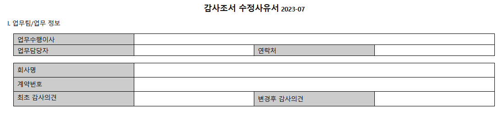

        - 계약번호는 ERP 계약번호를 의미합니다(ex. 23-1111-01-0001 형식)
        - 최초 감사의견은 감사조서 수정 전 감사의견을 의미합니다.
        - 변경후 감사의견은 감사조서 수정 후 표명될 감사의견을 의미합니다[^5]. 

    2. 수정에 관한 사항

        감사조서 수정에 관한 사항은 수정사유서의 다음 표로 관리합니다. 수정 항목이 다수인 경우 표를 복사하여 아래로 붙여서 서식을 작성합니다.

        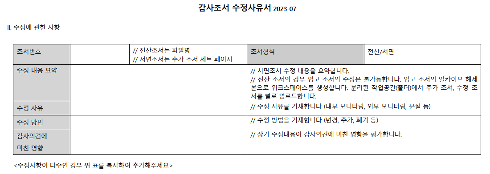

        - 조서번호는 전산조서의 경우 파일명(오딧로비 수정폴더상 파일명과 일치할 것), 서면조서의 경우 수정조서세트의 페이지 번호를 기재합니다. 페이지 번호는 범위가 될 수 있습니다.
        - 수정 내용 요약은 관련 절차와 누락되거나 보완이 필요한 문서화 항목, 증빙 등을 요약 제시합니다.
        - 수정 사유는 내부 모니터링 결과(사후심리 등), 외부 모니터링 결과(감리 등), 분실 등이 있습니다.
        - 감사의견에 미친 영향은 추가 조서화의 결과가 감사 의견에 어떤 영향을 주었는지 업무수행이사의 평가를 기재합니다. 

    3. 결재선은 신청(작성자 → 담당이사) → 처리(품질관리실 → 본점 조서관리자 → 사전심리 실시자 → 품질관리업무 담당이사)입니다. 조서 수정의 경우 사안의 중요성을 고려하여 업무에 참여한 모든 담당자의 승인을 요구합니다.
    
    4. 제출 후 검토 절차는 다음과 같습니다.
    
        1. 담당이사까지 승인한 본 서식은 품질관리실에서 제목과 작성내용의 형식 검사 후 처리합니다. 본점 조서관리자는 조서 수정 절차가 적절히 수행되었는지 평가한 후 승인합니다. 사전심리 실시자와 품질관리업무 담당이사는 조서의 수정이 관련 법규와 부합하는지, 감사의견에 미치는 영향이 정당하게 평가되었는지 확인후 승인합니다.
        2. 승인 후 업무팀은 수정된 조서를 반영하여 업무를 종료합니다.

    5. 첨부항목은 다음과 같습니다.

        A. 업무팀에서 본 서식에 첨부할 항목은 다음과 같습니다. (하이웍스 문서는 관련문서 첨부로 참조합니다)

        ① 감사조서 출고증 ② 서면조서를 수정할 경우 해당 수정조서세트의 스캔본 (용량 문제가 있는 경우 별도로 제출해주세요. 품질관리실에서 구글 Drive 링크를 코멘트하겠습니다.)

[^5]:

    재감사로 감사의견이 변경되는 경우 필수자문대상입니다. [자문 절차](/policy/qualityProcedure/consultation/#-) 참고 바랍니다. 

#### 재입고 절차

재입고 절차는 감사조서 재입고증으로 관리합니다. 조서가 수정된 경우 추가 증빙이 요구된다는 점 확인 부탁드립니다.

!!! Note "감사조서 재입고증"

    1. 제목은 "**[계약번호]_[회사명]**"으로 하고, 아래의 기본정보를 누락없이 정확하게 기재합니다.

        !!! warning ""

            제목의 정보는 품질관리 모니터링 목적으로 활용됩니다. 정확하게 기재하여주시기 바랍니다. 형식 검토 단계에서 제목 수정이 요구될 수 있습니다.

        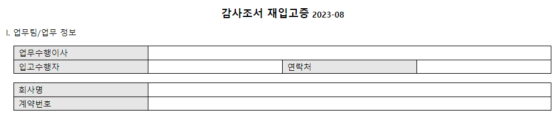

        - 계약번호는 ERP 계약번호를 의미합니다(ex. 23-1111-01-0001 형식)

    2. 재입고에 관한 사항

        감사조서 재입고에 관한 사항은 감사조서 재입고증의 다음 표로 관리합니다.

        

        - 재입고 내용은 서면조서와 전산조서 등 입고 항목으로 기재합니다. 첨부한 출고증으로 대여 항목을 확인합니다. 부분 재입고는 허용되지 않습니다. 대여 기한이 경과되어 필요 조서를 제외한 나머지를 입고하려면, 전체를 재입고하고 다시 출고하여야 합니다. 전산조서의 재입고의 경우 조서가 수정된 경우 최초 입고와 같이, 업무 참여자 모두 감사정보 폐기 서약서에 서명하여야 합니다.

    3. 결재선은 신청(작성자 → 담당이사) → 처리(품질관리실 → 본점 조서관리자)입니다. 
    
    4. 제출 후 검토 절차는 다음과 같습니다.
    
        1. 담당이사까지 승인한 본 서식은 품질관리실에서 제목과 작성내용의 형식 검사 후 처리합니다.  조서관리자는 실물 확인 증빙 첨부 후 승인합니다.
        2.  승인 후 업무팀은 조서관리자에게 출고조서와 수정조서세트를 제출하고, 생성된 워크스페이스를 Archive 처리합니다. ERP에 재입고 승인을 요청합니다.

            - 조서관리자가 업무팀에 제출받는 출고조서는 해당 계약에 대하여 최종 출고증에서 실물 확인된 서면조서 전수입니다.
            - 수정조서세트는 감사조서 수정사유서에 첨부된 스캔본과 일치하는 조서세트입니다.
            - 조서관리자는 서면조서 실물을 확인한 후 ERP 재입고 승인합니다.
            - 전산조서의 경우 출고 생성된 '아카이브 해제본'을 Archive 처리하고 증빙을 제출합니다.

    5. 첨부항목은 다음과 같습니다(하이웍스 문서는 관련문서 첨부로 참조합니다).

        A. 업무팀에서 본 서식에 첨부할 항목은 다음과 같습니다. 
        
        ① 재입고의 근거인 감사조서 출고증  
        ② (전산조서 입고의 경우) Audit Lobby에서 Archive 완료 후 보내오는 "아카이브 생성 안내"를 PDF 출력하여 첨부  
        ③ (조서 수정 절차가 진행된 경우) 1) 감사조서 수정사유서 2) AP_7_감사정보_폐기_서약서 3) 재감사업무 참여자의 시간 입력 내역

        B. 조서관리자가 본 서식에 첨부할 항목은 다음과 같습니다([하이웍스앱-전자결재-입고증-추가항목(···)-파일첨부-사진찍기]로 입고증에 사진을 첨부할 수 있습니다).
        
        ① 재입고조서의 실물사진  
        ② 수정조서세트의 실물사진 

## 폐기

감사조서는 법정 기한이 경과된 이후 품질관리실에서 장부기록 내용과 실사 수행 결과에 따라 폐기 대상을 선정하여 대표이사의 승인을 얻어 일괄 폐기하는 것을 원칙으로 합니다. 법정 기한이 도래하였으나 감리, 법원에 제출 등의 사유로 감사조서가 제출된 경우 기한내 폐기되지 않을 수 있으나, 외부 제출 의무를 이행한 후 기한 도래 조서는 폐기하겠습니다.

## 변경이력

절차의 추가, 수정, 삭제 등 주요 변경 내역을 기록하고 있습니다.

### [1.0] - 2023-08-23

최초 배포. 아래 하이웍스 공지 내역을 종합하여 대체함.

- [수정] [품질관리실] 2021년 기말감사 안내 - 조서입고 절차 안내
    - [품질관리실] 2021년 기말감사 안내 - 조서입고 절차 안내
    - [품질관리실] 조서입고 절차 정비 안내
- [품질관리실] 2022년 감사조서서식(예시) 관련 안내
    - 2021 감사조서서식(예시) 배포안내
- [품질관리실] 조서 대여·반납·수정 절차 안내
- [품질관리실] 전기 감사조서 열람 절차
- [품질관리실] 감사정보 유출방지 절차 안내

