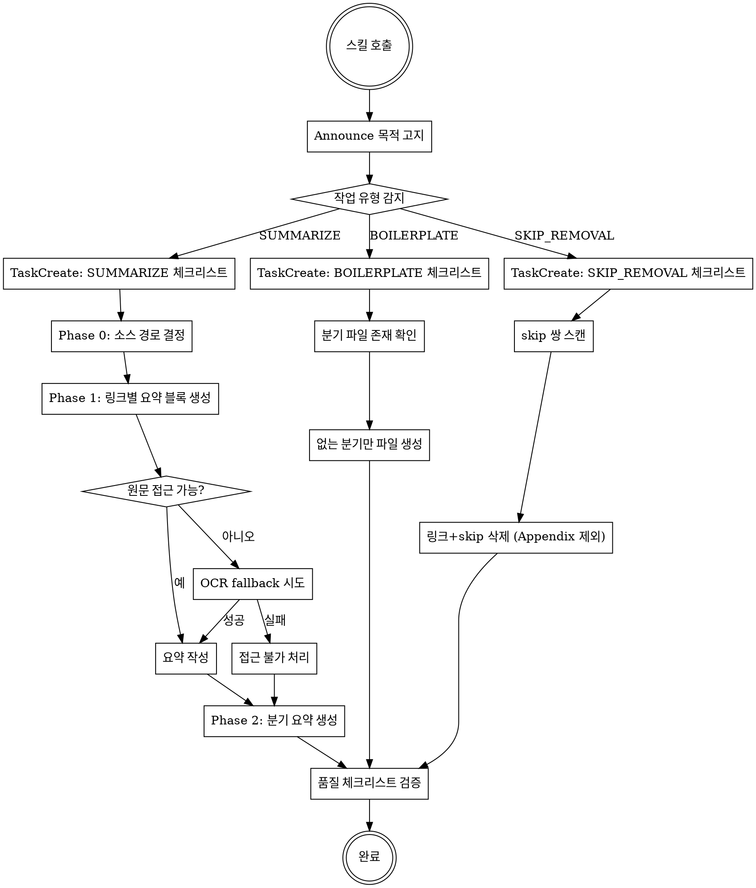

# quality-updates-writer 스킬 전면 재설계 Spec

**날짜**: 2026-03-27
**상태**: 승인됨
**범위**: `.claude/skills/quality-updates-writer/SKILL.md` 전면 재작성, `boilerplate.md` 흡수 후 deprecated

---

## 배경 및 목적

현재 `quality-updates-writer` 스킬은 도메인 규칙을 잘 담고 있으나 Superpowers 프레임워크 패턴과 맞지 않아 Claude가 작업을 체계적으로 추적하거나 단계를 누락 없이 따르기 어렵다. 주요 문제점:

| # | 문제 | 심각도 |
|---|------|--------|
| 1 | 프로세스 흐름도 없음 | 높음 |
| 2 | TaskCreate 체크리스트 없음 — 품질 표가 마크다운 표로만 존재 | 높음 |
| 3 | 워크플로우와 참조 자료 혼재 | 높음 |
| 4 | rigid/flexible 선언 없음 | 중간 |
| 5 | Announce 단계 없음 | 중간 |
| 6 | 세션 초기화 지침 없음 | 중간 |
| 7 | boilerplate.md가 "참조" 한 줄로만 연결 | 낮음 |

**목표**: Superpowers-native 전면 재작성으로 Claude의 준수율을 극대화하고 유지보수성을 개선한다.

---

## 설계 결정

### 스킬 타입: RIGID

도메인 포맷 규칙이 엄격히 정해져 있으므로 (표 스키마 변경 금지, 들여쓰기 4칸 규칙 등) RIGID로 선언. Claude가 임의로 규칙을 변형하지 않는다.

### 단일 파일 자기완결

`boilerplate.md`의 내용을 SKILL.md에 흡수하여 Skill 툴 1회 로드로 모든 정보 접근 가능.
흡수 후 `boilerplate.md`는 파일 상단에 `<!-- DEPRECATED: 내용이 SKILL.md로 이동됨 -->` 주석을 추가하여 deprecated 처리. 파일 자체는 삭제하지 않는다 (git 이력 보존).

### 작업 유형 3종 분기

세션 시작 시 사용자 요청을 분석해 3개 유형 중 하나로 분류:

| 유형 | 감지 키워드 | 생성되는 TaskCreate 항목 |
|------|-------------|--------------------------|
| SUMMARIZE | "요약", "정리", "처리", "보도자료" | Phase 0 × 1, Phase 1 × N링크, Phase 2 × 1, 품질 검증 × 1 |
| BOILERPLATE | "보일러플레이트", "골격", "생성해줘" | 파일 확인 × 1, 분기 생성 × N, 검증 × 1 |
| SKIP_REMOVAL | "스킵 제거", "배포 정리", "skip 제거" | 스캔 × 1, 삭제 × 1, 검증 × 1 |

---

## 파일 구조 (새 SKILL.md)

```
[블록 1] Frontmatter + RIGID 선언 + Gold standard 기준 파일
[블록 2] 세션 시작 의식
         - Announce 텍스트
         - 작업 유형 감지 규칙
         - TaskCreate 체크리스트 생성 지침 (유형별)
[블록 3] 프로세스 흐름도 (dot diagram)
[블록 4] WORKFLOW — SUMMARIZE
         Phase 0 → Phase 1 (링크마다 반복) → Phase 2
[블록 5] WORKFLOW — BOILERPLATE
         (기존 boilerplate.md 내용 흡수)
[블록 6] WORKFLOW — SKIP_REMOVAL
         (기존 스킬 내 분산된 스킵 제거 지침 통합)
[블록 7] REFERENCE A. 블록 문법·들여쓰기
[블록 8] REFERENCE B. 작성 규칙
[블록 9] REFERENCE C. 요약 대상 선별 기준
[블록 10] REFERENCE D. 제재 조치 표 스키마 (Type A / Type B)
[블록 11] REFERENCE E. 특수 유형 요약
[블록 12] REFERENCE F. Phase 2 구조 규칙
[블록 13] REFERENCE G. Appendix A 구조
[블록 14] 품질 검증 체크리스트 (유형별 TaskCreate 항목)
```

---

## 프로세스 흐름도



---

## WORKFLOW 상세

### SUMMARIZE

**STEP 1 — Phase 0: 소스 경로 결정**
- TaskUpdate: in_progress
- 우선순위 표로 PDF/WEB/CLIP 소스 경로 결정
- PDF: `scripts/pdf_path.txt` 저장 → `extract_pdf.py` 실행
- 추출 실패 시: OCR fallback (shot → clip → `<!-- 원문 접근 불가 -->`)
- TaskUpdate: completed

**STEP 2 — Phase 1: 링크별 요약 블록 생성** (링크마다 반복)
- TaskUpdate: in_progress (링크별 개별 태스크)
- 요약 대상 여부 판단 → REFERENCE C 참조
- `!!!` / `???` 블록 생성 → REFERENCE A, B 참조
- 제재 조치 해당 시: Type A / Type B 표 생성 → REFERENCE D 참조
- 특수 유형 해당 시: 해당 규칙 적용 → REFERENCE E 참조
- TaskUpdate: completed

**STEP 3 — Phase 2: 분기 요약 생성**
- TaskUpdate: in_progress
- Executive Summary (음/슴체, 3~5문장, 불릿 금지) → REFERENCE F 참조
- 기관별 요약 (`!!! success` + 탭 구조) → REFERENCE F 참조
- 시사점 (기업·감사인만) → REFERENCE F 참조
- TaskUpdate: completed

### BOILERPLATE

**STEP 1 — 연도·분기 확인**
- 사용자 요청에서 대상 연도 추출
- `docs/quality-updates/{연도}/` 내 기존 파일 목록 확인
- 없는 분기만 생성 대상으로 설정

**STEP 2 — 분기 파일 생성** (없는 분기마다 반복)
- TaskCreate: "Q{N} 파일 생성"
- YAML frontmatter + 플레이스홀더 구조 생성
- 기존 파일 덮어쓰기 절대 금지

**STEP 3 — 완료 검증**
- 생성된 파일 경로 목록 출력

### SKIP_REMOVAL

**STEP 1 — 대상 파일 스캔**
- `docs/quality-updates/**/*.md`에서 skip 쌍 탐색
- Appendix A 구역은 스캔 제외

**STEP 2 — 삭제 실행**
- 링크 줄 + `<!-- skip -->` 줄 쌍 삭제
- 미결정 링크(skip 없음)는 보존
- 앞뒤 빈 줄 정리

**STEP 3 — 완료 검증**
- Appendix A 원본 링크 보존 확인

---

## REFERENCE 블록 목록

현행 SKILL.md의 포맷·규칙 내용을 **그대로 이동** (내용 변경 없음):

| 블록 | 출처 (현행) |
|------|-------------|
| REFERENCE A. 블록 문법·들여쓰기 | §1.1 |
| REFERENCE B. 작성 규칙 | §1.2 |
| REFERENCE C. 요약 대상 선별 기준 | §1.3 |
| REFERENCE D. 제재 조치 표 스키마 (Type A/B) | §1.4 |
| REFERENCE E. 특수 유형 요약 | §1.5 |
| REFERENCE F. Phase 2 구조 규칙 | Phase 2 섹션 |
| REFERENCE G. Appendix A 구조 | 공통 규칙 §Appendix A |

---

## 품질 검증 체크리스트

완료 전 TaskCreate로 생성되는 항목:

### SUMMARIZE 유형
- [ ] 유효한 MkDocs 마크다운 (admonition 중첩, 들여쓰기 4칸)
- [ ] 요약 블록 내 URL 없음
- [ ] `!!!` / `???` 선택이 길이·유형에 적합
- [ ] 접두어 스타일 블록 내 일관 (스타일 A/B 혼용 없음)
- [ ] 어미 규칙 준수 (Phase 1: 명사형, Phase 2 ES: 음/슴체)
- [ ] 수치·날짜·기준치 원문 보존
- [ ] PDF 추출 실패 시 OCR fallback 1회 수행 후 접근불가 판단
- [ ] Type A 표: 스키마·백만원 단위·반복부호 치환
- [ ] Type B 표: 회사별 필수, 감사인 조치 표는 조치 있을 때만
- [ ] 증선위·금융위 조치 → 금융위원회 탭에만 기재
- [ ] 시사점: 기업·감사인 탭만 포함
- [ ] Appendix A 파일 말미 배치, 원본 링크 보존

### BOILERPLATE 유형
- [ ] 기존 파일 덮어쓰기 없음
- [ ] YAML frontmatter 완전 작성 (period_label, agencies 포함)
- [ ] 4개 기관 섹션 헤더 완전 포함

### SKIP_REMOVAL 유형
- [ ] Appendix A 구역 링크 삭제 없음
- [ ] 미결정 링크(skip 없음) 보존
- [ ] 삭제 전후 빈 줄 정리 완료

---

## 파일 변경 목록

| 파일 | 변경 |
|------|------|
| `.claude/skills/quality-updates-writer/SKILL.md` | 전면 재작성 |
| `.claude/skills/quality-updates-writer/boilerplate.md` | 상단에 deprecated 주석 추가, 파일 삭제 안 함 |
