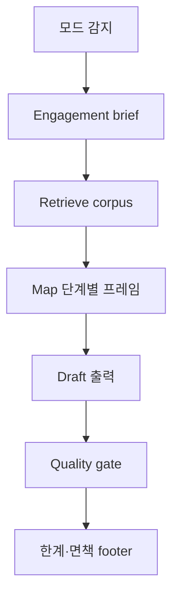

# 감사 규제 렌즈 스킬 설계 스펙

**날짜**: 2026-06-27  
**상태**: 승인됨  
**범위**: `.claude/skills/audit-regulatory-lens/` — **Planning · Execution · Reporting**(Quality review 포함) 3단계에서 Quality Updates 코퍼스를 근거로 감사 보조

**관련 spec**

| 문서 | 관계 |
|------|------|
| [2026-06-26-remove-phase2-summaries-design.md](2026-06-26-remove-phase2-summaries-design.md) | 링크+note 정본 (인용 소스) |
| [2026-06-27-mcp-corpus-design.md](2026-06-27-mcp-corpus-design.md) | v1.1 retrieval — **선행 구현 불필요**; tool 계약만 본 spec에 명시 |

**브레인스토밍 결정**

| 항목 | 결정 |
|------|------|
| 스킬 성격 | **ADVISORY** — `.md`·코퍼스 **읽기 전용**, 콘텐츠 파이프라인 미변경 |
| 단계 | **Planning / Execution / Reporting** 3모드 **동급** 풀세트 |
| Reporting | **Quality review(품질검토)** 서브플로 포함 |
| Retrieval v1 | repo `docs/quality-updates/` (grep·read); MCP **v1.1** |
| writer 스킬 | **분리** — `quality-updates-writer`와 역할·트리거 겹치지 않음 |

---

## 배경

감사인은 Planning·Execution·Reporting(및 Engagement quality review) 각 단계에서 **감독당국·기준원의 최근 메시지**를 규제 렌즈로 반영하고 싶어 한다. Quality Updates는 FSS/FSC/KICPA/KASB 보도·공지를 **링크+note**로 큐레이션해 두었으나, **감사 단계별로 어떻게 조회·서술할지**는 정의되어 있지 않다.

**목표**: Cursor/Claude Agent가 동일 스킬로 3단계 각각에서 **출처 있는** 규제 코멘트·강조·갭 분석을 생성한다.

**비목표**

- 감사기준(KSA)·K-IFRS **전문 대체** 또는 법률·감사결론
- workpaper 시스템·감사소프트웨어 **API 연동**
- 코퍼스 **쓰기**(요약·큐레이션 — `quality-updates-writer` 담당)
- embedding·의미 검색 (MCP v2)

---

## 1. 스킬 개요

### 1.1 위치

```
.claude/skills/audit-regulatory-lens/
  SKILL.md           # RIGID-lite 워크플로·출력·guardrail
  reference/
    keywords.md      # assertion → 검색 키워드·동의어 (선택)
    output-samples.md # 3단계 gold output 예시 (선택)
```

**AGENTS.md** 라우팅 행 추가: “감사 규제 렌즈 → audit-regulatory-lens”.

### 1.2 트리거·모드 감지

| 모드 | 감지 키워드 (예) |
|------|------------------|
| **PLANNING** | 감사계획, planning, RKRA, 중점영역, 감사절차 설계, 수임 초기 |
| **EXECUTION** | 수행, execution, fieldwork, 조서, 테스트, 중간, 실증 |
| **REPORTING** | reporting, 완료, 보고, 발행 전, quality review, 품질검토, EQCR |

모호하면 **1문장 질문**으로 모드 확인. 복수 단계 요청 시 **단계별 섹션**으로 순차 출력.

### 1.3 Announce (세션 시작)

> `audit-regulatory-lens 스킬로 [PLANNING|EXECUTION|REPORTING]을 시작합니다. 근거: Quality Updates 코퍼스(링크+note). MCP 미연결 시 repo 검색 fallback.`

---

## 2. 공통 워크플로



### 2.1 Engagement brief (모드 공통)

에이전트가 수집·확인 (사용자 제공 우선, 없으면 질문):

| 필드 | 필수 | 예 |
|------|:----:|-----|
| `reporting_period` | ✓ | 2025-12-31 결산 |
| `entity_type` | ✓ | 상장 / 코스닥 / 비상장 / 금융(보험·은행) |
| `industry` | | 제조, IT, 생명보험 |
| `focus_areas` | ✓ | 수익인식, ICFR, 전환사채, … |
| `corpus_window` | | 기본: 결산일 기준 **최근 4분기** + 해당 사업연도 감독 메시지 |
| `user_context` | | 모드별 추가 (아래) |

### 2.2 Retrieve (corpus)

**우선순위**

1. MCP tools 사용 가능 → §6 tool 호출
2. Else → repo fallback:
   - `docs/quality-updates/{year}/*.md` 대상
   - `rg`/read로 `focus_areas` 키워드 + 기관명
   - **`summary_status` 우선**: note 있는 항목(`!!!`/`???` note) > `no_summary` > 제목만
   - `<!-- skip -->` 항목 **제외** (공개 코퍼스와 동일)

**인용 규칙**: note bullet·표 내용만 **사실 인용**; note 없으면 **제목+URL만**.

### 2.3 Quality gate (공통 RIGID-lite)

- [ ] 모든 **규제 사실**에 `(YY-MM-DD) [제목](URL)` 또는 MCP `id`+`url`
- [ ] corpus에 **없는** 제재·수치·제도명 **미기재**
- [ ] note 없는 항목에 **상세 내용 invent** 금지
- [ ] `(시사점)` bullet → **「당국 메시지」** 라벨; 감사인 행동 → **「감사 시사」** 라벨 **분리**
- [ ] **법률 자문·감사의견·적정/한정** 표명 금지
- [ ] 매칭 없음 → **「해당 기간·키워드 코퍼스 직접 매칭 없음」** 명시

### 2.4 Footer (공통)

```markdown
---
**한계**: 본 출력은 Quality Updates에 수록된 보도·공지 note를 바탕으로 한 감사 **보조**이며,
KSA/K-IFRS 전문·감사결론·법률 자문을 대체하지 않습니다. 최종 판단은 engagement 팀이 합니다.
```

---

## 3. 모드별 설계 (동급 풀세트)

### 3.1 PLANNING

**목적**: 감사계획·RKRA·중점영역·절차·문서요청에 **최근 감독 강조** 반영.

**추가 brief**

- 계획 수준: 그룹/단일 / 첫 수임·연속
- 알려진 경영자·IT·Fraud 리스크 (선택)

**Retrieve 초점**

- 금감원: 운영계획, 중점심사, 유의사항, 지적사례
- 금융위: 제재·입법예고
- 한공회·기준원: 감사·공시 실무 유의

**출력 스키마** (중점영역당 1블록, 필수 섹션):

```markdown
## Planning — 규제 렌즈

### Engagement 요약
- …

### [중점영역: {name}]

#### 규제 메시지 (corpus)
- … (note 인용 bullet)

#### 감사 계획 시사
- **리스크·관심사**: …
- **제안 절차/증빙**: …
- **문서·문답**: …

#### 출처
- (YY-MM-DD) [제목](URL)

### Planning 체크리스트 (팀 검토용)
- [ ] …

### 코퍼스 미매칭 영역
- …
```

**체크리스트**: 최소 5항 — 팀이 WP에 옮기기 전 self-review.

---

### 3.2 EXECUTION

**목적**: 수행 중 **현재 작업**과 최근 감독 메시지 **정합**, 문서화·escalation 힌트.

**추가 brief**

- **현재 조서/절차** 요약 (필수)
- 진행 중 finding·이슈 (선택)
- 테스트 단계: TOD/TOE/추정/특수관계자 등 (선택)

**Retrieve 초점**

- brief의 `focus_areas` + **조서 키워드** 교집합
- 최근 **지적사례·제재** 중 유사 패턴 (note에 있을 때만)

**출력 스키마**

```markdown
## Execution — 규제 렌즈

### 수행 맥락 요약
- …

### [작업 영역: {name}]

#### 규제 메시지 (corpus)
- …

#### 수행 대비 시사
- **정합**: 조서가 반영하는 감독 포인트
- **갭/보완**: 추가 절차·문서·질문
- **Escalation**: 팀/EQCR 상의 트리거 (corpus 근거 있을 때만)

#### 조서용 코멘트 초안 (선택)
- 「…」

#### 출처
- …

### Execution 체크리스트
- [ ] …
```

**원칙**: Execution은 **가장 맥락 의존** — `user_context`(조서 발췌) 없으면 **질문 후** 진행.

---

### 3.3 REPORTING (Quality review 포함)

**목적**: 완료·보고 단계 및 **품질검토**에서 결론·공시·Significant matters가 **최근 감독 기대**와 맞는지 점검.

**서브플로**

| 서브 | 트리거 | 초점 |
|------|--------|------|
| **REPORTING** | 보고, 완료, 발행 | 공시·보고서·후속사건·경영자 서한 |
| **QUALITY_REVIEW** | quality review, EQCR, 품질검토 | 감사품질·독립성·네트워크 공시·감리 메시지 |

한 세션에 둘 다 요청 가능 → **Part A Reporting / Part B Quality review** 로 분리.

**추가 brief**

- 초안 결론·KAM·Significant matters 요약 (필수)
- Quality review: 검토 범위(계획·조서·결론) (QR 시 필수)

**Retrieve 초점**

- 사업보고서·내부회계·공시 유의사항
- 감사품질·감사인 지정·네트워크·비감사용역
- 제재 사례 중 **보고·공시** 관련

**출력 스키마 — Part A Reporting**

```markdown
## Reporting — 규제 렌즈

### 보고 맥락 요약
- …

### [보고 이슈: {name}]

#### 규제 메시지 (corpus)
- …

#### 보고·공시 시사
- **정합 / 갭**
- **발행 전 확인**

#### 출처
- …

### Reporting sign-off 체크리스트
- [ ] …
```

**출력 스키마 — Part B Quality review**

```markdown
## Quality review — 규제 렌즈

### QR 범위
- …

### [QR 초점: {name}]

#### 규제·감독 메시지 (corpus)
- …

#### 품질검토 시사
- **계획·수행·결론** 중 어디를 deep dive할지
- **문서화·증빙** QR 코멘트 초안

#### 출처
- …

### EQCR/QR 체크리스트
- [ ] …
```

---

## 4. `quality-updates-writer`와의 경계

| | writer | audit-regulatory-lens |
|---|--------|----------------------|
| 목적 | 코퍼스 **생산** | 코퍼스 **소비** |
| 파일 수정 | 예 (note) | **금지** |
| 트리거 | 요약·스킵·보일러 | Planning/Execution/Reporting |
| 포맷 | note admonition RIGID | 감사 출력 스키마 RIGID-lite |

동일 세션에서 writer 호출 **금지** (역할 충돌).

---

## 5. Retrieval v1 — repo fallback (상세)

MCP 미구현 시 스킬이 **직접** 수행:

```bash
# 예: ICFR + 최근 분기
rg -i "내부회계|ICFR|운영실태" docs/quality-updates/2025/ docs/quality-updates/2026/
```

**읽기**: 매칭 링크 주변 note 블록 전체 (admonition 포함).

**기간 필터**: `period.end`가 `corpus_window`와 겹치는 분기 파일 우선 (`mkdocs.yml` nav·front matter).

**한계 고지**: v1 키워드 검색 — 동의어 누락 가능 → MCP v1.1 권장.

---

## 6. MCP tool 계약 (v1.1 — 소비자 요구)

MCP [corpus spec](2026-06-27-mcp-corpus-design.md) 구현 시 스킬이 **우선** 호출:

| Tool | 스킬 사용처 |
|------|-------------|
| `list_quarterly_periods` | `corpus_window` 결정 |
| `search_regulatory_updates` | `query`, `agency`, `period_label`, `has_summary=true` |
| `get_regulatory_update` | note 전문·URL 확정 |

**스킬 detect**: MCP tool 목록에 위 이름 있으면 repo fallback **skip**.

---

## 7. 구현 순서 (plan 작성용)

```
P1  SKILL.md — 공통 워크플로 + 3모드 출력 스키마 + guardrail
P2  reference/output-samples.md (선택) — 2025 Q4·2026 Q1 실제 note 기반 예시
P3  AGENTS.md · docs/project/README.md 라우팅
P4  (수동) Cursor에서 3모드 스모크 — MCP 없이
P5  MCP corpus 구현 후 SKILL.md v1.1 절 추가 (tool 우선)
```

**P1~P4는 MCP 없이 완료 가능.**

---

## 8. 완료 조건 (Acceptance)

- [x] `.claude/skills/audit-regulatory-lens/SKILL.md` 존재
- [x] PLANNING / EXECUTION / REPORTING(+QR) 각각 **출력 스키마·체크리스트** SKILL에 정의
- [x] 공통 quality gate·footer
- [x] repo fallback 절차 명시
- [x] MCP tool 계약 §6 반영
- [x] AGENTS.md 라우팅
- [ ] (HITL) 3모드 스모크 1회씩 — 인용 URL·note 일치 확인

---

## 9. 리스크·완화

| 리스크 | 완화 |
|--------|------|
| 과도한 일반론 | corpus 인용 없으면 해당 bullet 생략 |
| 조서 없이 Execution 실행 | brief 필수 질문 |
| QR vs Reporting 혼동 | 서브플로 Part A/B |
| 키워드 검색 누락 | keywords.md·MCP v1.1 |
| writer와 혼용 | 트리거·AGENTS 분리 |

---

## 개정 이력

| 날짜 | 내용 |
|------|------|
| 2026-06-27 | 초안 — 3단계 동급, Reporting에 Quality review 포함 (브레인스토밍 C) |
