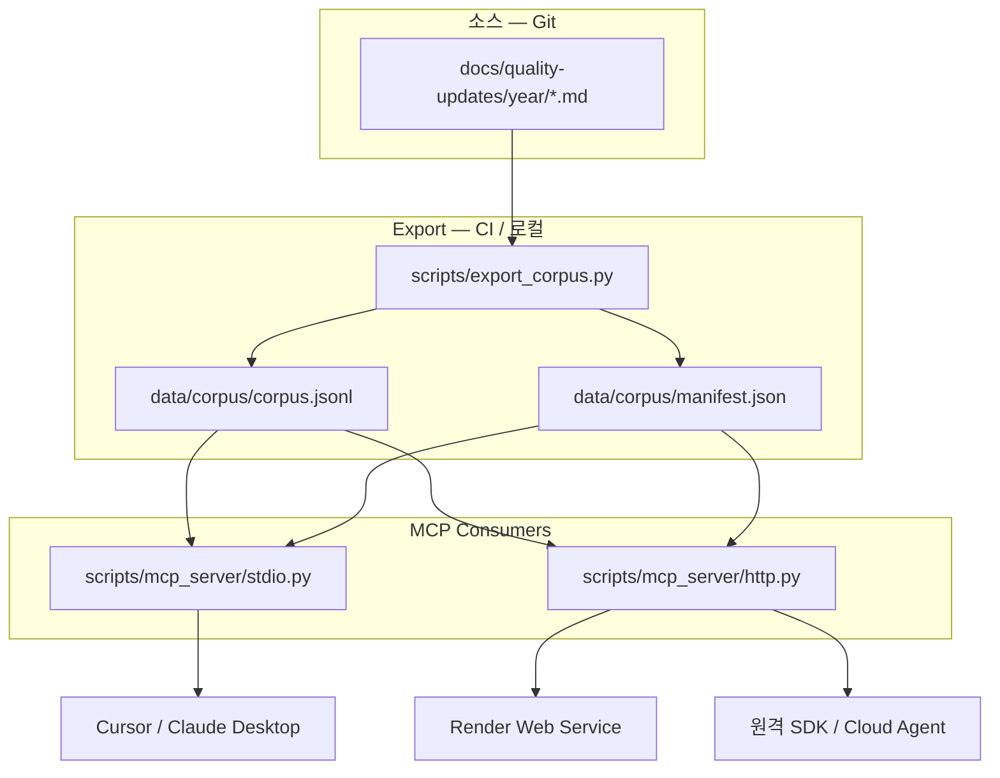

# MCP 코퍼스·서버 설계 스펙

**날짜**: 2026-06-27  
**상태**: 승인됨  
**범위**: 분기 규제 업데이트 Markdown → 구조화 코퍼스 export, **로컬 stdio MCP**, **Hosted HTTP MCP** (v1 동시)

**선행 spec**: [2026-06-26-remove-phase2-summaries-design.md](2026-06-26-remove-phase2-summaries-design.md) (Phase 2 제거·링크 note 정본)

**브레인스토밍 결정**

| 항목 | 결정 |
|------|------|
| 코퍼스 전략 | **안 A** — Export-first JSONL, runtime parse 아님 |
| 소비 환경 | **C** — 로컬 stdio + Hosted HTTP **v1 동시** |
| 코퍼스 정본 | **공개 배포본** — `skip` 제외 (`prepare_deploy`와 동일 경계) |
| Appendix A | v1 **제외** (본문 큐레이션 링크만); v1.1 옵션 |
| fss-review | v1 **범위 외** |

---

## 배경

Phase 2 제거 후 공개·파이프라인 정본은 **링크 + Phase 1 note + YAML**이다. MkDocs 사이트는 사람 탐색용이고, 에이전트(MCP)는 **필터·검색·단건 fetch**가 필요하다.

| 자산 | MCP v1 활용 |
|------|-------------|
| `scripts/editor/parser.py` | 링크·agency·state·source — **확장 기반** |
| `prepare_deploy` / `skip_removal` | skip 제외 규칙 **재사용** |
| YAML front matter | `period_label`, `period`, `agencies` |
| `mkdocs.yml` nav | 기간 목록·공개 URL 매핑 |

**목표**: Cursor/Claude Desktop **로컬 MCP**와 **원격 Hosted MCP**가 **동일 코퍼스 스냅샷**을 읽도록 한다.

---

## 목표

1. **Corpus export** — `docs/quality-updates/{year}/*.md` → 버전드 JSONL + manifest
2. **로컬 stdio MCP** — Cursor `.cursor/mcp.json` 등록 가능
3. **Hosted HTTP MCP** — Render(또는 동급) Web Service, SSE/Streamable HTTP
4. **파이프라인 통합** — export·schema 검증을 CI / 배포 흐름에 연결
5. **문서화** — AGENTS.md 라우팅, README MCP 섹션

### 비목표 (v1)

- 벡터 embedding·의미 검색
- fss-review, Appendix A 전체 목록 index
- MCP를 통한 **쓰기**(큐레이션·요약 갱신)
- `prepare_deploy`가 소스 `.md`를 **변경하지 않는** export 전용 경로 (export는 in-memory skip 필터)

---

## 아키텍처



**단일 코퍼스 SSOT**: `data/corpus/` (build artifact). 로컬·Hosted는 **동일 파일**을 읽는다.

---

## 1. Corpus export

### 1.1 CLI

```bash
python scripts/export_corpus.py              # default targets
python scripts/export_corpus.py --dry-run    # stats only
python scripts/export_corpus.py --strict     # schema + validate_content 연동
```

**입력**: `docs/quality-updates/{year}/*.md` (`index.md` 제외)

**처리**:

1. 파일별 YAML front matter 파싱 (`period`, `period_label`, `title`, …)
2. 본문에 `remove_skip_pairs()` **in-memory** 적용 (소스 파일 **미수정**)
3. 확장 파서로 항목 추출 (Appendix A **이전**만)
4. `data/corpus/corpus.jsonl` (1 line = 1 item JSON) + `manifest.json` 기록

**manifest.json** (예):

```json
{
  "schema_version": "1.0.0",
  "generated_at": "2026-06-27T12:00:00+09:00",
  "item_count": 842,
  "periods": ["2026-Q1", "2025-Q4"],
  "source_commit": "optional-git-sha"
}
```

### 1.2 항목 스키마 (v1.0.0)

| 필드 | 타입 | 필수 | 설명 |
|------|------|:----:|------|
| `id` | string | ✓ | `{period_label}\|{agency}\|{date}\|{url_hash8}` |
| `schema_version` | string | ✓ | `"1.0.0"` |
| `period_label` | string | ✓ | e.g. `2026-Q1` |
| `period` | object | ✓ | `{start, end}` ISO date |
| `agency` | string | ✓ | 4기관 canonical name |
| `subsection` | string | | `#### 보도자료` 등 |
| `date` | string | ✓ | `YY-MM-DD` |
| `title` | string | ✓ | 링크 텍스트 |
| `url` | string | ✓ | canonical URL |
| `summary_status` | enum | ✓ | `done` \| `no_summary` \| `undecided` |
| `source` | object | | `{type, ref}` — pdf/web/clip/shot |
| `notes` | array | | `[{admonition, title, bullets[], tables[]}]` |
| `source_doc` | string | ✓ | repo-relative path |
| `public_page` | string | | MkDocs URL (site_url + nav path) |

**제외**: `summary_status === skip` (export 단계에서 drop)

**notes 파싱**:

- `!!! note` / `??? note` / Type A·B 표 블록
- bullet은 문자열 배열; `(시사점)` 접두어 **유지**
- 중첩 admonition은 1-depth flatten 또는 `children` (v1: flatten 권장)

### 1.3 파서 모듈

**신규**: `scripts/corpus/` (editor와 **분리**, editor API 복사 금지 — 공통 로직은 `scripts/corpus/parse.py`)

| 모듈 | 책임 |
|------|------|
| `corpus/parse.py` | front matter, subsection, link, note, skip 필터 |
| `corpus/schema.py` | dataclass / JSON schema, `id` 생성 |
| `export_corpus.py` | CLI, manifest, write JSONL |

**editor/parser.py**: v1에서 **변경 최소** — corpus가 SSOT 파서; 장기적으로 editor가 corpus.parse를 import하도록 정리 가능 (v1 범위 외).

### 1.4 산출물 Git 정책

| 옵션 | v1 결정 |
|------|---------|
| `data/corpus/` 커밋 | **Yes** — Hosted Render가 clone만으로 서빙 가능 |
| `.gitignore` | 커밋하므로 ignore **하지 않음** |

CI에서 export 후 diff가 있으면 **fail** (drift 방지) 또는 PR bot 갱신 — v1: **`export_corpus --strict` + pytest**로 스키마만 검증; 커밋 갱신은 HITL.

---

## 2. 로컬 stdio MCP

### 2.1 진입점

```bash
python -m scripts.mcp_server.stdio
# 또는
python scripts/mcp_server/stdio.py
```

**의존성**: `mcp` (Model Context Protocol Python SDK) — `requirements.txt`에 pin 추가

### 2.2 Tools (v1)

| Tool | 입력 | 출력 |
|------|------|------|
| `search_regulatory_updates` | `query?`, `agency?`, `period_label?`, `date_from?`, `date_to?`, `has_summary?`, `limit?` | 매칭 항목 요약 목록 (title, date, agency, id, snippet) |
| `get_regulatory_update` | `id` 또는 `url` | 전체 항목 JSON (notes 포함) |
| `list_quarterly_periods` | — | manifest `periods` + front matter 메타 |

**검색 v1**: 대소문자 무시 **substring** (title + note bullets). embedding은 v2.

### 2.3 Resources (v1)

| URI | 내용 |
|-----|------|
| `quality-updates://corpus/manifest` | manifest.json |
| `quality-updates://period/{period_label}` | 해당 기간 항목 id 목록 |

### 2.4 Cursor 등록 (문서화 예시)

```json
{
  "mcpServers": {
    "quality-updates": {
      "command": "python",
      "args": ["-m", "scripts.mcp_server.stdio"],
      "cwd": "/path/to/quality-updates",
      "env": {}
    }
  }
}
```

로컬 사용 전: `python scripts/export_corpus.py` 실행 (또는 CI 산출물 pull).

---

## 3. Hosted HTTP MCP

### 3.1 배포 모델

MkDocs static site와 **분리된 Render Web Service** (2번째 서비스).

| 서비스 | Render 타입 | 명령 |
|--------|-------------|------|
| 기존 site | Static / Python build | `mkdocs build` |
| **MCP (신규)** | Web Service | `uvicorn scripts.mcp_server.http:app --host 0.0.0.0 --port $PORT` |

**repo 내**: `render.yaml` (Blueprint) 또는 README에 수동 설정 절차.

### 3.2 Transport

- **Streamable HTTP** 또는 **SSE** — Python MCP SDK 지원 transport 사용 (구현 시 SDK 최신 문서 기준)
- 경로 예: `https://quality-updates-mcp.onrender.com/mcp`

### 3.3 인증 (v1)

공개 정보 코퍼스이나 **남용 방지**를 위해:

| 항목 | v1 |
|------|-----|
| 인증 | `Authorization: Bearer <MCP_API_KEY>` (Render env) |
| 미설정 시 | 로컬 stdio만 허용; Hosted는 **키 필수** |
| CORS | MCP 클라이언트 origin만 (또는 SDK default) |
| Rate limit | v1.1 — Render 레벨 기본 보호 |

로컬 stdio: **인증 없음** (localhost).

### 3.4 Tools / Resources

로컬 stdio와 **동일 surface** — `scripts/mcp_server/core.py`에 공유 구현.

```text
scripts/mcp_server/
  core.py      # corpus load, search, get
  stdio.py     # MCP stdio transport
  http.py      # FastAPI/Starlette + MCP HTTP
```

### 3.5 배포 파이프라인

```text
main push
  → CI: export_corpus --strict, pytest, validate
  → Render MCP service: pull + restart (corpus.jsonl in repo)
  → (기존) MkDocs site deploy
```

Hosted는 **Git에 커밋된 corpus**를 읽음 — 별도 DB 불필요.

---

## 4. CI·품질 게이트

| # | 게이트 | 담당 |
|---|--------|------|
| G1 | `export_corpus.py --strict` exit 0 | CI |
| G2 | `scripts/tests/test_corpus_export.py` | CI |
| G3 | `scripts/tests/test_mcp_core.py` (search/get fixture) | CI |
| G4 | corpus JSONL schema_version 일치 | CI |
| G5 | (선택) Hosted smoke — health + auth reject | post-deploy HITL |

**`--strict`**: export + 항목 수 최소 임계 + `validate_content` on source md + schema validate.

---

## 5. 문서·Agent 라우팅

| 파일 | 변경 |
|------|------|
| `README.md` | MCP 로컬·Hosted 설정 섹션 |
| `AGENTS.md` | 작업 라우팅表에 MCP·corpus export 행 |
| `docs/project/README.md` | SSOT: corpus export, MCP server |
| `docs/superpowers/README.md` | 본 spec 색인 |

**분기 운영**: export는 **Phase 5 배포 전** 또는 CI; HITL은 corpus diff 확인(선택).

---

## 6. 구현 순서 (plan 작성용)

```
P1  corpus/parse.py + export_corpus.py + tests + data/corpus/ 초기 생성
P2  mcp_server/core.py + stdio.py + tests
P3  mcp_server/http.py + Render 문서 + env MCP_API_KEY
P4  CI workflow + README/AGENTS 문서
P5  (HITL) Cursor mcp.json 예시 검증, Hosted smoke
```

P1→P2→P3 순서 필수 (공유 core).

---

## 7. 완료 조건 (Acceptance)

- [x] `python scripts/export_corpus.py --strict` → `data/corpus/corpus.jsonl` + manifest
- [x] skip 항목 **JSONL에 없음**; `no_summary`·`done` 포함
- [x] note bullets·`(시사점)` 보존 spot-check
- [ ] 로컬 stdio: Cursor에서 `list_quarterly_periods`, `search_regulatory_updates`, `get_regulatory_update` 동작
- [ ] Hosted: Bearer 키로 동일 tool 3종 HTTP 호출 성공; 키 없으면 401
- [x] `pytest` + `validate_content --strict` + `mkdocs build --strict` 기존 게이트 유지
- [x] README MCP 설정 문서화

---

## 8. 리스크·완화

| 리스크 | 완화 |
|--------|------|
| corpus·소스 drift | CI strict export; 커밋된 JSONL |
| parser/note edge cases | gold standard 2분기 fixture 테스트 |
| Render 2-service 비용 | Free tier 문서화; scale-to-zero |
| MCP SDK transport 변경 | pin version; http/stdio thin wrapper |
| Hosted 키 유출 | env only; README에 commit 금지 |
| corpus JSONL 크기 | v1 ~수 MB; v2 chunk/resource pagination |

---

## 9. v2 후보 (별 spec)

- Appendix A read-only index tool
- fss-review corpus namespace
- Embedding + hybrid search
- `prepare_deploy` 후 자동 export hook (mutating deploy와 분리 유지)

---

## 개정 이력

| 날짜 | 내용 |
|------|------|
| 2026-06-27 | 초안 — Export-first, 로컬 stdio + Hosted HTTP v1 (브레인스토밍 C) |
